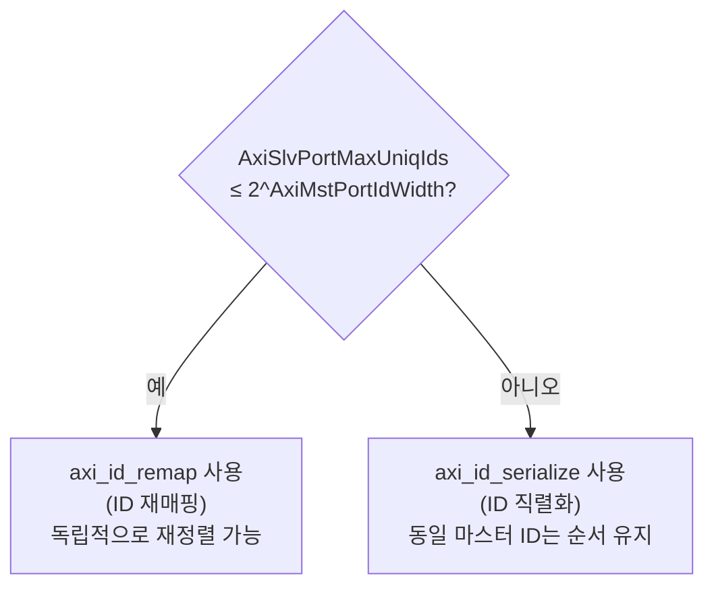
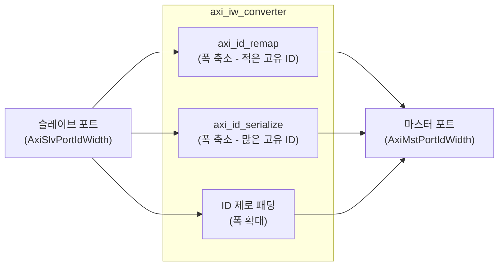

# axi_iw_converter.sv

## 개요

AXI4+ATOP ID 폭 변환기입니다. 슬레이브 포트와 마스터 포트 간의 임의의 ID 폭 조합을 지원합니다.

- **ID 폭 확대**: 마스터 포트 ID가 더 넓은 경우, 슬레이브 ID 앞에 0을 패딩
- **ID 폭 축소**: 두 가지 전략 사용

## ID 폭 축소 전략

## 블록 다이어그램

## 파라미터

| 파라미터 | 타입 | 기본값 | 설명 |
|---------|------|--------|------|
| `AxiSlvPortIdWidth` | `int unsigned` | 0 | 슬레이브 포트 ID 폭 |
| `AxiMstPortIdWidth` | `int unsigned` | 0 | 마스터 포트 ID 폭 |
| `AxiSlvPortMaxUniqIds` | `int unsigned` | 0 | 슬레이브 포트 최대 고유 ID 수 (읽기/쓰기 별도) |
| `AxiSlvPortMaxTxnsPerId` | `int unsigned` | 0 | ID당 최대 미처리 트랜잭션 (axi_id_remap 전달) |
| `AxiSlvPortMaxTxns` | `int unsigned` | 0 | 슬레이브 포트 최대 미처리 트랜잭션 (axi_id_serialize 전달) |
| `AxiMstPortMaxUniqIds` | `int unsigned` | 0 | 마스터 포트 최대 고유 ID 수 |
| `AxiMstPortMaxTxnsPerId` | `int unsigned` | 0 | 마스터 ID당 최대 트랜잭션 |
| `AxiAddrWidth` | `int unsigned` | 0 | 주소 폭 |
| `AxiDataWidth` | `int unsigned` | 0 | 데이터 폭 |
| `AxiUserWidth` | `int unsigned` | 0 | 사용자 신호 폭 |
| `slv_req_t` | `type` | `logic` | 슬레이브 요청 타입 |
| `slv_resp_t` | `type` | `logic` | 슬레이브 응답 타입 |
| `mst_req_t` | `type` | `logic` | 마스터 요청 타입 |
| `mst_resp_t` | `type` | `logic` | 마스터 응답 타입 |

## 포트

| 포트 | 방향 | 설명 |
|------|------|------|
| `clk_i` | 입력 | 클록 |
| `rst_ni` | 입력 | 비동기 리셋 (액티브 로우) |
| `slv_req_i` | 입력 | 슬레이브 포트 요청 |
| `slv_resp_o` | 출력 | 슬레이브 포트 응답 |
| `mst_req_o` | 출력 | 마스터 포트 요청 |
| `mst_resp_i` | 입력 | 마스터 포트 응답 |

## 의존성

- `axi_id_remap`
- `axi_id_serialize`
- `axi_pkg`
- `axi/typedef.svh`
