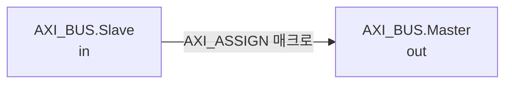

# axi_join.sv

## 개요

두 AXI 인터페이스를 연결하는 커넥터 모듈입니다. 슬레이브 인터페이스의 모든 신호를 마스터 인터페이스로 직접 연결합니다.

## 블록 다이어그램



## 포트

| 포트 | 타입 | 설명 |
|------|------|------|
| `in` | `AXI_BUS.Slave` | 입력 AXI 인터페이스 (슬레이브) |
| `out` | `AXI_BUS.Master` | 출력 AXI 인터페이스 (마스터) |

## 내부 동작

`AXI_ASSIGN` 매크로를 사용하여 `in`의 모든 신호를 `out`으로 직접 연결합니다.

시뮬레이션 시 다음을 검증합니다:
- 주소 폭 일치: `in.AXI_ADDR_WIDTH == out.AXI_ADDR_WIDTH`
- 데이터 폭 일치: `in.AXI_DATA_WIDTH == out.AXI_DATA_WIDTH`
- ID 폭 호환: `in.AXI_ID_WIDTH <= out.AXI_ID_WIDTH`
- 사용자 신호 폭 일치: `in.AXI_USER_WIDTH == out.AXI_USER_WIDTH`

## 의존성

- `axi/assign.svh`

## 사용 예시

```systemverilog
axi_join_intf i_join (
  .in  (axi_slave_bus),
  .out (axi_master_bus)
);
```
