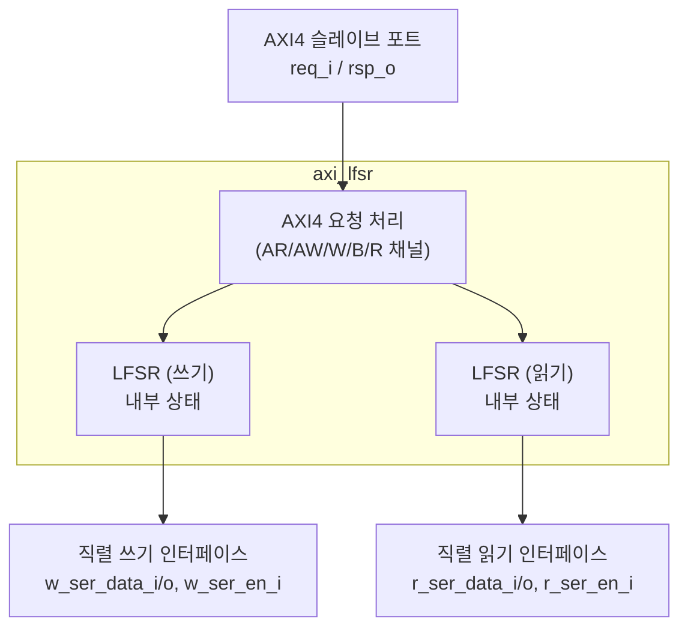

# axi_lfsr.sv

## 개요

AXI4 LFSR(Linear Feedback Shift Register) 슬레이브 장치입니다. 읽기 요청에 대해 의사 난수(pseudo-random) 데이터로 응답합니다. 내부 상태를 설정하기 위한 직렬(serial) 인터페이스를 제공합니다.

주로 테스트 및 검증 환경에서 무작위 데이터를 생성하는 데 사용됩니다.

## 블록 다이어그램

## 파라미터

| 파라미터 | 타입 | 기본값 | 설명 |
|---------|------|--------|------|
| `DataWidth` | `int unsigned` | 0 | AXI4 데이터 폭 |
| `AddrWidth` | `int unsigned` | 0 | AXI4 주소 폭 |
| `IdWidth` | `int unsigned` | 0 | AXI4 ID 폭 |
| `UserWidth` | `int unsigned` | 0 | AXI4 사용자 신호 폭 |
| `axi_req_t` | `type` | `logic` | AXI4 요청 구조체 타입 |
| `axi_rsp_t` | `type` | `logic` | AXI4 응답 구조체 타입 |

## 포트

| 포트 | 방향 | 폭 | 설명 |
|------|------|----|------|
| `clk_i` | 입력 | 1 | 클록 (상승 에지) |
| `rst_ni` | 입력 | 1 | 비동기 리셋 (액티브 로우) |
| `testmode_i` | 입력 | 1 | 테스트 모드 |
| `req_i` | 입력 | - | AXI4 요청 구조체 |
| `rsp_o` | 출력 | - | AXI4 응답 구조체 |
| `w_ser_data_i` | 입력 | 1 | 쓰기 LFSR 직렬 데이터 입력 |
| `w_ser_data_o` | 출력 | 1 | 쓰기 LFSR 직렬 데이터 출력 |
| `w_ser_en_i` | 입력 | 1 | 쓰기 LFSR 직렬 시프트 활성화 |
| `r_ser_data_i` | 입력 | 1 | 읽기 LFSR 직렬 데이터 입력 |
| `r_ser_data_o` | 출력 | 1 | 읽기 LFSR 직렬 데이터 출력 |
| `r_ser_en_i` | 입력 | 1 | 읽기 LFSR 직렬 시프트 활성화 |

## 동작 원리

1. AXI4 슬레이브로서 읽기/쓰기 요청을 수신
2. 읽기 요청: LFSR이 생성한 의사 난수 데이터로 응답
3. 쓰기 요청: 슬레이브로서 응답 (데이터는 LFSR 상태에 영향 없음)
4. 직렬 인터페이스로 LFSR 초기 상태 설정 가능

## 의존성

- `axi/typedef.svh`
- `axi_pkg`
