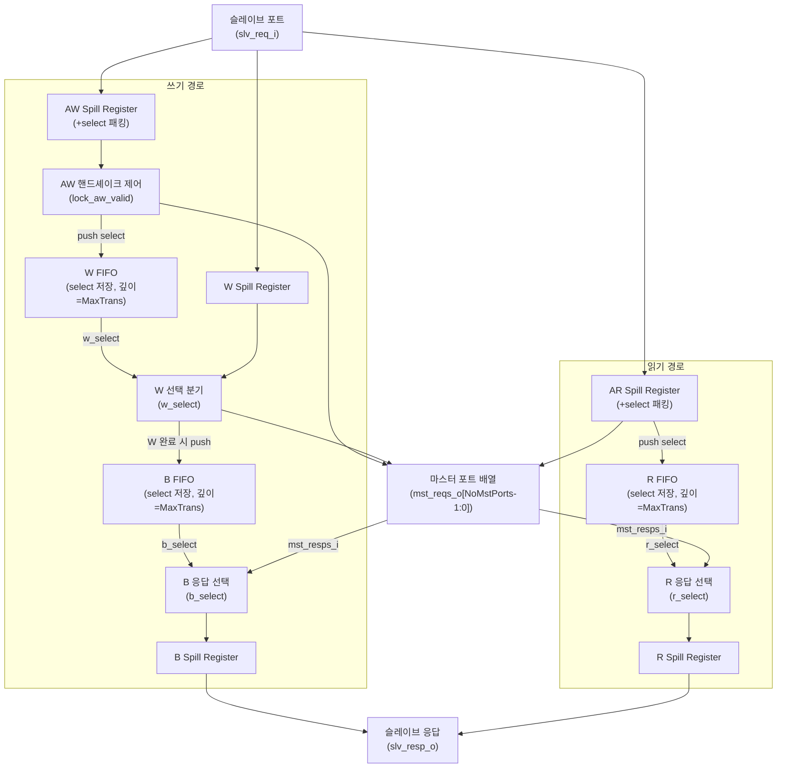

# axi_lite_demux

## 모듈 목적 및 개요

`axi_lite_demux`는 하나의 AXI4-Lite 슬레이브 포트에서 들어오는 요청을 여러 개의 마스터 포트 중 하나로 분기(demultiplex)하는 모듈입니다.

외부에서 제공되는 선택 신호(`slv_aw_select_i`, `slv_ar_select_i`)에 따라 쓰기(AW/W/B) 채널과 읽기(AR/R) 채널 각각을 독립적으로 대상 마스터 포트로 라우팅합니다. 선택 신호는 해당 AXI4-Lite 채널의 valid 신호가 활성화된 동안 안정적으로 유지되어야 합니다.

- `NoMstPorts == 1`인 퇴화(degenerate) 케이스에서는 단순히 슬레이브 포트와 마스터 포트를 직접 연결(spill register 경유)합니다.
- 일반 케이스에서는 FIFO를 이용해 in-flight 트랜잭션의 선택 정보를 추적하고, 응답 채널(B, R)이 올바른 슬레이브 포트로 반환되도록 보장합니다.

인터페이스 래퍼 모듈 `axi_lite_demux_intf`도 함께 제공됩니다.

---

## 파라미터 테이블

| 이름 | 타입 | 기본값 | 설명 |
|------|------|--------|------|
| `aw_chan_t` | type | `logic` | AXI4-Lite AW 채널 구조체 타입 |
| `w_chan_t` | type | `logic` | AXI4-Lite W 채널 구조체 타입 |
| `b_chan_t` | type | `logic` | AXI4-Lite B 채널 구조체 타입 |
| `ar_chan_t` | type | `logic` | AXI4-Lite AR 채널 구조체 타입 |
| `r_chan_t` | type | `logic` | AXI4-Lite R 채널 구조체 타입 |
| `axi_req_t` | type | `logic` | AXI4-Lite 요청 구조체 타입 |
| `axi_resp_t` | type | `logic` | AXI4-Lite 응답 구조체 타입 |
| `NoMstPorts` | `int unsigned` | `0` | 마스터 포트 수 (최소 1) |
| `MaxTrans` | `int unsigned` | `0` | 채널당 최대 동시 진행 트랜잭션 수 (FIFO 깊이) |
| `FallThrough` | `bit` | `1'b0` | FIFO 폴-스루(fall-through) 모드 활성화 여부 |
| `SpillAw` | `bit` | `1'b1` | 슬레이브 AW 채널에 1사이클 레이턴시 삽입 여부 |
| `SpillW` | `bit` | `1'b0` | 슬레이브 W 채널에 1사이클 레이턴시 삽입 여부 |
| `SpillB` | `bit` | `1'b0` | 슬레이브 B 채널에 1사이클 레이턴시 삽입 여부 |
| `SpillAr` | `bit` | `1'b1` | 슬레이브 AR 채널에 1사이클 레이턴시 삽입 여부 |
| `SpillR` | `bit` | `1'b0` | 슬레이브 R 채널에 1사이클 레이턴시 삽입 여부 |
| `select_t` | type | `logic[$clog2(NoMstPorts)-1:0]` | 선택 신호 타입 (자동 계산, 오버라이드 금지) |

---

## 포트 테이블

| 이름 | 방향 | 너비 | 설명 |
|------|------|------|------|
| `clk_i` | input | 1 | 클럭 (상승 에지 트리거) |
| `rst_ni` | input | 1 | 비동기 리셋 (Active Low) |
| `test_i` | input | 1 | 테스트 모드 활성화 신호 |
| `slv_req_i` | input | `axi_req_t` | 슬레이브 포트 AXI4-Lite 요청 입력 |
| `slv_aw_select_i` | input | `select_t` | AW 채널 목적지 마스터 포트 선택 신호 |
| `slv_ar_select_i` | input | `select_t` | AR 채널 목적지 마스터 포트 선택 신호 |
| `slv_resp_o` | output | `axi_resp_t` | 슬레이브 포트 AXI4-Lite 응답 출력 |
| `mst_reqs_o` | output | `axi_req_t [NoMstPorts-1:0]` | 마스터 포트 배열 AXI4-Lite 요청 출력 |
| `mst_resps_i` | input | `axi_resp_t [NoMstPorts-1:0]` | 마스터 포트 배열 AXI4-Lite 응답 입력 |

---

## 내부 동작 및 로직 설명

### 쓰기 경로 (AW → W → B)

1. **AW 채널**: `slv_aw_select_i`와 AW 채널 데이터를 묶어 spill register를 통과시킵니다. AW 핸드셰이크가 발생하면 선택 값을 **W FIFO**에 push합니다. `lock_aw_valid` 레지스터를 이용해, 마스터 포트가 아직 AW를 수락하지 않은 경우 valid를 유지합니다.

2. **W 채널**: W FIFO에서 꺼낸 선택 값(`w_select`)에 해당하는 마스터 포트에만 W valid를 전달합니다. W 트랜잭션 완료 시 선택 값을 **B FIFO**에 push합니다. B FIFO가 가득 차면 W 채널을 블록킹합니다.

3. **B 채널**: B FIFO의 선택 값(`b_select`)에 해당하는 마스터 포트의 B 응답을 슬레이브 포트로 전달합니다. B 핸드셰이크 완료 시 B FIFO에서 pop합니다.

### 읽기 경로 (AR → R)

1. **AR 채널**: `slv_ar_select_i`와 AR 채널 데이터를 묶어 spill register를 통과시킵니다. AR 핸드셰이크 발생 시 선택 값을 **R FIFO**에 push합니다. R FIFO가 가득 차면 AR 채널을 블록킹합니다.

2. **R 채널**: R FIFO의 선택 값(`r_select`)에 해당하는 마스터 포트의 R 응답을 슬레이브 포트로 전달합니다. R 핸드셰이크 완료 시 R FIFO에서 pop합니다.

### 시뮬레이션 검증 (Assertion)

- AW/AR 선택 신호가 `NoMstPorts` 범위 내에 있어야 합니다.
- valid가 활성화된 후 ready 없이 deassert되지 않아야 합니다.
- valid 활성 중 채널 데이터가 안정적으로 유지되어야 합니다.

---

## Mermaid 블록 다이어그램



---

## 의존성 모듈 목록

| 모듈 | 설명 |
|------|------|
| `spill_register` | 1사이클 레이턴시 삽입 레지스터 (common_cells) |
| `fifo_v3` | 선택 신호 저장용 FIFO (common_cells) |
| `axi_lite_demux_intf` | 인터페이스 래퍼 (동일 파일 내 정의) |

헤더 파일:
- `common_cells/registers.svh`
- `axi/assign.svh`
- `axi/typedef.svh`

---

## 사용 예시

```systemverilog
// 타입 정의
`AXI_LITE_TYPEDEF_AW_CHAN_T(aw_chan_t, logic [31:0])
`AXI_LITE_TYPEDEF_W_CHAN_T(w_chan_t, logic [31:0], logic [3:0])
`AXI_LITE_TYPEDEF_B_CHAN_T(b_chan_t)
`AXI_LITE_TYPEDEF_AR_CHAN_T(ar_chan_t, logic [31:0])
`AXI_LITE_TYPEDEF_R_CHAN_T(r_chan_t, logic [31:0])
`AXI_LITE_TYPEDEF_REQ_T(axi_req_t, aw_chan_t, w_chan_t, ar_chan_t)
`AXI_LITE_TYPEDEF_RESP_T(axi_resp_t, b_chan_t, r_chan_t)

// 3개 마스터 포트로 분기, 최대 4개 동시 트랜잭션
axi_lite_demux #(
  .aw_chan_t   ( aw_chan_t  ),
  .w_chan_t    ( w_chan_t   ),
  .b_chan_t    ( b_chan_t   ),
  .ar_chan_t   ( ar_chan_t  ),
  .r_chan_t    ( r_chan_t   ),
  .axi_req_t   ( axi_req_t ),
  .axi_resp_t  ( axi_resp_t),
  .NoMstPorts  ( 3         ),
  .MaxTrans    ( 4         ),
  .FallThrough ( 1'b0      ),
  .SpillAw     ( 1'b1      ),
  .SpillAr     ( 1'b1      )
) i_demux (
  .clk_i,
  .rst_ni,
  .test_i          ( 1'b0          ),
  .slv_req_i       ( slv_req       ),
  .slv_aw_select_i ( aw_select     ), // 0~2 범위의 값, AW valid 동안 안정적으로 유지
  .slv_ar_select_i ( ar_select     ), // 0~2 범위의 값, AR valid 동안 안정적으로 유지
  .slv_resp_o      ( slv_resp      ),
  .mst_reqs_o      ( mst_reqs      ),
  .mst_resps_i     ( mst_resps     )
);
```

> **주의**: `slv_aw_select_i`와 `slv_ar_select_i`는 각각 `aw_valid`와 `ar_valid`가 활성화된 동안 반드시 안정적으로 유지되어야 합니다. 선택 값은 반드시 `[0, NoMstPorts)` 범위 내에 있어야 합니다.
