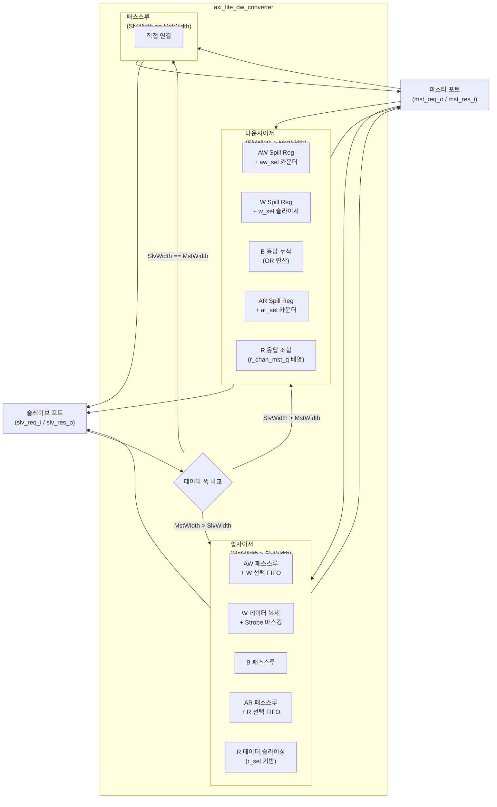

# axi_lite_dw_converter

## 모듈 목적 및 개요

`axi_lite_dw_converter`는 AXI4-Lite 버스의 데이터 폭(Data Width)을 변환하는 모듈입니다. 슬레이브 포트와 마스터 포트 간에 데이터 폭이 다를 경우 이를 투명하게 처리합니다.

동작 모드는 세 가지입니다:

| 모드 | 조건 | 설명 |
|------|------|------|
| **다운사이저(Downsizer)** | `AxiSlvPortDataWidth > AxiMstPortDataWidth` | 슬레이브의 넓은 트랜잭션을 마스터 포트에서 여러 번의 좁은 트랜잭션으로 분할 |
| **업사이저(Upsizer)** | `AxiSlvPortDataWidth < AxiMstPortDataWidth` | 슬레이브의 좁은 트랜잭션을 마스터 포트의 넓은 버스에 복제하여 전달 |
| **패스스루(Pass-Through)** | `AxiSlvPortDataWidth == AxiMstPortDataWidth` | 슬레이브 포트를 마스터 포트에 직접 연결 |

인터페이스 래퍼 모듈 `axi_lite_dw_converter_intf`도 함께 제공됩니다.

---

## 파라미터 테이블

| 이름 | 타입 | 기본값 | 설명 |
|------|------|--------|------|
| `AxiAddrWidth` | `int unsigned` | `0` | AXI4-Lite 주소 폭 (비트) |
| `AxiSlvPortDataWidth` | `int unsigned` | `0` | 슬레이브 포트 데이터 폭 (비트, 8 초과, 2의 거듭제곱) |
| `AxiMstPortDataWidth` | `int unsigned` | `0` | 마스터 포트 데이터 폭 (비트, 8 초과, 2의 거듭제곱) |
| `axi_lite_aw_t` | type | `logic` | AXI4-Lite AW 채널 구조체 타입 (양쪽 포트 공통) |
| `axi_lite_slv_w_t` | type | `logic` | 슬레이브 포트 W 채널 구조체 타입 |
| `axi_lite_mst_w_t` | type | `logic` | 마스터 포트 W 채널 구조체 타입 |
| `axi_lite_b_t` | type | `logic` | AXI4-Lite B 채널 구조체 타입 (양쪽 포트 공통) |
| `axi_lite_ar_t` | type | `logic` | AXI4-Lite AR 채널 구조체 타입 (양쪽 포트 공통) |
| `axi_lite_slv_r_t` | type | `logic` | 슬레이브 포트 R 채널 구조체 타입 |
| `axi_lite_mst_r_t` | type | `logic` | 마스터 포트 R 채널 구조체 타입 |
| `axi_lite_slv_req_t` | type | `logic` | 슬레이브 포트 요청 구조체 타입 |
| `axi_lite_slv_res_t` | type | `logic` | 슬레이브 포트 응답 구조체 타입 |
| `axi_lite_mst_req_t` | type | `logic` | 마스터 포트 요청 구조체 타입 |
| `axi_lite_mst_res_t` | type | `logic` | 마스터 포트 응답 구조체 타입 |

---

## 포트 테이블

| 이름 | 방향 | 너비 | 설명 |
|------|------|------|------|
| `clk_i` | input | 1 | 클럭 (상승 에지 트리거) |
| `rst_ni` | input | 1 | 비동기 리셋 (Active Low) |
| `slv_req_i` | input | `axi_lite_slv_req_t` | 슬레이브 포트 AXI4-Lite 요청 입력 |
| `slv_res_o` | output | `axi_lite_slv_res_t` | 슬레이브 포트 AXI4-Lite 응답 출력 |
| `mst_req_o` | output | `axi_lite_mst_req_t` | 마스터 포트 AXI4-Lite 요청 출력 |
| `mst_res_i` | input | `axi_lite_mst_res_t` | 마스터 포트 AXI4-Lite 응답 입력 |

---

## 내부 동작 및 로직 설명

### 다운사이저 모드 (`AxiSlvPortDataWidth > AxiMstPortDataWidth`)

`DownsizeFactor = AxiSlvPortDataWidth / AxiMstPortDataWidth` 횟수만큼 마스터 포트에서 트랜잭션을 생성합니다.

- **AW 채널**: spill register를 거친 후, `aw_sel_q` 카운터를 이용해 마스터 포트 주소를 정렬(aligned) 주소로 순차 발행합니다. `out_address()` 함수가 선택 인덱스에 따른 하위 어드레스 비트를 계산합니다.
- **W 채널**: spill register를 거친 후, `w_sel_q` 카운터를 이용해 슬레이브 W 데이터를 `AxiMstPortDataWidth` 단위로 슬라이싱하여 순차 전송합니다.
- **B 채널**: `DownsizeFactor`번의 B 응답을 수집하여 OR 연산으로 에러 응답을 누적한 뒤, 마지막 응답 시점에 슬레이브로 전달합니다.
- **AR 채널**: AW와 동일하게 주소를 순차 발행합니다.
- **R 채널**: `DownsizeFactor - 1`개의 이전 응답을 레지스터에 저장하고, 마지막 응답이 도착하면 전체 데이터를 조합하여 슬레이브로 전달합니다.

### 업사이저 모드 (`AxiMstPortDataWidth > AxiSlvPortDataWidth`)

- **AW 채널**: 슬레이브의 AW를 그대로 마스터로 전달하며, FIFO가 가득 찬 경우 블록킹합니다. AW 주소의 하위 비트에서 byte lane 선택 값(`aw_sel`)을 계산하여 FIFO에 저장합니다.
- **W 채널**: 데이터는 `UpsizeFactor`배로 복제하고, strobe는 `w_sel`에 따라 올바른 byte lane 위치에만 활성화합니다.
- **B 채널**: 그대로 패스스루합니다.
- **AR 채널**: AW와 동일 방식으로 처리하며, R lane 선택 값을 별도 FIFO에 저장합니다.
- **R 채널**: `r_sel`에 따라 마스터 R 데이터의 해당 byte lane 구간만 슬레이브로 전달합니다.

### 패스스루 모드

단순 assign 연결: `mst_req_o = slv_req_i`, `slv_res_o = mst_res_i`.

---

## Mermaid 블록 다이어그램



---

## 의존성 모듈 목록

| 모듈 | 설명 |
|------|------|
| `spill_register` | 1사이클 레이턴시 삽입 레지스터 (common_cells) |
| `fifo_v3` | 업사이저의 lane 선택 신호 저장용 FIFO (common_cells) |
| `axi_lite_dw_converter_intf` | 인터페이스 래퍼 (동일 파일 내 정의) |

헤더 파일:
- `common_cells/registers.svh`
- `axi/typedef.svh`
- `axi/assign.svh`

---

## 사용 예시

### 64비트 → 32비트 다운사이저

```systemverilog
// 타입 정의
typedef logic [31:0] addr_t;
typedef logic [63:0] data_slv_t;
typedef logic  [7:0] strb_slv_t;
typedef logic [31:0] data_mst_t;
typedef logic  [3:0] strb_mst_t;
`AXI_LITE_TYPEDEF_AW_CHAN_T(aw_t, addr_t)
`AXI_LITE_TYPEDEF_W_CHAN_T(w_slv_t, data_slv_t, strb_slv_t)
`AXI_LITE_TYPEDEF_W_CHAN_T(w_mst_t, data_mst_t, strb_mst_t)
`AXI_LITE_TYPEDEF_B_CHAN_T(b_t)
`AXI_LITE_TYPEDEF_AR_CHAN_T(ar_t, addr_t)
`AXI_LITE_TYPEDEF_R_CHAN_T(r_slv_t, data_slv_t)
`AXI_LITE_TYPEDEF_R_CHAN_T(r_mst_t, data_mst_t)
`AXI_LITE_TYPEDEF_REQ_T(req_slv_t, aw_t, w_slv_t, ar_t)
`AXI_LITE_TYPEDEF_RESP_T(res_slv_t, b_t, r_slv_t)
`AXI_LITE_TYPEDEF_REQ_T(req_mst_t, aw_t, w_mst_t, ar_t)
`AXI_LITE_TYPEDEF_RESP_T(res_mst_t, b_t, r_mst_t)

axi_lite_dw_converter #(
  .AxiAddrWidth        ( 32 ),
  .AxiSlvPortDataWidth ( 64 ),
  .AxiMstPortDataWidth ( 32 ),
  .axi_lite_aw_t       ( aw_t     ),
  .axi_lite_slv_w_t    ( w_slv_t  ),
  .axi_lite_mst_w_t    ( w_mst_t  ),
  .axi_lite_b_t        ( b_t      ),
  .axi_lite_ar_t       ( ar_t     ),
  .axi_lite_slv_r_t    ( r_slv_t  ),
  .axi_lite_mst_r_t    ( r_mst_t  ),
  .axi_lite_slv_req_t  ( req_slv_t),
  .axi_lite_slv_res_t  ( res_slv_t),
  .axi_lite_mst_req_t  ( req_mst_t),
  .axi_lite_mst_res_t  ( res_mst_t)
) i_dw_converter (
  .clk_i,
  .rst_ni,
  .slv_req_i ( slv_req ),
  .slv_res_o ( slv_res ),
  .mst_req_o ( mst_req ),
  .mst_res_i ( mst_res )
);
```

### 인터페이스 래퍼 사용 (32비트 → 64비트 업사이저)

```systemverilog
axi_lite_dw_converter_intf #(
  .AXI_ADDR_WIDTH          ( 32 ),
  .AXI_SLV_PORT_DATA_WIDTH ( 32 ),
  .AXI_MST_PORT_DATA_WIDTH ( 64 )
) i_dw_converter (
  .clk_i,
  .rst_ni,
  .slv  ( slv_if ), // AXI_LITE.Slave
  .mst  ( mst_if )  // AXI_LITE.Master
);
```

> **주의**: `AxiSlvPortDataWidth`와 `AxiMstPortDataWidth`는 각각 8비트 초과이고 2의 거듭제곱이어야 합니다.
