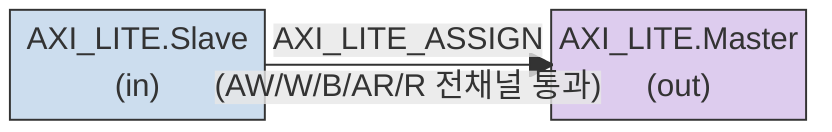

# axi_lite_join.sv 문서

## 모듈 개요 및 기능

`axi_lite_join_intf`는 두 개의 AXI4-Lite 인터페이스(슬레이브 포트와 마스터 포트)를 단순히 연결(wire-through)하는 커넥터 모듈이다. 내부 로직 없이 `AXI_LITE_ASSIGN` 매크로를 통해 모든 채널 신호를 그대로 통과시킨다. 주소 폭과 데이터 폭이 입출력 인터페이스 간에 일치하는지 어서션으로 검증한다.

---

## Mermaid 블록 다이어그램



---

## 파라미터 테이블

이 모듈은 별도의 파라미터를 선언하지 않는다. 주소 폭(`AXI_ADDR_WIDTH`)과 데이터 폭(`AXI_DATA_WIDTH`)은 인터페이스 자체에 내장되어 있으며, 어서션을 통해 입출력 일치를 보장한다.

| 이름 | 타입 | 기본값 | 설명 |
|------|------|--------|------|
| (없음) | — | — | 인터페이스 파라미터로 폭 정보 보유 |

---

## 포트 테이블

| 이름 | 방향 | 폭 | 설명 |
|------|------|----|------|
| `in` | Slave (입력) | AXI4-Lite 인터페이스 전체 | AXI4-Lite 슬레이브 포트 (AW, W, B, AR, R 채널) |
| `out` | Master (출력) | AXI4-Lite 인터페이스 전체 | AXI4-Lite 마스터 포트 (AW, W, B, AR, R 채널) |

---

## 내부 아키텍처 설명

내부 구현은 단일 매크로 호출로 구성된다.

```
`AXI_LITE_ASSIGN(out, in)
```

이 매크로는 AXI4-Lite의 다섯 채널(AW, W, B, AR, R) 모든 신호와 핸드셰이크(valid/ready)를 `in`에서 `out`으로 직접 연결한다. 별도의 레지스터, FSM, FIFO 없이 순수 조합 논리(wire)로만 구성된다.

**시뮬레이션 전용 어서션:**
- `in.AXI_ADDR_WIDTH == out.AXI_ADDR_WIDTH`: 주소 폭 일치 확인
- `in.AXI_DATA_WIDTH == out.AXI_DATA_WIDTH`: 데이터 폭 일치 확인

---

## 인스턴스화하는 서브모듈 목록

없음 (서브모듈 인스턴스 없음)

---

## 타이밍/레이턴시 특성

| 항목 | 값 |
|------|-----|
| 레이턴시 | 0 사이클 (순수 wire 연결) |
| 클록 도메인 | 단일 클록 도메인 없음 (조합 논리만 존재) |
| 파이프라인 단계 | 없음 |

---

## 특수 동작

- 클록 및 리셋 신호가 존재하지 않는 완전한 조합 논리 모듈이다.
- `VERILATOR` 환경이나 합성 시에는 어서션 블록이 제거된다(`pragma translate_off`).
- AXI4-Lite 인터페이스 폭 불일치 시 시뮬레이션에서 `$fatal`을 발생시킨다.
- 이 모듈의 주 용도는 인터페이스 간 단순 조인(이름 변경, 계층 연결)이다.
