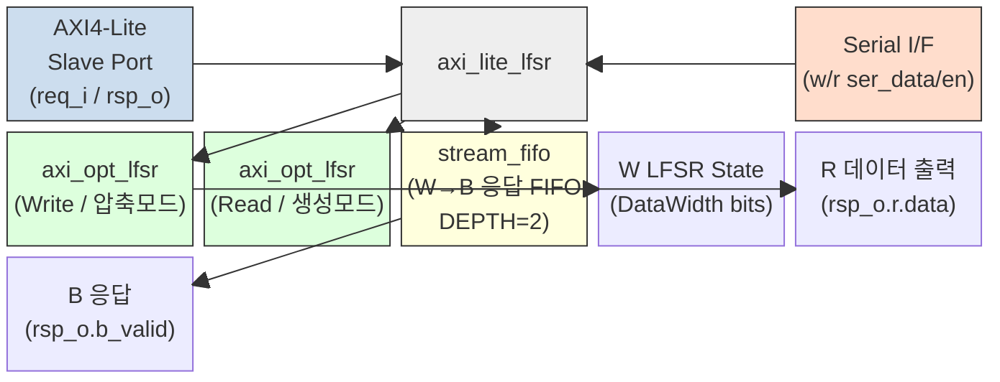

# axi_lite_lfsr.sv 문서

## 모듈 개요 및 기능

이 파일에는 두 개의 모듈이 정의되어 있다.

- **`axi_lite_lfsr`**: AXI4-Lite 슬레이브 디바이스로, 읽기 요청에 대해 LFSR(Linear Feedback Shift Register) 기반 의사난수(pseudo-random) 데이터를 응답한다. 쓰기 채널은 LFSR 상태를 압축(compress)하는 데 사용하며, 직렬 인터페이스를 통해 LFSR 초기 상태를 로드하거나 읽어낼 수 있다.
- **`axi_opt_lfsr`**: XNOR 탭 기반 LFSR 시프트 레지스터 코어. 압축 모드(입력 데이터를 XOR하여 상태 압축), 생성 모드(의사난수 생성), 직렬 접근 모드(초기 상태 로드/추출)를 지원한다.

---

## Mermaid 블록 다이어그램

---

## 파라미터 테이블

### `axi_lite_lfsr`

| 이름 | 타입 | 기본값 | 설명 |
|------|------|--------|------|
| `DataWidth` | `int unsigned` | `32'd0` | AXI4-Lite 데이터 폭 (비트 단위) |
| `axi_lite_req_t` | `type` | `logic` | AXI4-Lite 요청 구조체 타입 |
| `axi_lite_rsp_t` | `type` | `logic` | AXI4-Lite 응답 구조체 타입 |

### `axi_opt_lfsr`

| 이름 | 타입 | 기본값 | 설명 |
|------|------|--------|------|
| `Width` | `int unsigned` | `32'd0` | LFSR 폭 (8/16/32/64/128/256/512/1024 비트 지원) |

---

## 포트 테이블

### `axi_lite_lfsr` 포트

| 이름 | 방향 | 폭 | 설명 |
|------|------|----|------|
| `clk_i` | 입력 | 1 | 상승 엣지 클록 |
| `rst_ni` | 입력 | 1 | 액티브-로우 비동기 리셋 |
| `testmode_i` | 입력 | 1 | 테스트 모드 활성화 |
| `req_i` | 입력 | `axi_lite_req_t` | AXI4-Lite 요청 구조체 |
| `rsp_o` | 출력 | `axi_lite_rsp_t` | AXI4-Lite 응답 구조체 |
| `w_ser_data_i` | 입력 | 1 | 쓰기 LFSR 직렬 데이터 입력 |
| `w_ser_data_o` | 출력 | 1 | 쓰기 LFSR 직렬 데이터 출력 |
| `w_ser_en_i` | 입력 | 1 | 쓰기 LFSR 직렬 시프트 활성화 |
| `r_ser_data_i` | 입력 | 1 | 읽기 LFSR 직렬 데이터 입력 |
| `r_ser_data_o` | 출력 | 1 | 읽기 LFSR 직렬 데이터 출력 |
| `r_ser_en_i` | 입력 | 1 | 읽기 LFSR 직렬 시프트 활성화 |

### `axi_opt_lfsr` 포트

| 이름 | 방향 | 폭 | 설명 |
|------|------|----|------|
| `clk_i` | 입력 | 1 | 상승 엣지 클록 |
| `rst_ni` | 입력 | 1 | 액티브-로우 비동기 리셋 |
| `en_i` | 입력 | 1 | LFSR 클록 인에이블 |
| `ser_data_i` | 입력 | 1 | 직렬 입력 데이터 (초기 상태 로드) |
| `ser_data_o` | 출력 | 1 | 직렬 출력 데이터 (`reg_q[0]`) |
| `ser_en_i` | 입력 | 1 | 직렬 접근 모드 활성화 |
| `inp_en_i` | 입력 | 1 | 압축 모드 활성화 (`data_i`를 LFSR에 XOR) |
| `data_i` | 입력 | `Width` | 압축 모드용 병렬 입력 데이터 |
| `data_o` | 출력 | `Width` | LFSR 현재 상태 출력 |

---

## 내부 아키텍처 설명

### `axi_lite_lfsr` 채널별 동작

**AW 채널:** `w_ser_en_i`가 비활성화일 때만 `aw_ready`를 어서트. 실제 주소는 무시된다.

**W 채널:** 쓰기 데이터를 LFSR에 압축. 스트로브(`strb`) 비트가 0인 바이트는 현재 LFSR 상태 값을 유지하고, 1인 바이트만 입력 데이터로 대체한다. `stream_fifo`를 통해 W 트랜잭션당 하나의 B 응답을 생성한다.

**B 채널:** 깊이 2의 `stream_fifo`가 W 트랜잭션 수신 시 엔트리를 추가하고, `b_ready` 시 제거하는 방식으로 응답을 생성한다. 응답 코드는 항상 `RESP_OKAY`.

**AR 채널:** `w_ser_en_i`가 비활성화일 때만 `ar_ready`를 어서트. 주소는 무시된다.

**R 채널:** 읽기 LFSR이 생성하는 의사난수 데이터를 반환. `r_ser_en_i` 활성 중에는 `r_valid`를 디어서트하여 트랜잭션 차단.

### `axi_opt_lfsr` 동작 모드

| 모드 | 조건 | 동작 |
|------|------|------|
| 직렬 접근 | `ser_en_i=1` | `reg_d[Width-1] = ser_data_i` (헤드에 직렬 삽입) |
| 압축 모드 | `inp_en_i=1, ser_en_i=0` | `reg_d[i] = reg_q[i+1] ^ data_i[i]` |
| 생성 모드 | `inp_en_i=0, ser_en_i=0` | `reg_d[i] = reg_q[i+1]`, 헤드는 XNOR 피드백 |

XNOR 탭은 Width에 따라 룩업 테이블로 결정된다(예: Width=32일 때 탭: {32,30,26,25}).

---

## 인스턴스화하는 서브모듈 목록

| 인스턴스명 | 모듈명 | 역할 |
|-----------|--------|------|
| `i_axi_opt_lfsr_w` | `axi_opt_lfsr` | 쓰기 채널 LFSR (압축 모드) |
| `i_axi_opt_lfsr_r` | `axi_opt_lfsr` | 읽기 채널 LFSR (생성 모드) |
| `i_stream_fifo_w_b` | `stream_fifo` | W→B 응답 FIFO (깊이 2, 폭 1비트) |

---

## 타이밍/레이턴시 특성

| 항목 | 값 |
|------|-----|
| 클록 도메인 | 단일 (`clk_i`) |
| W→B 레이턴시 | 최소 1 사이클 (stream_fifo non-fall-through) |
| AR→R 레이턴시 | 0 사이클 (조합 논리 직접 연결) |
| LFSR 갱신 | W 핸드셰이크 완료 시 매 사이클 갱신 |

---

## 특수 동작

- **직렬 모드 우선**: `w_ser_en_i` 또는 `r_ser_en_i`가 활성화된 동안 AXI 트랜잭션이 블로킹된다(`aw_ready`, `ar_ready`, `w_ready`, `r_valid` 모두 비활성).
- **스트로브 마스킹**: 쓰기 스트로브가 0인 바이트는 LFSR 현재 상태를 유지하여 부분 압축을 지원한다.
- **지원 Width**: 8, 16, 32, 64, 128, 256, 512, 1024 비트. 그 외 값은 `default: 'x` 처리로 합성 시 오류가 될 수 있다.
- **리셋 값**: LFSR 레지스터는 리셋 시 모두 `'1`로 초기화된다 (`FFL` 매크로의 리셋 값).
