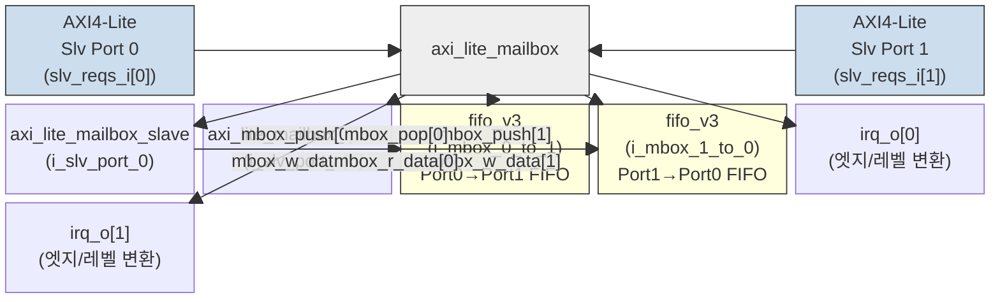

# axi_lite_mailbox.sv 문서

## 모듈 개요 및 기능

`axi_lite_mailbox`는 두 개의 독립적인 AXI4-Lite 슬레이브 포트를 가지는 양방향 메일박스(mailbox) IP이다. 포트 0과 포트 1 사이에 각각 하나씩, 총 두 개의 FIFO를 통해 데이터를 교환한다. 각 포트는 메모리 맵 레지스터를 통해 메일박스를 제어하고, 인터럽트 요청(IRQ)을 생성한다.

주요 기능:
- 포트 0 → 포트 1 방향, 포트 1 → 포트 0 방향의 독립적인 FIFO 쌍
- FIFO 깊이, 인터럽트 트리거 방식(엣지/레벨), 극성(Active-High/Low) 파라미터 설정 가능
- 각 포트별 10개의 메모리 맵 제어 레지스터
- 쓰기/읽기 임계값 기반 인터럽트 생성

---

## Mermaid 블록 다이어그램

---

## 파라미터 테이블

### `axi_lite_mailbox`

| 이름 | 타입 | 기본값 | 설명 |
|------|------|--------|------|
| `MailboxDepth` | `int unsigned` | `32'd0` | 메일박스 FIFO 깊이 (최소 2 이상) |
| `IrqEdgeTrig` | `bit unsigned` | `1'b0` | 1: 엣지 트리거 IRQ, 0: 레벨 트리거 IRQ |
| `IrqActHigh` | `bit unsigned` | `1'b1` | 1: Active-High IRQ, 0: Active-Low IRQ |
| `AxiAddrWidth` | `int unsigned` | `32'd0` | AXI4-Lite 주소 폭 (비트) |
| `AxiDataWidth` | `int unsigned` | `32'd0` | AXI4-Lite 데이터 폭 (비트) |
| `req_lite_t` | `type` | `logic` | AXI4-Lite 요청 구조체 타입 |
| `resp_lite_t` | `type` | `logic` | AXI4-Lite 응답 구조체 타입 |
| `addr_t` | `type` | `logic [AxiAddrWidth-1:0]` | 주소 타입 (의존 파라미터, 오버라이드 금지) |

---

## 포트 테이블

### `axi_lite_mailbox` 포트

| 이름 | 방향 | 폭 | 설명 |
|------|------|----|------|
| `clk_i` | 입력 | 1 | 클록 |
| `rst_ni` | 입력 | 1 | 비동기 리셋 (액티브 로우) |
| `test_i` | 입력 | 1 | 테스트 모드 활성화 |
| `slv_reqs_i[1:0]` | 입력 | `req_lite_t[2]` | AXI4-Lite 슬레이브 요청 (포트 0/1) |
| `slv_resps_o[1:0]` | 출력 | `resp_lite_t[2]` | AXI4-Lite 슬레이브 응답 (포트 0/1) |
| `irq_o[1:0]` | 출력 | 2 | 인터럽트 출력 (각 포트별 1비트) |
| `base_addr_i[1:0]` | 입력 | `addr_t[2]` | 각 포트의 레지스터 맵 베이스 주소 |

---

## 내부 아키텍처 설명

### 레지스터 맵 (`axi_lite_mailbox_slave` 내부)

각 슬레이브 포트는 `base_addr_i`로부터 데이터 폭(바이트 단위) 간격으로 10개의 레지스터를 갖는다.

| 오프셋 | 이름 | 접근 | 설명 |
|--------|------|------|------|
| +0 | `MBOXW` | WO (읽으면 0xFEEDC0DE) | 메일박스 쓰기: FIFO에 데이터 푸시 |
| +1×(폭/8) | `MBOXR` | RO | 메일박스 읽기: FIFO에서 데이터 팝. 비어있으면 0xFEEDDEAD + SLVERR |
| +2×(폭/8) | `STATUS` | RO | {RIRQT초과, WIRQT초과, FIFO풀, FIFO빔} |
| +3×(폭/8) | `ERROR` | RO | 에러 레지스터 (읽으면 클리어) |
| +4×(폭/8) | `WIRQT` | RW | 쓰기 인터럽트 임계값 |
| +5×(폭/8) | `RIRQT` | RW | 읽기 인터럽트 임계값 |
| +6×(폭/8) | `IRQS` | RW | IRQ 상태 (쓰기로 개별 비트 클리어) |
| +7×(폭/8) | `IRQEN` | RW | IRQ 활성화 마스크 |
| +8×(폭/8) | `IRQP` | RO | IRQ 보류 (`IRQS & IRQEN`) |
| +9×(폭/8) | `CTRL` | WO | FIFO 플러시 제어 |

### 인터럽트 생성 로직

`IRQS` 비트 구성:
- `[0]`: 쓰기 임계값 초과 IRQ
- `[1]`: 읽기 임계값 초과 IRQ
- `[2]`: 에러 IRQ (빈 FIFO 읽기 또는 꽉 찬 FIFO 쓰기)

`irq_o[i] = |(IRQS & IRQEN)` (레벨 트리거 시)

엣지 트리거 모드(`IrqEdgeTrig=1`)에서는 `FFLARN` 레지스터를 통해 IRQ 상태의 상승 엣지 검출 시에만 단일 사이클 펄스 생성.

### B/R 채널 타이밍

`axi_lite_mailbox_slave`는 B 채널과 R 채널에 각각 `spill_register`를 사용하여 슬레이브 포트의 입력→출력 조합 경로를 차단한다.

---

## 인스턴스화하는 서브모듈 목록

| 인스턴스명 | 모듈명 | 역할 |
|-----------|--------|------|
| `i_slv_port_0` | `axi_lite_mailbox_slave` | 포트 0 AXI-Lite 슬레이브 인터페이스 및 레지스터 |
| `i_slv_port_1` | `axi_lite_mailbox_slave` | 포트 1 AXI-Lite 슬레이브 인터페이스 및 레지스터 |
| `i_mbox_0_to_1` | `fifo_v3` | 포트 0→1 방향 데이터 FIFO |
| `i_mbox_1_to_0` | `fifo_v3` | 포트 1→0 방향 데이터 FIFO |

`axi_lite_mailbox_slave` 내부:
| 인스턴스명 | 모듈명 | 역할 |
|-----------|--------|------|
| `i_waddr_decode` | `addr_decode` | AW 채널 주소 디코더 |
| `i_raddr_decode` | `addr_decode` | AR 채널 주소 디코더 |
| `i_b_chan_outp` | `spill_register` | B 채널 출력 스필 레지스터 |
| `i_r_chan_outp` | `spill_register` | R 채널 출력 스필 레지스터 |

---

## 타이밍/레이턴시 특성

| 항목 | 값 |
|------|-----|
| 클록 도메인 | 단일 (`clk_i`) |
| 쓰기 응답(B) 레이턴시 | 1 사이클 (spill_register) |
| 읽기 응답(R) 레이턴시 | 1 사이클 (spill_register) |
| FIFO non-fall-through | 인큐 다음 사이클부터 dequeue 가능 |

---

## 특수 동작

- **크로스 포트 플러시**: CTRL 레지스터를 통해 자신 포트의 쓰기 FIFO 또는 상대 포트의 읽기 FIFO를 플러시할 수 있다. FIFO 플러시 신호는 OR 결합된다(`w_mbox_flush[0] | r_mbox_flush[1]`).
- **임계값 클램핑**: WIRQT, RIRQT가 `MailboxDepth` 이상이면 `MailboxDepth - 1`로 자동 클램핑.
- **FIFO usage MSB**: `mbox_usage`의 최상위 비트에 FIFO full 플래그를 연결하여 임계값 비교 시 오버플로 방지.
- **인터페이스 래퍼**: `axi_lite_mailbox_intf`는 SystemVerilog 인터페이스 포트를 사용하는 래퍼 모듈이다.
