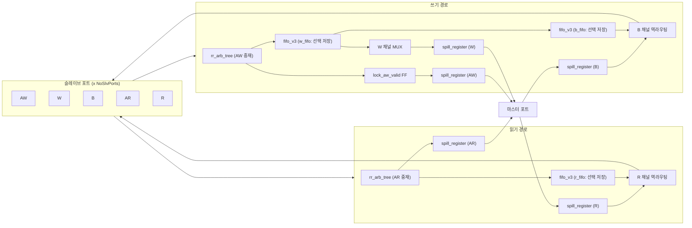

# axi_lite_mux.sv

## 모듈 개요 및 기능

`axi_lite_mux`는 여러 개의 AXI4-Lite 슬레이브 포트를 하나의 마스터 포트로 다중화하는 멀티플렉서 모듈이다. 중재(arbitration)는 라운드 로빈(Round-Robin) 방식으로 수행되며, 응답은 요청 순서대로 원래 슬레이브 포트로 역라우팅된다. AW/AR 채널에 독립적인 라운드 로빈 중재 트리를 두고, W/B/R 채널은 FIFO를 통해 선택 정보를 전달하여 채널 간 독립성을 유지한다.

`NoSlvPorts == 1`인 경우에는 단순 스필 레지스터(spill register) 패스스루로 처리되며, 실제 중재 로직은 `NoSlvPorts > 1`인 경우에만 생성된다.

인터페이스 래퍼 모듈 `axi_lite_mux_intf`도 동일 파일에 포함되어 있다.

---

## Mermaid 블록 다이어그램

```mermaid
block-beta
  columns 5

  slv0["slv_reqs_i[0]"] space:1 block:mux["axi_lite_mux"]:3 space:1 mst["mst_req_o"]
  slv1["slv_reqs_i[1]"] space:1 block:internal:3 space:1 mst_resp["mst_resp_i"]
  slvN["slv_reqs_i[N-1]"] space:1 space:1 space:1 space:1

  block:internal:3
    rr_aw["rr_arb_tree (AW)"]
    w_fifo["fifo_v3 (W Select)"]
    b_fifo["fifo_v3 (B Select)"]
    rr_ar["rr_arb_tree (AR)"]
    r_fifo["fifo_v3 (R Select)"]
    spill_aw["spill_register (AW)"]
    spill_w["spill_register (W)"]
    spill_b["spill_register (B)"]
    spill_ar["spill_register (AR)"]
    spill_r["spill_register (R)"]
  end
```



---

## 파라미터 테이블

| 이름 | 타입 | 기본값 | 설명 |
|---|---|---|---|
| `aw_chan_t` | type | `logic` | AXI4-Lite AW 채널 타입 |
| `w_chan_t` | type | `logic` | AXI4-Lite W 채널 타입 |
| `b_chan_t` | type | `logic` | AXI4-Lite B 채널 타입 |
| `ar_chan_t` | type | `logic` | AXI4-Lite AR 채널 타입 |
| `r_chan_t` | type | `logic` | AXI4-Lite R 채널 타입 |
| `axi_req_t` | type | `logic` | AXI4-Lite 요청 구조체 타입 |
| `axi_resp_t` | type | `logic` | AXI4-Lite 응답 구조체 타입 |
| `NoSlvPorts` | `int unsigned` | `0` | 슬레이브 포트 수 (최소 1) |
| `MaxTrans` | `int unsigned` | `0` | 포트당 최대 미처리 트랜잭션 수 (FIFO 깊이) |
| `FallThrough` | `bit` | `1'b0` | 1이면 FIFO가 fall-through 모드 (순수 조합 경로) |
| `SpillAw` | `bit` | `1'b1` | AW 마스터 포트에 스필 레지스터 삽입 여부 |
| `SpillW` | `bit` | `1'b0` | W 마스터 포트에 스필 레지스터 삽입 여부 |
| `SpillB` | `bit` | `1'b0` | B 마스터 포트에 스필 레지스터 삽입 여부 |
| `SpillAr` | `bit` | `1'b1` | AR 마스터 포트에 스필 레지스터 삽입 여부 |
| `SpillR` | `bit` | `1'b0` | R 마스터 포트에 스필 레지스터 삽입 여부 |

---

## 포트 테이블

| 이름 | 방향 | 폭 | 설명 |
|---|---|---|---|
| `clk_i` | input | 1 | 클럭 (상승 에지) |
| `rst_ni` | input | 1 | 비동기 리셋 (활성 Low) |
| `test_i` | input | 1 | 테스트 모드 활성화 |
| `slv_reqs_i` | input | `[NoSlvPorts-1:0]` | 슬레이브 포트 요청 배열 |
| `slv_resps_o` | output | `[NoSlvPorts-1:0]` | 슬레이브 포트 응답 배열 |
| `mst_req_o` | output | 1 | 마스터 포트 요청 |
| `mst_resp_i` | input | 1 | 마스터 포트 응답 |

---

## 내부 아키텍처 설명

### NoSlvPorts == 1 (단일 포트 패스스루)

`gen_no_mux` 블록이 생성되어 각 채널(AW, W, B, AR, R)에 대해 `spill_register`만 삽입한다. 중재 로직 없이 직접 연결된다.

### NoSlvPorts > 1 (실제 다중화)

**쓰기 경로:**

1. **AW 채널 중재:** `rr_arb_tree`가 모든 슬레이브 포트의 AW 채널을 라운드 로빈으로 중재한다. 중재 결과(포트 인덱스 `aw_select`)는 `w_fifo`에 푸시된다.
2. **AW Valid 잠금:** 마스터 포트가 AW를 수락하지 않는 경우, `lock_aw_valid_q` FF가 valid를 잠그고 `w_fifo` 중복 푸시를 방지한다.
3. **W 채널:** `w_fifo`에서 꺼낸 `w_select`를 기반으로 적절한 슬레이브 포트의 W 채널을 선택하여 마스터로 전달한다. W 트랜잭션 완료 시 `b_fifo`에 선택 정보를 저장한다.
4. **B 채널 역라우팅:** `b_fifo`에서 꺼낸 `b_select`에 해당하는 슬레이브 포트로만 B 채널 valid를 전달한다.

**읽기 경로:**

1. **AR 채널 중재:** `rr_arb_tree`가 AR 채널을 중재하고, 선택 인덱스를 `r_fifo`에 저장한다.
2. **R 채널 역라우팅:** `r_fifo`에서 꺼낸 `r_select`에 해당하는 슬레이브 포트로만 R 채널 valid를 전달한다.

모든 채널에 `spill_register`를 선택적으로 삽입하여 타이밍 클로저를 돕는다.

---

## 인스턴스화하는 서브모듈

| 서브모듈 | 인스턴스명 | 수량 | 역할 |
|---|---|---|---|
| `rr_arb_tree` | `i_aw_arbiter` | 1 | AW 채널 라운드 로빈 중재 |
| `rr_arb_tree` | `i_ar_arbiter` | 1 | AR 채널 라운드 로빈 중재 |
| `fifo_v3` | `i_w_fifo` | 1 | AW 선택 정보 저장 (W 채널용) |
| `fifo_v3` | `i_b_fifo` | 1 | W 선택 정보 저장 (B 채널 역라우팅용) |
| `fifo_v3` | `i_r_fifo` | 1 | AR 선택 정보 저장 (R 채널 역라우팅용) |
| `spill_register` | `i_aw_spill_reg` | 1 | AW 채널 출력 파이프라인 레지스터 |
| `spill_register` | `i_w_spill_reg` | 1 | W 채널 출력 파이프라인 레지스터 |
| `spill_register` | `i_b_spill_reg` | 1 | B 채널 입력 파이프라인 레지스터 |
| `spill_register` | `i_ar_spill_reg` | 1 | AR 채널 출력 파이프라인 레지스터 |
| `spill_register` | `i_r_spill_reg` | 1 | R 채널 입력 파이프라인 레지스터 |

---

## 타이밍/레이턴시 특성

| 조건 | 레이턴시 |
|---|---|
| `FallThrough = 1` | AW→W, AR→R 경로가 0사이클 통과 가능 (FIFO fall-through) |
| `FallThrough = 0` | FIFO에 1사이클 레이턴시 추가 |
| `SpillAw = 1` (기본값) | AW 채널에 1사이클 레이턴시 추가 |
| `SpillAr = 1` (기본값) | AR 채널에 1사이클 레이턴시 추가 |
| `SpillW/B/R = 0` (기본값) | W, B, R 채널에는 추가 레이턴시 없음 |
| `NoSlvPorts = 1` | 각 Spill 파라미터에 따라 채널별 0 또는 1사이클 레이턴시 |

최악의 경우(SpillAw=1, FallThrough=0): 쓰기 주소(AW) 경로에 최소 2사이클 레이턴시 발생. `MaxTrans` 개수 초과 시 추가 백프레셔(backpressure)로 인한 지연 발생 가능.
