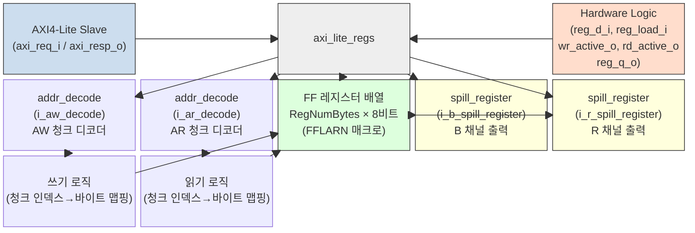

# axi_lite_regs.sv 문서

## 모듈 개요 및 기능

`axi_lite_regs`는 AXI4-Lite 슬레이브 인터페이스를 통해 읽기/쓰기 가능한 레지스터 배열을 제공한다. 레지스터는 바이트(8비트) 단위로 관리되며, 두 가지 접근 방식을 지원한다.

1. **AXI4-Lite 포트**: 메모리 맵 읽기/쓰기
2. **직접 하드웨어 포트**: `reg_d_i`/`reg_load_i`로 로직에서 직접 로드, `reg_q_o`로 현재 값 출력

주요 기능:
- 개별 바이트 수준의 읽기 전용(`AxiReadOnly`) 설정
- 특권(privileged) 및 보안(secure) 접근만 허용하는 보호 기능(`PrivProtOnly`, `SecuProtOnly`)
- AXI 쓰기와 직접 로드 간 충돌 시 AXI 쓰기 스톨(stall)
- 리셋 값 파라미터 설정 (`RegRstVal`)

---

## Mermaid 블록 다이어그램



---

## 파라미터 테이블

| 이름 | 타입 | 기본값 | 설명 |
|------|------|--------|------|
| `RegNumBytes` | `int unsigned` | `32'd0` | 레지스터 필드 총 바이트 수 |
| `AxiAddrWidth` | `int unsigned` | `32'd0` | AXI4-Lite 주소 폭 (최소 `$clog2(RegNumBytes)`) |
| `AxiDataWidth` | `int unsigned` | `32'd0` | AXI4-Lite 데이터 폭 |
| `PrivProtOnly` | `bit` | `1'b0` | 1: `AxProt[0]`이 설정된 특권 접근만 허용 |
| `SecuProtOnly` | `bit` | `1'b0` | 1: `AxProt[1]`이 설정된 보안 접근만 허용 |
| `AxiReadOnly` | `logic [RegNumBytes-1:0]` | 전부 0 | 비트별 AXI 쓰기 금지 마스크 (1=읽기 전용) |
| `byte_t` | `type` | `logic [7:0]` | 바이트 타입 (오버라이드 금지) |
| `RegRstVal` | `byte_t [RegNumBytes-1:0]` | 전부 `8'h00` | 각 바이트의 리셋 초기값 |
| `req_lite_t` | `type` | `logic` | AXI4-Lite 요청 구조체 타입 |
| `resp_lite_t` | `type` | `logic` | AXI4-Lite 응답 구조체 타입 |

---

## 포트 테이블

| 이름 | 방향 | 폭 | 설명 |
|------|------|----|------|
| `clk_i` | 입력 | 1 | 상승 엣지 클록 |
| `rst_ni` | 입력 | 1 | 비동기 리셋 (액티브 로우) |
| `axi_req_i` | 입력 | `req_lite_t` | AXI4-Lite 슬레이브 요청 |
| `axi_resp_o` | 출력 | `resp_lite_t` | AXI4-Lite 슬레이브 응답 |
| `wr_active_o` | 출력 | `RegNumBytes` | 해당 사이클에 AXI가 쓰는 바이트 인덱스 마스크 (읽기 전용 포함) |
| `rd_active_o` | 출력 | `RegNumBytes` | 해당 사이클에 AXI가 읽는 바이트 인덱스 마스크 |
| `reg_d_i` | 입력 | `byte_t [RegNumBytes-1:0]` | 하드웨어에서 직접 로드할 바이트 값 |
| `reg_load_i` | 입력 | `RegNumBytes` | 각 바이트의 직접 로드 활성화 비트 |
| `reg_q_o` | 출력 | `byte_t [RegNumBytes-1:0]` | 각 바이트의 현재 등록 값 |

---

## 내부 아키텍처 설명

### 청크(Chunk) 개념

AXI 데이터 버스 폭(`AxiDataWidth`)이 8비트보다 크므로, 레지스터 배열을 `AxiStrbWidth`(= AxiDataWidth/8) 바이트 단위 청크로 분할하여 주소 디코딩을 수행한다.

```
NumChunks = ceil(RegNumBytes / AxiStrbWidth)
```

예) `AxiDataWidth=32`, `RegNumBytes=12` → 3개 청크, 청크 0: 바이트 0-3, 청크 1: 바이트 4-7, 청크 2: 바이트 8-11

### 쓰기 로직

1. AW, W 채널이 동시에 유효하고 B 채널 스필 레지스터가 준비 상태일 때 트랜잭션 처리
2. 주소 디코딩 유효 및 보호 수준 확인
3. 해당 청크 내 어떤 바이트도 직접 로드(`reg_load_i`) 중이면 스톨
4. 스트로브 마스크를 적용하여 읽기 전용이 아닌 바이트만 갱신
5. 모든 쓰기 대상 바이트가 읽기 전용이면 `RESP_SLVERR` 응답

### 읽기 로직

1. AR 유효 시 주소 디코딩 및 보호 수준 확인
2. 디코딩 성공 시 해당 청크의 `reg_q_o` 값을 R 채널에 연결
3. 디코딩 실패 또는 보호 레벨 불일치 시 `0xBA5E1E55` 데이터 + `RESP_SLVERR` 반환

### 레지스터 배열

각 바이트는 `FFLARN` 매크로(load-enable 플립플롭, 비동기 리셋)로 구현된다. AXI 쓰기와 직접 로드가 동시에 발생하면 직접 로드가 우선하며, AXI는 스톨한다.

---

## 인스턴스화하는 서브모듈 목록

| 인스턴스명 | 모듈명 | 역할 |
|-----------|--------|------|
| `i_aw_decode` | `addr_decode` | AW 채널 청크 인덱스 디코더 |
| `i_ar_decode` | `addr_decode` | AR 채널 청크 인덱스 디코더 |
| `i_b_spill_register` | `spill_register` | B 채널 스필 레지스터 (조합 경로 차단) |
| `i_r_spill_register` | `spill_register` | R 채널 스필 레지스터 (조합 경로 차단) |

---

## 타이밍/레이턴시 특성

| 항목 | 값 |
|------|-----|
| 클록 도메인 | 단일 (`clk_i`) |
| 쓰기 응답(B) 레이턴시 | 1 사이클 (spill_register, `Bypass=0`) |
| 읽기 응답(R) 레이턴시 | 1 사이클 (spill_register, `Bypass=0`) |
| 직접 로드 충돌 시 | AXI 쓰기 스톨 (충돌 해소 시까지) |

---

## 특수 동작

- **상수 노출 방법**: `AxiReadOnly[i]=1`, `reg_load_i[i]=0`, `RegRstVal[i]=원하는값`으로 설정하면 AXI 읽기 전용 상수 레지스터로 사용 가능. 합성 후 FF 대신 LUT으로 최적화될 수 있다.
- **읽기 전용 바이트 쓰기 시도**: 해당 바이트는 무시되지만, 스트로브가 읽기 전용 바이트에만 설정된 경우 `RESP_SLVERR`로 응답한다.
- **주소 디코딩 범위**: `AddrWidth = $clog2(RegNumBytes)+1` 비트의 하위 비트만 사용하여 청크 인덱스 결정. 상위 비트는 무시한다.
- **시뮬레이션 어서션**: 읽기 전용 바이트가 AXI에 의해 변경되는 경우 `$fatal`을 발생시킨다.
- **인터페이스 래퍼**: `axi_lite_regs_intf`는 SystemVerilog 인터페이스 기반 래퍼 모듈이다.
