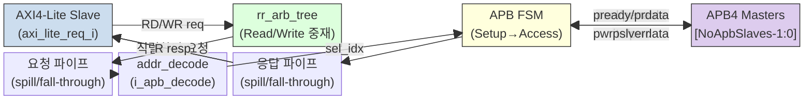

# axi_lite_to_apb.sv 문서

## 모듈 개요 및 기능

`axi_lite_to_apb`는 AXI4-Lite 슬레이브 포트를 APB4(AMBA Peripheral Bus v4) 마스터 포트로 변환하는 브리지 모듈이다. 하나의 AXI4-Lite 슬레이브 포트를 통해 여러 APB4 슬레이브를 구동할 수 있다. 주소 디코딩을 통해 적절한 APB 슬레이브를 선택하며, APB 2사이클 프로토콜(Setup→Access)을 FSM으로 구현한다.

주요 특성:
- AXI4-Lite 읽기/쓰기 요청을 라운드로빈 중재(rr_arb_tree)로 직렬화
- APB4 2사이클 (Setup + Access) 전송 FSM
- 요청/응답 경로 각각 선택적 파이프라인 레지스터 삽입 가능
- 디코드 에러 시 APB 트랜잭션 없이 즉시 DECERR 응답

---

## Mermaid 블록 다이어그램

---

## 파라미터 테이블

| 이름 | 타입 | 기본값 | 설명 |
|------|------|--------|------|
| `NoApbSlaves` | `int unsigned` | `32'd1` | 연결된 APB 슬레이브 수 |
| `NoRules` | `int unsigned` | `32'd1` | 주소 맵 규칙 수 |
| `AddrWidth` | `int unsigned` | `32'd32` | 주소 폭 (AXI4-Lite, APB4 동일) |
| `DataWidth` | `int unsigned` | `32'd32` | 데이터 폭 (AXI4-Lite, APB4 동일) |
| `PipelineRequest` | `bit` | `1'b0` | 1: 요청 경로에 spill_register 삽입, 0: fall-through |
| `PipelineResponse` | `bit` | `1'b0` | 1: 응답 경로에 spill_register 삽입, 0: fall-through |
| `axi_lite_req_t` | `type` | `logic` | AXI4-Lite 요청 구조체 타입 |
| `axi_lite_resp_t` | `type` | `logic` | AXI4-Lite 응답 구조체 타입 |
| `apb_req_t` | `type` | `logic` | APB4 요청 구조체 타입 |
| `apb_resp_t` | `type` | `logic` | APB4 응답 구조체 타입 |
| `rule_t` | `type` | `logic` | common_cells `addr_decode` 규칙 타입 |

---

## 포트 테이블

| 이름 | 방향 | 폭 | 설명 |
|------|------|----|------|
| `clk_i` | 입력 | 1 | 클록 |
| `rst_ni` | 입력 | 1 | 비동기 리셋 (액티브 로우) |
| `axi_lite_req_i` | 입력 | `axi_lite_req_t` | AXI4-Lite 슬레이브 요청 |
| `axi_lite_resp_o` | 출력 | `axi_lite_resp_t` | AXI4-Lite 슬레이브 응답 |
| `apb_req_o` | 출력 | `apb_req_t [NoApbSlaves-1:0]` | APB4 마스터 요청 배열 |
| `apb_resp_i` | 입력 | `apb_resp_t [NoApbSlaves-1:0]` | APB4 슬레이브 응답 배열 |
| `addr_map_i` | 입력 | `rule_t [NoRules-1:0]` | APB 슬레이브 주소 맵 |

---

## 내부 아키텍처 설명

### 1. AXI4-Lite 슬레이브 변환

읽기(AR) 및 쓰기(AW+W) 채널을 각각 내부 `int_req_t` 구조체로 변환한다.
- 쓰기 유효: `aw_valid & w_valid` (AW, W 동시 유효 필요)
- 읽기 유효: `ar_valid`

### 2. 라운드로빈 중재 (`rr_arb_tree`)

읽기(`RD=0`)와 쓰기(`WR=1`) 두 요청을 `rr_arb_tree`로 중재하여 단일 APB 요청 스트림으로 직렬화한다. `LockIn=1`로 진행 중인 요청이 완료될 때까지 잠긴다.

### 3. 요청 파이프라인

- `PipelineRequest=1`: `spill_register` (1사이클 지연, 타이밍 개선)
- `PipelineRequest=0`: `fall_through_register` (0사이클 지연, 낮은 레이턴시)

### 4. APB FSM

두 상태의 Mealy FSM:

| 상태 | 동작 |
|------|------|
| **Setup** | 요청 유효 + 디코딩 성공 시: APB `psel=1, penable=0` 어서트 후 Access 상태로 전이 |
| **Setup** | 디코드 에러 시: APB 트랜잭션 없이 즉시 DECERR 응답 생성 |
| **Access** | APB `psel=1, penable=1` 유지. `pready` 수신 시: 응답 생성 후 Setup으로 복귀 |

쓰기 스트로브가 모두 0인 경우 쓰기 트랜잭션을 생략하고 `RESP_OKAY` 반환.

### 5. 응답 파이프라인

- `PipelineResponse=1`: `spill_register`
- `PipelineResponse=0`: `fall_through_register`

APB 쓰기 응답 → AXI B 채널, APB 읽기 응답 → AXI R 채널로 각각 독립적으로 처리.

### APB 주소 정렬

APB 사양(2.1.1)에 따라 `paddr`는 데이터 폭에 맞게 정렬된다(`axi_pkg::aligned_addr` 사용).

---

## 인스턴스화하는 서브모듈 목록

| 인스턴스명 | 모듈명 | 역할 |
|-----------|--------|------|
| `i_req_arb` | `rr_arb_tree` | 읽기/쓰기 요청 라운드로빈 중재 |
| `i_req_spill` / `i_req_ft_reg` | `spill_register` / `fall_through_register` | 요청 파이프라인 |
| `i_write_resp_spill` / `i_write_resp_ft_reg` | `spill_register` / `fall_through_register` | 쓰기 응답 파이프라인 |
| `i_read_resp_spill` / `i_read_resp_ft_reg` | `spill_register` / `fall_through_register` | 읽기 응답 파이프라인 |
| `i_apb_decode` | `addr_decode` | APB 슬레이브 주소 디코더 |

---

## 타이밍/레이턴시 특성

| 항목 | 값 |
|------|-----|
| 클록 도메인 | 단일 (`clk_i`) |
| APB 최소 전송 시간 | 2 사이클 (Setup + Access, `pready=1` 즉시 응답 시) |
| 요청 파이프라인 추가 지연 | 0 또는 1 사이클 (`PipelineRequest` 설정에 따라) |
| 응답 파이프라인 추가 지연 | 0 또는 1 사이클 (`PipelineResponse` 설정에 따라) |
| 최대 처리량 | 1 APB 트랜잭션 / 2 사이클 (`pready=1` 즉시 응답 기준) |

---

## 특수 동작

- **읽기/쓰기 직렬화**: AXI4-Lite는 읽기/쓰기 채널이 독립적이지만 APB는 단일 버스이므로, 라운드로빈 중재로 직렬화된다.
- **psel 원-핫**: 각 APB 슬레이브는 자신의 인덱스에 해당하는 `psel` 비트만 어서트됨. 나머지 필드는 활성 슬레이브의 인덱스로 인덱싱하여 접근.
- **pslverr 변환**: APB `pslverr=1` → AXI `RESP_SLVERR`, `pslverr=0` → `RESP_OKAY`.
- **DECERR 처리**: 주소 디코딩 실패 시 APB 사이클 없이 즉시 `RESP_DECERR` 반환.
- **인터페이스 래퍼**: `axi_lite_to_apb_intf`는 원-핫 psel 신호를 이진 인덱스로 변환하는 `onehot_to_bin`을 포함하는 래퍼 모듈이다.
