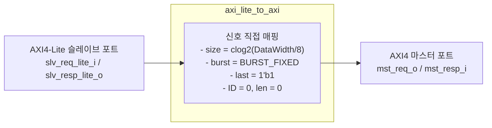

# axi_lite_to_axi.sv

## 개요

AXI4-Lite를 완전한 AXI4로 변환하는 어댑터입니다. AXI4-Lite 트랜잭션을 AXI4 형식으로 확장하여 AXI4 슬레이브에 전달합니다.

## 블록 다이어그램

## 파라미터

| 파라미터 | 타입 | 기본값 | 설명 |
|---------|------|--------|------|
| `AxiDataWidth` | `int unsigned` | 0 | 데이터 폭 (비트) |
| `req_lite_t` | `type` | `logic` | AXI4-Lite 요청 구조체 타입 |
| `resp_lite_t` | `type` | `logic` | AXI4-Lite 응답 구조체 타입 |
| `axi_req_t` | `type` | `logic` | AXI4 요청 구조체 타입 |
| `axi_resp_t` | `type` | `logic` | AXI4 응답 구조체 타입 |

## 포트

| 포트 | 방향 | 설명 |
|------|------|------|
| `slv_req_lite_i` | 입력 | AXI4-Lite 슬레이브 요청 |
| `slv_resp_lite_o` | 출력 | AXI4-Lite 슬레이브 응답 |
| `slv_aw_cache_i` | 입력 | AW 채널 캐시 속성 |
| `slv_ar_cache_i` | 입력 | AR 채널 캐시 속성 |
| `mst_req_o` | 출력 | AXI4 마스터 요청 |
| `mst_resp_i` | 입력 | AXI4 마스터 응답 |

## AXI4-Lite → AXI4 변환 규칙

| AXI4 필드 | 값 |
|-----------|-----|
| `size` | `clog2(AxiDataWidth/8)` (최대 크기) |
| `burst` | `BURST_FIXED` |
| `len` | `0` (단일 비트) |
| `w.last` | `1'b1` |
| `id` | `'0` |
| `user` | `'0` |
| `cache` | `slv_aw_cache_i` / `slv_ar_cache_i` |

## 의존성

- `axi_pkg`
