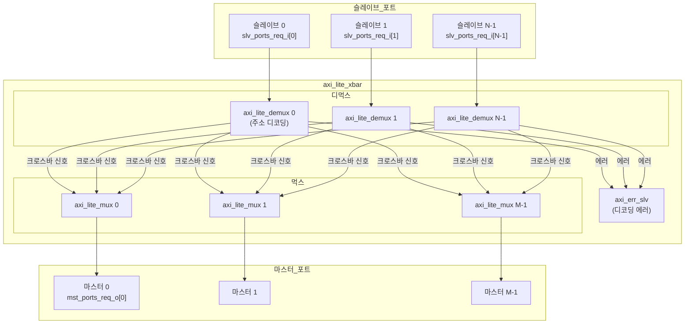

# axi_lite_xbar.sv

## 개요

완전 연결(Fully-Connected) AXI4-Lite 크로스바(Crossbar) 스위치입니다. 여러 슬레이브 포트에서 여러 마스터 포트로 AXI4-Lite 트랜잭션을 라우팅합니다.

자세한 문서는 `doc/axi_lite_xbar.md`를 참조하세요.

## 블록 다이어그램

## 파라미터

| 파라미터 | 타입 | 기본값 | 설명 |
|---------|------|--------|------|
| `Cfg` | `axi_pkg::xbar_cfg_t` | `'0` | 크로스바 설정 구조체 |
| `aw_chan_t` | `type` | `logic` | AW 채널 타입 |
| `w_chan_t` | `type` | `logic` | W 채널 타입 |
| `b_chan_t` | `type` | `logic` | B 채널 타입 |
| `ar_chan_t` | `type` | `logic` | AR 채널 타입 |
| `r_chan_t` | `type` | `logic` | R 채널 타입 |
| `axi_req_t` | `type` | `logic` | AXI4-Lite 요청 타입 |
| `axi_resp_t` | `type` | `logic` | AXI4-Lite 응답 타입 |
| `rule_t` | `type` | `axi_pkg::xbar_rule_64_t` | 주소 디코딩 규칙 타입 |
| `MstIdxWidth` | `int unsigned` | 파생 | 마스터 인덱스 폭 |

## xbar_cfg_t 주요 필드

| 필드 | 설명 |
|------|------|
| `NoSlvPorts` | 슬레이브 포트 수 |
| `NoMstPorts` | 마스터 포트 수 |
| `NoAddrRules` | 주소 매핑 규칙 수 |
| `AxiAddrWidth` | 주소 폭 |
| `AxiDataWidth` | 데이터 폭 |

## 포트

| 포트 | 방향 | 설명 |
|------|------|------|
| `clk_i` | 입력 | 클록 |
| `rst_ni` | 입력 | 비동기 리셋 (액티브 로우) |
| `test_i` | 입력 | 테스트 모드 |
| `slv_ports_req_i` | 입력 | 슬레이브 포트 요청 배열 |
| `slv_ports_resp_o` | 출력 | 슬레이브 포트 응답 배열 |
| `mst_ports_req_o` | 출력 | 마스터 포트 요청 배열 |
| `mst_ports_resp_i` | 입력 | 마스터 포트 응답 배열 |
| `addr_map_i` | 입력 | 주소-마스터 포트 매핑 테이블 |
| `en_default_mst_port_i` | 입력 | 기본 마스터 포트 활성화 (포트별) |
| `default_mst_port_i` | 입력 | 기본 마스터 포트 인덱스 (포트별) |

## 내부 구조

각 슬레이브 포트에 `axi_lite_demux`가 연결되어 주소에 따라 적절한 마스터 포트로 라우팅합니다. 각 마스터 포트에는 `axi_lite_mux`가 연결되어 여러 슬레이브의 요청을 중재합니다.

## 의존성

- `axi_lite_demux`
- `axi_lite_mux`
- `axi_err_slv`
- `addr_decode` (common_cells)
- `axi_pkg`
- `axi/typedef.svh`
