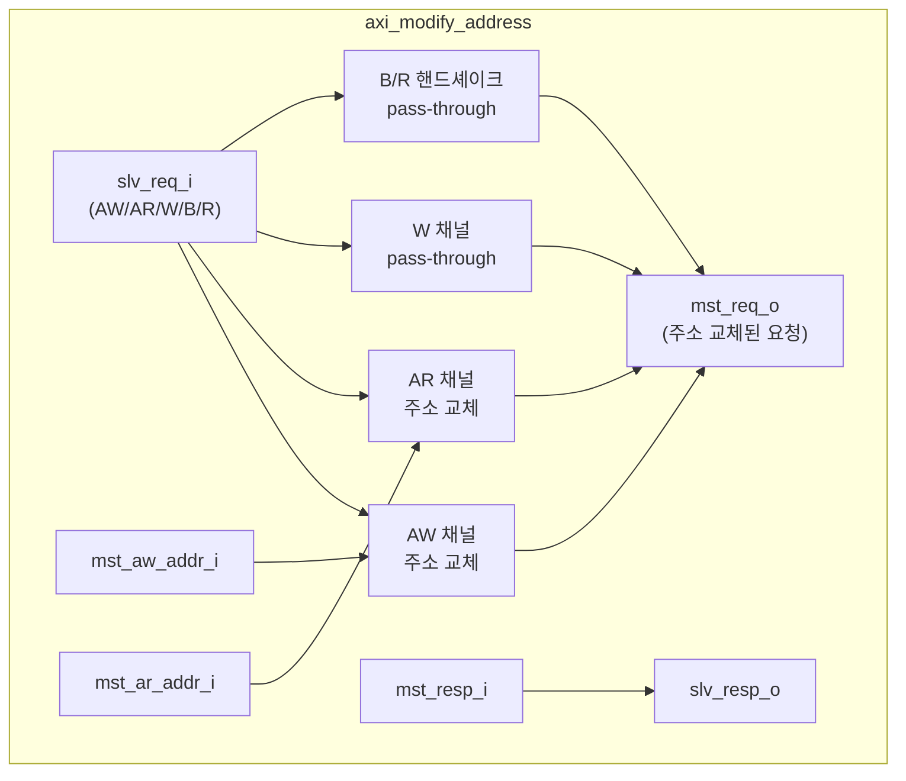

# axi_modify_address

## 모듈 목적 및 개요

`axi_modify_address`는 AXI4 버스에서 주소를 교체(변조)하는 순수 조합 논리 모듈입니다. 슬레이브 포트로 수신된 AXI 요청에서 AW(Write Address) 채널과 AR(Read Address) 채널의 주소 필드만 외부 입력 신호로 교체하고, 나머지 모든 필드 및 응답 신호는 그대로 통과시킵니다. 주소 변환기, 리매핑 로직, 버스 브리지 등에서 활용됩니다.

인터페이스 래퍼 모듈 `axi_modify_address_intf`도 함께 제공되어 `AXI_BUS` SystemVerilog 인터페이스와 연동할 수 있습니다.

---

## 파라미터 테이블

### `axi_modify_address` (구조체 기반)

| 이름 | 타입 | 기본값 | 설명 |
|------|------|--------|------|
| `slv_req_t` | `type` | `logic` | 슬레이브 포트의 AXI 요청 구조체 타입 |
| `mst_addr_t` | `type` | `logic` | 마스터 포트의 주소 타입 |
| `mst_req_t` | `type` | `logic` | 마스터 포트의 AXI 요청 구조체 타입 |
| `axi_resp_t` | `type` | `logic` | 슬레이브 및 마스터 포트 공통 응답 구조체 타입 |

### `axi_modify_address_intf` (인터페이스 기반)

| 이름 | 타입 | 기본값 | 설명 |
|------|------|--------|------|
| `AXI_SLV_PORT_ADDR_WIDTH` | `int unsigned` | `0` | 슬레이브 포트 주소 비트폭 |
| `AXI_MST_PORT_ADDR_WIDTH` | `int unsigned` | `AXI_SLV_PORT_ADDR_WIDTH` | 마스터 포트 주소 비트폭 |
| `AXI_DATA_WIDTH` | `int unsigned` | `0` | 데이터 비트폭 |
| `AXI_ID_WIDTH` | `int unsigned` | `0` | ID 비트폭 |
| `AXI_USER_WIDTH` | `int unsigned` | `0` | USER 신호 비트폭 |
| `mst_addr_t` | `type` | `logic [AXI_MST_PORT_ADDR_WIDTH-1:0]` | 파생 파라미터. 마스터 주소 타입 (오버라이드 금지) |

---

## 포트 테이블

### `axi_modify_address`

| 이름 | 방향 | 너비 | 설명 |
|------|------|------|------|
| `slv_req_i` | input | `slv_req_t` | 슬레이브 포트 AXI 요청 |
| `slv_resp_o` | output | `axi_resp_t` | 슬레이브 포트 AXI 응답 |
| `mst_aw_addr_i` | input | `mst_addr_t` | 마스터 포트에 적용할 AW 채널 주소. AW 핸드셰이크가 진행 중인 동안 안정적으로 유지되어야 함 |
| `mst_ar_addr_i` | input | `mst_addr_t` | 마스터 포트에 적용할 AR 채널 주소. AR 핸드셰이크가 진행 중인 동안 안정적으로 유지되어야 함 |
| `mst_req_o` | output | `mst_req_t` | 마스터 포트 AXI 요청 (주소 교체 적용) |
| `mst_resp_i` | input | `axi_resp_t` | 마스터 포트 AXI 응답 |

### `axi_modify_address_intf` (추가 포트)

| 이름 | 방향 | 너비 | 설명 |
|------|------|------|------|
| `slv` | `AXI_BUS.Slave` | - | 슬레이브 AXI 인터페이스 포트 |
| `mst_aw_addr_i` | input | `mst_addr_t` | 마스터 AW 주소 |
| `mst_ar_addr_i` | input | `mst_addr_t` | 마스터 AR 주소 |
| `mst` | `AXI_BUS.Master` | - | 마스터 AXI 인터페이스 포트 |

---

## 내부 동작 및 로직 설명

모듈은 완전 조합 논리(purely combinational)로 동작합니다. 클럭이나 리셋 신호가 없습니다.

1. **AW 채널 처리**: 슬레이브로부터 수신한 `slv_req_i.aw` 구조체의 모든 필드(id, len, size, burst, lock, cache, prot, qos, region, atop, user)는 그대로 마스터 `mst_req_o.aw`에 전달됩니다. 단, `addr` 필드만 외부 입력 `mst_aw_addr_i`로 교체됩니다.

2. **AR 채널 처리**: `slv_req_i.ar` 구조체도 동일하게 처리되며, `addr` 필드만 `mst_ar_addr_i`로 교체됩니다.

3. **W, B, R 채널**: 쓰기 데이터(W), 쓰기 응답(B), 읽기 응답(R) 채널 및 모든 valid/ready 핸드셰이크 신호는 수정 없이 통과(pass-through)됩니다.

4. **응답 경로**: `slv_resp_o = mst_resp_i`로 직접 연결되어 응답 신호가 그대로 전달됩니다.

5. **인터페이스 래퍼**: `axi_modify_address_intf`는 `AXI_TYPEDEF`와 `AXI_ASSIGN` 매크로를 이용해 `AXI_BUS` 인터페이스와 구조체 기반 포트 간의 변환을 처리하고 내부적으로 `axi_modify_address`를 인스턴스화합니다.

---

## Mermaid 블록 다이어그램



---

## 의존성 모듈 목록

| 모듈/파일 | 용도 |
|-----------|------|
| `axi/typedef.svh` | AXI 채널 구조체 타입 정의 매크로 (`AXI_TYPEDEF_*`) |
| `axi/assign.svh` | AXI 인터페이스 ↔ 구조체 간 신호 할당 매크로 (`AXI_ASSIGN_*`) |

---

## 사용 예시

```systemverilog
// 패키지 및 타입 정의
import axi_pkg::*;

typedef logic [31:0] addr_t;
typedef logic [3:0]  id_t;
typedef logic [63:0] data_t;
typedef logic [7:0]  strb_t;
typedef logic [0:0]  user_t;

`AXI_TYPEDEF_AW_CHAN_T(aw_chan_t, addr_t, id_t, user_t)
`AXI_TYPEDEF_W_CHAN_T(w_chan_t, data_t, strb_t, user_t)
`AXI_TYPEDEF_B_CHAN_T(b_chan_t, id_t, user_t)
`AXI_TYPEDEF_AR_CHAN_T(ar_chan_t, addr_t, id_t, user_t)
`AXI_TYPEDEF_R_CHAN_T(r_chan_t, data_t, id_t, user_t)
`AXI_TYPEDEF_REQ_T(axi_req_t, aw_chan_t, w_chan_t, ar_chan_t)
`AXI_TYPEDEF_RESP_T(axi_resp_t, b_chan_t, r_chan_t)

// 변환된 주소 (예: 상위 로직에서 계산)
addr_t remapped_aw_addr, remapped_ar_addr;

axi_modify_address #(
  .slv_req_t  ( axi_req_t  ),
  .mst_addr_t ( addr_t     ),
  .mst_req_t  ( axi_req_t  ),
  .axi_resp_t ( axi_resp_t )
) i_addr_mod (
  .slv_req_i     ( slv_req        ),
  .slv_resp_o    ( slv_resp       ),
  .mst_aw_addr_i ( remapped_aw_addr ),
  .mst_ar_addr_i ( remapped_ar_addr ),
  .mst_req_o     ( mst_req        ),
  .mst_resp_i    ( mst_resp       )
);
```

> **주의**: `mst_aw_addr_i`와 `mst_ar_addr_i`는 각각의 핸드셰이크(aw_valid & aw_ready, ar_valid & ar_ready)가 완료될 때까지 안정적인 값을 유지해야 합니다.
