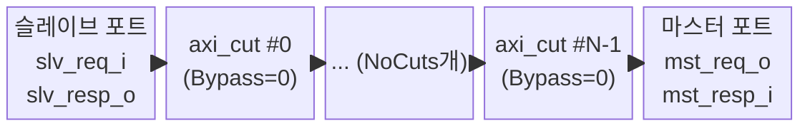

# `axi_multicut` — 다중 AXI4 타이밍 컷

## 모듈 개요 및 기능

`axi_multicut`은 AXI4 버스에 **N개의 파이프라인 레지스터 단계(컷)**를 직렬로 삽입하는 모듈입니다. 매우 긴 AXI 버스 배선의 타이밍 클로저를 돕기 위해 사용됩니다.

내부적으로 `NoCuts`개의 `axi_cut` 인스턴스를 체인으로 연결합니다. `NoCuts=0`이면 입력을 출력에 직결합니다(디제네레이트 케이스).

---

## Mermaid 블록 다이어그램



`NoCuts=0` 디제네레이트 케이스:
```
slv_req_i ──────────────────► mst_req_o
mst_resp_i ─────────────────► slv_resp_o
```

---

## 파라미터 테이블

| 이름 | 타입 | 기본값 | 설명 |
|---|---|---|---|
| `NoCuts` | `int unsigned` | `32'd1` | 삽입할 컷(spill register 단계) 수 |
| `aw_chan_t` | `type` | `logic` | AW 채널 페이로드 타입 |
| `w_chan_t` | `type` | `logic` | W 채널 페이로드 타입 |
| `b_chan_t` | `type` | `logic` | B 채널 페이로드 타입 |
| `ar_chan_t` | `type` | `logic` | AR 채널 페이로드 타입 |
| `r_chan_t` | `type` | `logic` | R 채널 페이로드 타입 |
| `axi_req_t` | `type` | `logic` | AXI 요청 구조체 타입 |
| `axi_resp_t` | `type` | `logic` | AXI 응답 구조체 타입 |

---

## 포트 테이블

| 포트 이름 | 방향 | 폭 | 설명 |
|---|---|---|---|
| `clk_i` | input | 1 | 클록 |
| `rst_ni` | input | 1 | 비동기 리셋 (active-low) |
| `slv_req_i` | input | `axi_req_t` | 슬레이브 포트 요청 입력 |
| `slv_resp_o` | output | `axi_resp_t` | 슬레이브 포트 응답 출력 |
| `mst_req_o` | output | `axi_req_t` | 마스터 포트 요청 출력 |
| `mst_resp_i` | input | `axi_resp_t` | 마스터 포트 응답 입력 |

---

## 내부 아키텍처

### 생성 구조

```systemverilog
// NoCuts=0: 직결
gen_no_cut: assign mst_req_o = slv_req_i; assign slv_resp_o = mst_resp_i;

// NoCuts>0: 체인
axi_req_t  [NoCuts:0] cut_req;
axi_resp_t [NoCuts:0] cut_resp;
cut_req[0] = slv_req_i;       // 슬레이브를 인덱스 0에 연결
slv_resp_o = cut_resp[0];

for (i = 0; i < NoCuts; i++):
    axi_cut(cut_req[i] → cut_resp[i] → cut_req[i+1] → cut_resp[i+1])

mst_req_o  = cut_req[NoCuts]; // 마스터를 최고 인덱스에 연결
cut_resp[NoCuts] = mst_resp_i;
```

모든 `axi_cut`은 `Bypass=0`으로 고정되어 항상 레지스터 단계를 삽입합니다.

---

## 인스턴스화하는 서브모듈

| 인스턴스 패턴 | 모듈 | 수량 |
|---|---|---|
| `gen_axi_cuts[i].i_cut` | `axi_cut` | `NoCuts`개 |

---

## 타이밍/레이턴시 특성

- 각 컷마다 **1 사이클 레이턴시** 추가
- 총 레이턴시: `NoCuts` 사이클 (요청 방향), `NoCuts` 사이클 (응답 방향)
- `NoCuts=0`: 추가 레이턴시 없음

---

## 인터페이스 래퍼 모듈

### `axi_multicut_intf`

AXI4 전용 인터페이스 래퍼. 추가 파라미터:

| 이름 | 설명 |
|---|---|
| `ADDR_WIDTH` | 주소 폭 |
| `DATA_WIDTH` | 데이터 폭 |
| `ID_WIDTH` | ID 폭 |
| `USER_WIDTH` | 사용자 신호 폭 |
| `NUM_CUTS` | 컷 수 (`NoCuts` 매핑) |

### `axi_lite_multicut_intf`

AXI-Lite 전용 인터페이스 래퍼. ID/USER 없이 `ADDR_WIDTH`, `DATA_WIDTH`만 사용.
