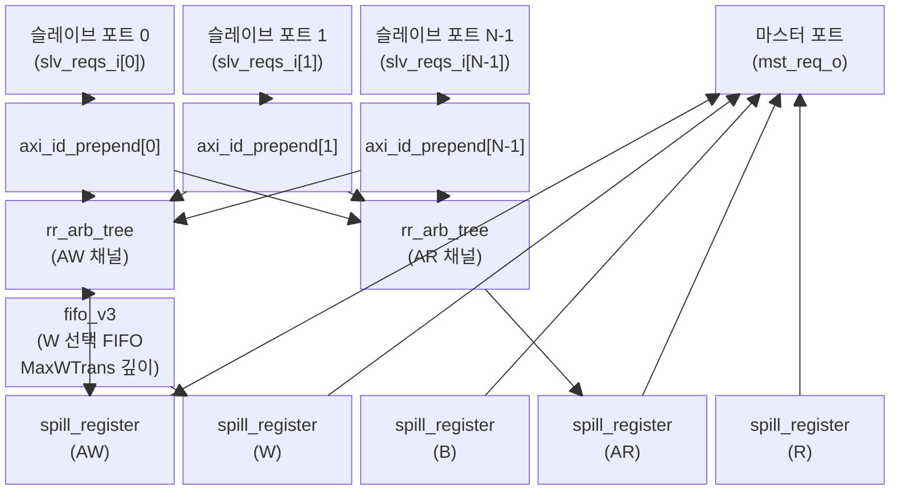

# axi_mux.sv

## 모듈 개요 및 기능

`axi_mux`는 복수의 AXI4 슬레이브 포트(마스터 모듈들이 연결되는 포트)를 하나의 마스터 포트(슬레이브 모듈로 연결되는 포트)로 다중화(multiplexing)하는 모듈이다.

핵심 동작 원리:
- 각 슬레이브 포트로 들어온 AXI ID에 슬레이브 포트 인덱스 비트를 상위에 prepend하여 마스터 포트의 확장된 ID를 생성한다.
- 확장 비트 폭 = `$clog2(NoSlvPorts)`, 따라서 마스터 포트의 ID 폭 = `SlvAxiIDWidth + $clog2(NoSlvPorts)`
- 응답(B/R) 채널에서는 확장 비트를 보고 해당 슬레이브 포트로 역방향 라우팅한다.
- `NoSlvPorts == 1`인 경우에는 아비트레이션 로직 없이 스필 레지스터만 배치하는 패스스루 경로가 생성된다.

---

## Mermaid 블록 다이어그램

---

## 파라미터 테이블

| 이름 | 타입 | 기본값 | 설명 |
|------|------|--------|------|
| `SlvAxiIDWidth` | `int unsigned` | `0` | 슬레이브 포트의 AXI ID 폭 |
| `slv_aw_chan_t` | `type` | `logic` | 슬레이브 포트 AW 채널 구조체 타입 |
| `mst_aw_chan_t` | `type` | `logic` | 마스터 포트 AW 채널 구조체 타입 (ID가 더 넓음) |
| `w_chan_t` | `type` | `logic` | 모든 포트 공통 W 채널 구조체 타입 |
| `slv_b_chan_t` | `type` | `logic` | 슬레이브 포트 B 채널 구조체 타입 |
| `mst_b_chan_t` | `type` | `logic` | 마스터 포트 B 채널 구조체 타입 |
| `slv_ar_chan_t` | `type` | `logic` | 슬레이브 포트 AR 채널 구조체 타입 |
| `mst_ar_chan_t` | `type` | `logic` | 마스터 포트 AR 채널 구조체 타입 |
| `slv_r_chan_t` | `type` | `logic` | 슬레이브 포트 R 채널 구조체 타입 |
| `mst_r_chan_t` | `type` | `logic` | 마스터 포트 R 채널 구조체 타입 |
| `slv_req_t` | `type` | `logic` | 슬레이브 포트 요청 구조체 타입 |
| `slv_resp_t` | `type` | `logic` | 슬레이브 포트 응답 구조체 타입 |
| `mst_req_t` | `type` | `logic` | 마스터 포트 요청 구조체 타입 |
| `mst_resp_t` | `type` | `logic` | 마스터 포트 응답 구조체 타입 |
| `NoSlvPorts` | `int unsigned` | `0` | 슬레이브 포트 수 |
| `MaxWTrans` | `int unsigned` | `8` | 쓰기 방향 최대 동시 미처리(outstanding) 트랜잭션 수 = W FIFO 깊이 |
| `FallThrough` | `bit` | `0` | 1이면 W FIFO가 완전 조합 논리(fall-through) 모드 |
| `SpillAw` | `bit` | `1` | AW 채널에 스필 레지스터 추가 (1사이클 레이턴시) |
| `SpillW` | `bit` | `0` | W 채널에 스필 레지스터 추가 |
| `SpillB` | `bit` | `0` | B 채널에 스필 레지스터 추가 |
| `SpillAr` | `bit` | `1` | AR 채널에 스필 레지스터 추가 |
| `SpillR` | `bit` | `0` | R 채널에 스필 레지스터 추가 |

**내부 파생 파라미터:**
- `MstIdxBits = $clog2(NoSlvPorts)`: 슬레이브 포트 인덱스 인코딩 비트 수
- `MstAxiIDWidth = SlvAxiIDWidth + MstIdxBits`: 마스터 포트 ID 폭

---

## 포트 테이블

| 이름 | 방향 | 폭 | 설명 |
|------|------|----|------|
| `clk_i` | input | 1 | 클록 (상승 에지) |
| `rst_ni` | input | 1 | 비동기 리셋 (active low) |
| `test_i` | input | 1 | 테스트 모드 활성화 |
| `slv_reqs_i` | input | `[NoSlvPorts-1:0]` | 슬레이브 포트 AXI 요청 배열 |
| `slv_resps_o` | output | `[NoSlvPorts-1:0]` | 슬레이브 포트 AXI 응답 배열 |
| `mst_req_o` | output | 1 | 마스터 포트 AXI 요청 |
| `mst_resp_i` | input | 1 | 마스터 포트 AXI 응답 |

---

## 내부 아키텍처 설명

### ID Prepend 단계 (`gen_id_prepend`)
각 슬레이브 포트마다 `axi_id_prepend` 인스턴스를 배치한다. 이 서브모듈은 슬레이브 포트의 ID 상위에 포트 인덱스 `i`를 `MstIdxBits` 폭으로 붙여, 마스터 측 ID를 생성한다. 응답 방향(B, R)에서는 반대로 상위 비트를 제거하여 원래 슬레이브 포트의 ID로 복원한다.

### AW 채널 아비트레이션 및 W FIFO
- `rr_arb_tree`를 사용하여 라운드-로빈 아비트레이션으로 여러 슬레이브 포트 중 하나를 선택한다. `LockIn = 1`이므로 트랜잭션이 완료될 때까지 같은 포트가 선택을 유지한다.
- `lock_aw_valid_q` FF: AW valid를 한번 내보낸 뒤 다운스트림이 stall할 경우, valid를 유지하기 위한 잠금 플래그. AXI 프로토콜상 valid는 once asserted 후 ready 없이 내릴 수 없으므로 필수적이다.
- `fifo_v3` (W FIFO): 깊이 `MaxWTrans`, 데이터 타입 `switch_id_t` (`MstIdxBits` 폭). AW 아비트레이션에서 결정된 포트 인덱스를 W 채널 라우팅에 전달하기 위해 사용한다. AW 트랜잭션과 W 데이터 전송 사이의 비동기 관계를 처리한다.
- W FIFO가 full이면 AW 요청을 차단한다.

### W 채널 다중화
- `w_fifo_data`에 저장된 슬레이브 포트 인덱스를 기반으로 `slv_w_chans`에서 해당 슬레이브의 W 데이터를 선택한다.
- W 채널에서 `last` 비트가 확인되면 W FIFO에서 항목을 팝한다.

### B 채널 역방향 라우팅
- B 응답의 ID에서 상위 `MstIdxBits` (`mst_b_chan.id[SlvAxiIDWidth +: MstIdxBits]`)를 추출하여 `switch_b_id`를 결정한다.
- B 채널을 모든 슬레이브 포트에 브로드캐스트(`{NoSlvPorts{mst_b_chan}}`)하되, `switch_b_id`에 해당하는 슬레이브 포트에만 valid를 어서트한다.

### AR 채널 아비트레이션
- AW와 동일하게 `rr_arb_tree`를 사용하나, W FIFO가 없으므로 구조가 더 단순하다.

### R 채널 역방향 라우팅
- B 채널과 동일한 방식으로 R 응답의 ID 상위 비트로 포트를 선택한다.

---

## 인스턴스화하는 서브모듈 목록

| 서브모듈 | 인스턴스명 | 역할 |
|----------|-----------|------|
| `axi_id_prepend` | `i_id_prepend` (×NoSlvPorts) | 슬레이브 포트 인덱스를 ID에 prepend/strip |
| `rr_arb_tree` | `i_aw_arbiter` | AW 채널 라운드-로빈 아비트레이션 |
| `rr_arb_tree` | `i_ar_arbiter` | AR 채널 라운드-로빈 아비트레이션 |
| `fifo_v3` | `i_w_fifo` | AW→W 채널 라우팅 정보 저장 FIFO |
| `spill_register` | `i_aw_spill_reg` | AW 채널 스필 레지스터 |
| `spill_register` | `i_w_spill_reg` | W 채널 스필 레지스터 |
| `spill_register` | `i_b_spill_reg` | B 채널 스필 레지스터 |
| `spill_register` | `i_ar_spill_reg` | AR 채널 스필 레지스터 |
| `spill_register` | `i_r_spill_reg` | R 채널 스필 레지스터 |

---

## 타이밍/레이턴시 특성

| 조건 | 레이턴시 |
|------|----------|
| `SpillAw = 1` | AW 채널에 1사이클 추가 |
| `SpillW = 1` | W 채널에 1사이클 추가 |
| `SpillB = 1` | B 채널에 1사이클 추가 |
| `SpillAr = 1` | AR 채널에 1사이클 추가 |
| `SpillR = 1` | R 채널에 1사이클 추가 |
| `FallThrough = 0` (기본) | W FIFO에 1사이클 추가 레이턴시 |
| `FallThrough = 1` | W FIFO는 완전 조합 논리, 추가 레이턴시 없음 |

기본 설정(`SpillAw=1, SpillAr=1`, 나머지 0)에서 AW와 AR 채널에 각각 1사이클 레이턴시가 추가된다.

---

## 동작 설명 및 특이 사항

### AW-to-W 의존성 제거
AXI 프로토콜상 W 채널과 AW 채널은 별도로 흘러야 한다. W 데이터가 어느 슬레이브 포트로 가야 하는지를 결정하기 위해 W FIFO에 포트 인덱스를 저장한다. W FIFO가 가득 찬 경우 새로운 AW 요청을 차단하여 데드락을 방지한다.

### AXI valid 유지 규칙 대응 (lock_aw_valid_q)
AXI 프로토콜은 valid를 한번 어서트하면 ready 없이 내릴 수 없다. 아비트레이션 결정 후 W FIFO 푸시는 즉시 이루어지지만 AW 트랜잭션(AW handshake)이 같은 사이클에 완료되지 않을 수 있다. 이 경우 `lock_aw_valid_q`를 세트하여 다음 사이클에도 valid를 유지하고, 추가 W FIFO 푸시를 방지한다.

### NoSlvPorts == 1 특수 처리
슬레이브 포트가 하나뿐이면 아비트레이션이 불필요하다. 이 경우 `gen_no_mux` 블록이 생성되며, 스필 레지스터만 배치하는 단순한 패스스루 경로가 형성된다. 이때 마스터 ID 폭과 슬레이브 ID 폭이 동일해야 한다는 추가 assertion이 적용된다.

### 인터페이스 래퍼 (`axi_mux_intf`)
SystemVerilog 인터페이스(`AXI_BUS`) 기반의 래퍼 모듈이 함께 제공된다. 내부에서 타입 정의 후 `axi_mux`를 인스턴스화한다.
