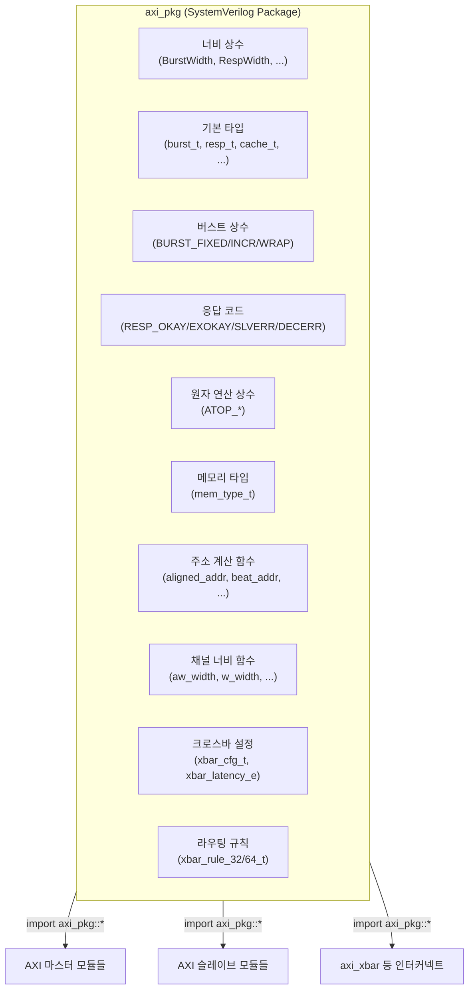

# axi_pkg

## 모듈 목적 및 개요

`axi_pkg`는 AXI4 및 AXI4+ATOP 프로토콜 구현에 필요한 모든 타입 정의, 상수(localparams), 유틸리티 함수를 제공하는 SystemVerilog **패키지(package)**입니다. 이 패키지를 임포트함으로써 프로젝트 내 모든 AXI 관련 모듈이 일관된 타입과 상수를 공유할 수 있습니다.

주요 제공 내용:
- AXI 버스 필드(burst, resp, cache, prot, qos 등)의 너비 상수 및 typedef
- 버스트 타입, 응답 코드, 캐시 속성, 원자 연산(ATOP) 관련 로컬 파라미터
- 주소 및 데이터 계산 함수 (정렬 주소, 랩 경계, 비트 인덱스 등)
- AXI 크로스바(`axi_xbar`) 설정 구조체 및 레이턴시 열거형
- 채널별 페이로드 비트폭 계산 함수

---

## 파라미터 테이블

`axi_pkg`는 패키지이므로 인스턴스 파라미터는 없습니다. 대신 패키지 내 전역 상수(parameter)가 정의됩니다.

| 이름 | 값 | 설명 |
|------|----|------|
| `BurstWidth` | `2` | AXI 버스트 타입 필드 비트폭 |
| `RespWidth` | `2` | AXI 응답 필드 비트폭 |
| `CacheWidth` | `4` | AXI 캐시 속성 필드 비트폭 |
| `ProtWidth` | `3` | AXI 보호 속성 필드 비트폭 |
| `QosWidth` | `4` | AXI QoS 필드 비트폭 |
| `RegionWidth` | `4` | AXI 리전 필드 비트폭 |
| `LenWidth` | `8` | AXI 버스트 길이 필드 비트폭 |
| `SizeWidth` | `3` | AXI 전송 크기 필드 비트폭 |
| `LockWidth` | `1` | AXI 락 필드 비트폭 |
| `AtopWidth` | `6` | AXI5 원자 연산 필드 비트폭 |
| `NsaidWidth` | `4` | AXI5 비보안 주소 식별자 필드 비트폭 |

---

## 주요 타입 정의

| 타입 이름 | 비트폭 | 설명 |
|-----------|--------|------|
| `burst_t` | `[1:0]` | AXI 버스트 타입 |
| `resp_t` | `[1:0]` | AXI 응답 코드 |
| `cache_t` | `[3:0]` | AXI 캐시 속성 |
| `prot_t` | `[2:0]` | AXI 보호 속성 |
| `qos_t` | `[3:0]` | AXI QoS |
| `region_t` | `[3:0]` | AXI 리전 |
| `len_t` | `[7:0]` | AXI 버스트 길이 |
| `size_t` | `[2:0]` | AXI 전송 크기 |
| `atop_t` | `[5:0]` | AXI5 원자 연산 코드 |
| `nsaid_t` | `[3:0]` | AXI5 비보안 주소 식별자 |
| `largest_addr_t` | `[127:0]` | 범용 주소 계산용 최대 주소 타입 |
| `mem_type_t` | `enum [3:0]` | 메모리 타입 열거형 (12가지) |
| `xbar_latency_e` | `enum [9:0]` | 크로스바 레이턴시 모드 열거형 |
| `xbar_cfg_t` | `struct packed` | AXI 크로스바 설정 구조체 |
| `xbar_rule_64_t` | `struct packed` | 64비트 주소용 라우팅 규칙 구조체 |
| `xbar_rule_32_t` | `struct packed` | 32비트 주소용 라우팅 규칙 구조체 |

---

## 포트 테이블

패키지이므로 포트가 없습니다. 모든 정의는 `import axi_pkg::*;` 또는 `axi_pkg::` 네임스페이스를 통해 사용합니다.

---

## 내부 동작 및 로직 설명

### 버스트 타입 상수

| 상수 | 값 | 설명 |
|------|----|------|
| `BURST_FIXED` | `2'b00` | 고정 주소 버스트 (FIFO 접근 등) |
| `BURST_INCR` | `2'b01` | 증가 주소 버스트 (일반 순차 메모리) |
| `BURST_WRAP` | `2'b10` | 랩어라운드 버스트 (캐시 라인 채움 등) |

### 응답 코드 상수

| 상수 | 값 | 설명 |
|------|----|------|
| `RESP_OKAY` | `2'b00` | 정상 접근 성공 |
| `RESP_EXOKAY` | `2'b01` | 배타적 접근 성공 |
| `RESP_SLVERR` | `2'b10` | 슬레이브 에러 |
| `RESP_DECERR` | `2'b11` | 디코드 에러 (라우팅 실패) |

### 캐시 속성 비트 상수

| 상수 | 값 | 설명 |
|------|----|------|
| `CACHE_BUFFERABLE` | `4'b0001` | 버퍼링 허용 |
| `CACHE_MODIFIABLE` | `4'b0010` | 트랜잭션 속성 변경 허용 |
| `CACHE_RD_ALLOC` | `4'b0100` | 읽기 할당 권장 |
| `CACHE_WR_ALLOC` | `4'b1000` | 쓰기 할당 권장 |

### 원자 연산(ATOP) 상수

| 상수 | 값 | 설명 |
|------|----|------|
| `ATOP_ATOMICSWAP` | `6'b110000` | 스왑 원자 연산 |
| `ATOP_ATOMICCMP` | `6'b110001` | 비교 후 스왑 원자 연산 |
| `ATOP_NONE` | `2'b00` | 원자 연산 없음 |
| `ATOP_ATOMICSTORE` | `2'b01` | 원자 저장 (응답 데이터 없음) |
| `ATOP_ATOMICLOAD` | `2'b10` | 원자 로드-수정-저장 (응답 데이터 있음) |
| `ATOP_ADD` ~ `ATOP_UMIN` | `3'b000`~`3'b111` | 산술/논리 원자 연산 종류 |
| `ATOP_R_RESP` | `32'd5` | 읽기 응답 존재 여부를 나타내는 비트 인덱스 |

### 주요 함수

| 함수 | 반환 타입 | 설명 |
|------|-----------|------|
| `num_bytes(size)` | `shortint unsigned` | `size` 필드로부터 전송 바이트 수 계산 (`1 << size`) |
| `aligned_addr(addr, size)` | `largest_addr_t` | `size`에 정렬된 주소 반환 |
| `wrap_boundary(addr, size, len)` | `largest_addr_t` | BURST_WRAP의 랩 경계 주소 계산 |
| `beat_addr(addr, size, len, burst, i_beat)` | `largest_addr_t` | 버스트 내 i번째 비트의 주소 계산 |
| `beat_lower_byte(...)` | `shortint unsigned` | 비트 내 최하위 바이트 인덱스 |
| `beat_upper_byte(...)` | `shortint unsigned` | 비트 내 최상위 바이트 인덱스 |
| `bufferable(cache)` | `logic` | CACHE_BUFFERABLE 비트 설정 여부 확인 |
| `modifiable(cache)` | `logic` | CACHE_MODIFIABLE 비트 설정 여부 확인 |
| `get_arcache(mtype)` | `logic [3:0]` | `mem_type_t`로부터 AR 캐시 필드 값 반환 |
| `get_awcache(mtype)` | `logic [3:0]` | `mem_type_t`로부터 AW 캐시 필드 값 반환 |
| `resp_precedence(resp_a, resp_b)` | `resp_t` | 두 응답 코드 중 우선순위가 높은 값 반환 (DECERR > SLVERR > OKAY > EXOKAY) |
| `aw_width(...)` | `int unsigned` | AW 채널 페이로드 비트폭 계산 |
| `w_width(...)` | `int unsigned` | W 채널 페이로드 비트폭 계산 |
| `b_width(...)` | `int unsigned` | B 채널 페이로드 비트폭 계산 |
| `ar_width(...)` | `int unsigned` | AR 채널 페이로드 비트폭 계산 |
| `r_width(...)` | `int unsigned` | R 채널 페이로드 비트폭 계산 |
| `req_width(...)` | `int unsigned` | 요청 채널 전체 비트폭 계산 |
| `rsp_width(...)` | `int unsigned` | 응답 채널 전체 비트폭 계산 |
| `iomsb(width)` | `integer unsigned` | `width-1` 또는 0 반환 (포트 벡터 선언 보조) |

### `xbar_cfg_t` 구조체 필드

| 필드 | 타입 | 설명 |
|------|------|------|
| `NoSlvPorts` | `int unsigned` | 크로스바 슬레이브 포트 수 (연결된 마스터 수) |
| `NoMstPorts` | `int unsigned` | 크로스바 마스터 포트 수 (연결된 슬레이브 수) |
| `MaxMstTrans` | `int unsigned` | 마스터당 최대 동시 진행 트랜잭션 수 |
| `MaxSlvTrans` | `int unsigned` | 슬레이브당 최대 동시 진행 트랜잭션 수 |
| `FallThrough` | `bit` | 내부 FIFO 폴스루 모드 여부 |
| `LatencyMode` | `bit [9:0]` | 레이턴시 모드 (`xbar_latency_e`) |
| `PipelineStages` | `int unsigned` | 라인 크로스 멀티컷 스테이지 수 |
| `AxiIdWidthSlvPorts` | `int unsigned` | 슬레이브 포트 ID 비트폭 |
| `AxiIdUsedSlvPorts` | `int unsigned` | 슬레이브 포트에서 사용되는 ID 비트 수 |
| `UniqueIds` | `bit` | ID 고유성 여부 |
| `AxiAddrWidth` | `int unsigned` | AXI 주소 비트폭 |
| `AxiDataWidth` | `int unsigned` | AXI 데이터 비트폭 |
| `NoAddrRules` | `int unsigned` | 라우팅 주소 규칙 수 |

---

## Mermaid 블록 다이어그램



---

## 의존성 모듈 목록

`axi_pkg`는 순수 패키지로서 다른 모듈에 대한 의존성이 없습니다.

---

## 사용 예시

```systemverilog
// 패키지 전체 임포트
import axi_pkg::*;

// 타입 사용 예시
axi_pkg::burst_t  burst;
axi_pkg::resp_t   resp;
axi_pkg::cache_t  cache;
axi_pkg::atop_t   atop;

// 상수 사용 예시
assign burst = axi_pkg::BURST_INCR;
assign resp  = axi_pkg::RESP_OKAY;

// 함수 사용 예시
logic [127:0] aligned;
assign aligned = axi_pkg::aligned_addr(128'hDEAD_BEEF, 3'b010); // 4바이트 정렬

// 응답 우선순위 병합
axi_pkg::resp_t merged_resp;
assign merged_resp = axi_pkg::resp_precedence(axi_pkg::RESP_OKAY, axi_pkg::RESP_SLVERR);
// -> RESP_SLVERR (에러가 우선)

// xbar 설정 구조체 사용 예시
localparam axi_pkg::xbar_cfg_t XbarCfg = '{
  NoSlvPorts:        2,
  NoMstPorts:        4,
  MaxMstTrans:       8,
  MaxSlvTrans:       8,
  FallThrough:       1'b0,
  LatencyMode:       axi_pkg::CUT_ALL_AX,
  PipelineStages:    0,
  AxiIdWidthSlvPorts:4,
  AxiIdUsedSlvPorts: 4,
  UniqueIds:         1'b0,
  AxiAddrWidth:      32,
  AxiDataWidth:      64,
  NoAddrRules:       4
};

// 원자 연산 응답 여부 확인 예시
if (req.aw.atop[axi_pkg::ATOP_R_RESP]) begin
  // 읽기 응답이 있는 원자 연산
end
```
