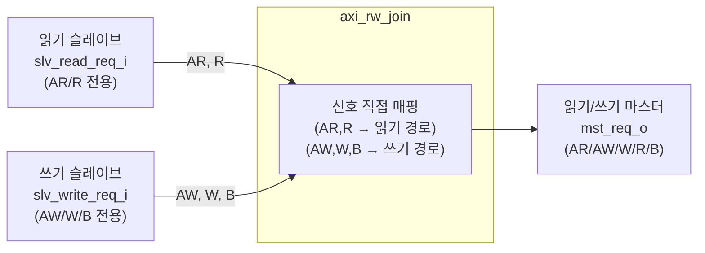

# axi_rw_join.sv

## 개요

읽기 전용 슬레이브와 쓰기 전용 슬레이브를 하나의 읽기/쓰기 마스터로 합치는 모듈입니다.

- 읽기 슬레이브의 AR, R 채널 → 마스터의 AR, R 채널로 연결
- 쓰기 슬레이브의 AW, W, B 채널 → 마스터의 AW, W, B 채널로 연결

## 블록 다이어그램

## 파라미터

| 파라미터 | 타입 | 기본값 | 설명 |
|---------|------|--------|------|
| `axi_req_t` | `type` | `logic` | AXI4 요청 구조체 타입 |
| `axi_resp_t` | `type` | `logic` | AXI4 응답 구조체 타입 |

## 포트

| 포트 | 방향 | 설명 |
|------|------|------|
| `clk_i` | 입력 | 클록 |
| `rst_ni` | 입력 | 비동기 리셋 (액티브 로우) |
| `slv_read_req_i` | 입력 | 읽기 슬레이브 요청 (AR/R만 사용) |
| `slv_read_resp_o` | 출력 | 읽기 슬레이브 응답 |
| `slv_write_req_i` | 입력 | 쓰기 슬레이브 요청 (AW/W/B만 사용) |
| `slv_write_resp_o` | 출력 | 쓰기 슬레이브 응답 |
| `mst_req_o` | 출력 | 읽기/쓰기 마스터 요청 |
| `mst_resp_i` | 입력 | 읽기/쓰기 마스터 응답 |

## 채널 연결 규칙

| 채널 | 소스 | 목적지 |
|------|------|--------|
| AR | `slv_read_req_i.ar` | `mst_req_o.ar` |
| R | `mst_resp_i.r` | `slv_read_resp_o.r` |
| AW | `slv_write_req_i.aw` | `mst_req_o.aw` |
| W | `slv_write_req_i.w` | `mst_req_o.w` |
| B | `mst_resp_i.b` | `slv_write_resp_o.b` |

어서션: 읽기 슬레이브의 AW/W가 절대 valid가 되지 않도록, 쓰기 슬레이브의 AR이 절대 valid가 되지 않도록 검증합니다.

## axi_rw_split과의 관계

`axi_rw_join`은 `axi_rw_split`의 역방향 연산입니다.

## 의존성

- `axi/assign.svh`
- `common_cells/assertions.svh`
