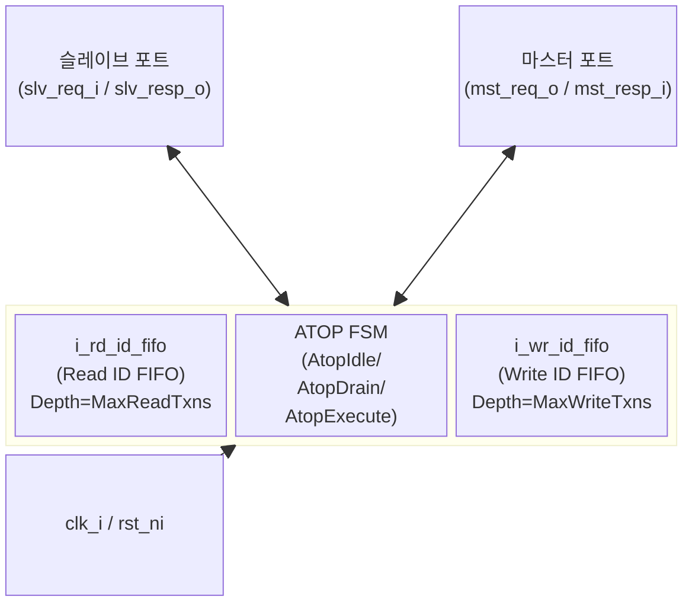

# axi_serializer

## 모듈 개요 및 기능

`axi_serializer`는 여러 AXI ID를 갖는 업스트림 트랜잭션을 하나의 ID(0)로 직렬화(serialize)하여 다운스트림으로 전달하는 모듈이다. 업스트림(슬레이브 포트)에서 수신한 트랜잭션의 원래 ID는 내부 FIFO에 저장되고, 다운스트림(마스터 포트)에서 응답이 돌아오면 저장된 ID로 복원하여 슬레이브 포트에 반환한다.

ATOP(Atomic Operation) 처리를 위한 3상태 FSM이 내장되어 있어 Atomic 트랜잭션 발생 시 진행 중인 모든 트랜잭션이 완료될 때까지 대기한 뒤 안전하게 실행한다.

---

## Mermaid 블록 다이어그램

---

## 파라미터 테이블

| 이름           | 타입             | 기본값   | 설명                                      |
|----------------|-----------------|---------|-------------------------------------------|
| MaxReadTxns    | int unsigned    | 0       | 동시 진행 가능한 최대 읽기 트랜잭션 수    |
| MaxWriteTxns   | int unsigned    | 0       | 동시 진행 가능한 최대 쓰기 트랜잭션 수    |
| AxiIdWidth     | int unsigned    | 0       | AXI4+ATOP ID 비트 폭                      |
| axi_req_t      | type            | logic   | AXI4+ATOP 요청 구조체 타입               |
| axi_resp_t     | type            | logic   | AXI4+ATOP 응답 구조체 타입               |

---

## 포트 테이블

| 이름         | 방향   | 폭           | 설명                              |
|--------------|--------|-------------|-----------------------------------|
| clk_i        | input  | 1           | 클록 (상승 에지 동작)             |
| rst_ni       | input  | 1           | 비동기 리셋 (Active Low)          |
| slv_req_i    | input  | axi_req_t   | 슬레이브 포트 요청 입력           |
| slv_resp_o   | output | axi_resp_t  | 슬레이브 포트 응답 출력           |
| mst_req_o    | output | axi_req_t   | 마스터 포트 요청 출력             |
| mst_resp_i   | input  | axi_resp_t  | 마스터 포트 응답 입력             |

---

## 내부 아키텍처 설명

### FSM (ATOP 상태 머신)

3개의 상태를 가지며 `state_q`/`state_d` 레지스터로 구현된다.

| 상태         | 설명                                                                           |
|--------------|--------------------------------------------------------------------------------|
| AtopIdle     | 일반 동작 상태. AR/AW 핸드셰이크를 FIFO 용량에 맞춰 정상 통과시킨다.          |
| AtopDrain    | Atomic 연산 감지. 진행 중인 모든 트랜잭션이 종료될 때까지 새 AW를 차단한다.   |
| AtopExecute  | Atomic AW 전송 완료 후 ATOP 응답(B, 선택적 R)이 반환될 때까지 대기한다.       |

### Read ID FIFO (i_rd_id_fifo)

- 깊이: `MaxReadTxns`
- AR 핸드셰이크 성공 시 슬레이브 포트의 `ar.id`를 push
- R 채널의 `r.last` 시 pop
- FIFO full이면 AR 채널 차단, empty이면 R 응답 차단

### Write ID FIFO (i_wr_id_fifo)

- 깊이: `MaxWriteTxns`
- AW 핸드셰이크 성공 시 슬레이브 포트의 `aw.id`를 push
- B 채널 핸드셰이크 성공 시 pop
- FIFO full이면 AW 채널 차단, empty이면 B 응답 차단

### ID 직렬화

- 다운스트림으로 전달되는 `mst_req_o.aw.id`와 `mst_req_o.ar.id`는 항상 `'0`으로 강제
- 업스트림 응답 시 `slv_resp_o.b.id = b_id`, `slv_resp_o.r.id = r_id`로 FIFO 출력 값 반영

---

## 인스턴스화하는 서브모듈 목록

| 인스턴스명      | 모듈명    | 역할                              |
|----------------|-----------|-----------------------------------|
| i_rd_id_fifo   | fifo_v3   | 읽기 트랜잭션 원본 ID 저장 FIFO  |
| i_wr_id_fifo   | fifo_v3   | 쓰기 트랜잭션 원본 ID 저장 FIFO  |

---

## 타이밍/레이턴시 특성

- FIFO는 `FALL_THROUGH = 1'b0`으로 설정되어 최소 1 사이클의 파이프라인 레이턴시 발생
- AR 요청에 대한 R 응답은 적어도 1 클록 이후에 유효
- ATOP 처리: Drain 상태 진입 후 진행 중인 모든 트랜잭션 완료 필요 (가변 레이턴시)

---

## 특수 동작

- **ATOP 지원**: `aw.atop[5:4] != ATOP_NONE`인 경우 AtopDrain 상태 진입, 모든 open 트랜잭션 완료 후 Atomic AW 전송
- **읽기 응답을 포함하는 ATOP**: `aw.atop[ATOP_R_RESP]`가 설정된 경우 AW가 승인될 때 `ar_id`를 `aw.id`로 설정하고 rd_fifo에도 push
- **인터페이스 래퍼**: `axi_serializer_intf` 모듈은 `AXI_BUS` 인터페이스 기반의 래퍼로, 내부적으로 `axi_serializer`를 인스턴스화
- **어설션**: 비시뮬레이션에서 AW, W, B, AR, R beat 손실을 SVA property로 검사
