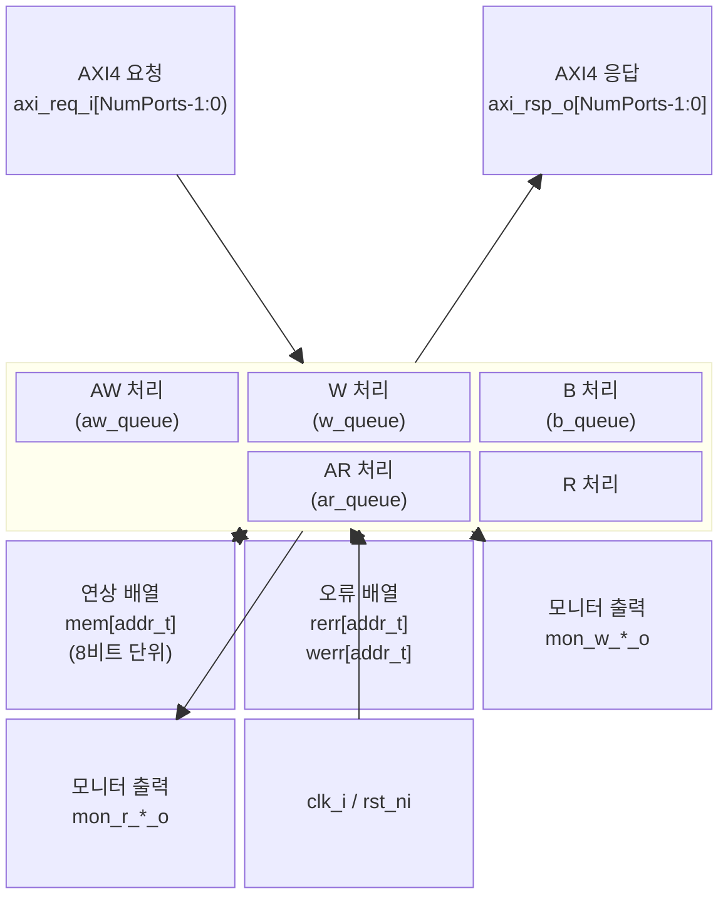

# axi_sim_mem

## 모듈 개요 및 기능

`axi_sim_mem`은 **시뮬레이션 전용** 무한 용량 메모리 모델로, AXI4 슬레이브 포트를 제공한다. 내부적으로 SystemVerilog 연상 배열(`mem[addr_t]`)을 사용하여 초기화 없이 임의 주소를 저장/조회할 수 있다.

주요 특징:
- 합성 불가 (시뮬레이션 전용)
- `$readmemh` 명령으로 메모리 내용 외부 로드 가능
- 멀티포트 지원 (`NumPorts` 파라미터)
- 읽기/쓰기 오류 응답 주입 기능 (`rerr`, `werr` 배열)
- 메모리 접근 모니터 출력 제공
- 미초기화 바이트에 대한 경고 및 기본값 설정 지원
- ATOP(Atomic Operations) 미지원

---

## Mermaid 블록 다이어그램

---

## 파라미터 테이블

| 이름                | 타입          | 기본값      | 설명                                                 |
|---------------------|--------------|------------|------------------------------------------------------|
| AddrWidth           | int unsigned | 0          | AXI 주소 비트 폭                                     |
| DataWidth           | int unsigned | 0          | AXI 데이터 비트 폭                                   |
| IdWidth             | int unsigned | 0          | AXI ID 비트 폭                                       |
| UserWidth           | int unsigned | 0          | AXI User 비트 폭                                     |
| NumPorts            | int unsigned | 1          | 요청 포트 수                                          |
| axi_req_t           | type         | logic      | AXI4 요청 구조체 타입                                |
| axi_rsp_t           | type         | logic      | AXI4 응답 구조체 타입                                |
| WarnUninitialized   | bit          | 0          | 미초기화 바이트 접근 시 경고 활성화                  |
| UninitializedData   | string       | "undefined"| 미초기화 데이터 기본값 ("undefined"/"zeros"/"ones"/"random") |
| ClearErrOnAccess    | bit          | 0          | 접근 시 오류 항목 자동 클리어                        |
| ApplDelay           | time         | 0ps        | 응답 신호 적용 지연 (상승 에지 이후)                 |
| AcqDelay            | time         | 0ps        | 입력 신호 샘플링 지연 (상승 에지 이후)               |

---

## 포트 테이블

| 이름                   | 방향   | 폭                           | 설명                                        |
|------------------------|--------|------------------------------|---------------------------------------------|
| clk_i                  | input  | 1                            | 상승 에지 클록                              |
| rst_ni                 | input  | 1                            | 비동기 리셋 (Active Low)                    |
| axi_req_i              | input  | axi_req_t [NumPorts-1:0]     | AXI4 요청 입력 (포트별)                     |
| axi_rsp_o              | output | axi_rsp_t [NumPorts-1:0]     | AXI4 응답 출력 (포트별)                     |
| mon_w_valid_o          | output | logic [NumPorts-1:0]         | 쓰기 모니터 유효 신호                       |
| mon_w_addr_o           | output | logic [NumPorts-1:0][AW-1:0] | 쓰기 모니터 주소                            |
| mon_w_data_o           | output | logic [NumPorts-1:0][DW-1:0] | 쓰기 모니터 데이터                          |
| mon_w_id_o             | output | logic [NumPorts-1:0][IW-1:0] | 쓰기 모니터 ID                              |
| mon_w_user_o           | output | logic [NumPorts-1:0][UW-1:0] | 쓰기 모니터 User                            |
| mon_w_beat_count_o     | output | axi_pkg::len_t [NumPorts-1:0]| 쓰기 비트 카운트                            |
| mon_w_last_o           | output | logic [NumPorts-1:0]         | 쓰기 마지막 비트 표시                       |
| mon_r_valid_o          | output | logic [NumPorts-1:0]         | 읽기 모니터 유효 신호                       |
| mon_r_addr_o           | output | logic [NumPorts-1:0][AW-1:0] | 읽기 모니터 주소                            |
| mon_r_data_o           | output | logic [NumPorts-1:0][DW-1:0] | 읽기 모니터 데이터                          |
| mon_r_id_o             | output | logic [NumPorts-1:0][IW-1:0] | 읽기 모니터 ID                              |
| mon_r_user_o           | output | logic [NumPorts-1:0][UW-1:0] | 읽기 모니터 User                            |
| mon_r_beat_count_o     | output | axi_pkg::len_t [NumPorts-1:0]| 읽기 비트 카운트                            |
| mon_r_last_o           | output | logic [NumPorts-1:0]         | 읽기 마지막 비트 표시                       |

---

## 내부 아키텍처 설명

모든 로직은 `initial` 블록 내 `forever` 루프로 구현된 행동 모델이다. 각 포트별로 독립적인 5개 프로세스가 병렬 실행된다.

### AW 채널 처리
- 매 클록 상승 에지마다 `aw_ready = 1`로 설정
- `aw_valid`이면 `aw_queue`에 AW 비트 삽입

### W 채널 처리
- `aw_queue`에 항목이 있을 때만 `w_ready = 1` 활성화
- 스트로브(strb) 기반 바이트 단위 메모리(`mem`) 업데이트
- `axi_pkg::beat_addr`로 버스트 주소 계산
- 버스트 완료 시 `b_queue`에 B 비트 삽입, 오류 발생 시 `error_happened` 반영

### B 채널 처리
- `b_queue`에 항목 있으면 `b_valid` 활성화
- `b_ready` 시 `b_queue`에서 항목 제거

### AR 채널 처리
- 매 클록마다 `ar_ready = 1`로 설정
- `ar_valid`이면 `ar_queue`에 AR 비트 삽입

### R 채널 처리
- `ar_queue` 항목에 따라 `axi_pkg::beat_addr`로 주소 계산
- 바이트 단위 메모리 읽기 (미초기화 시 `UninitializedData` 값 반환)
- `rerr` 배열 기반 오류 응답 반영
- `r_ready` 대기 후 다음 비트로 진행

### 모니터 출력
- 쓰기/읽기 모니터 신호는 해당 접근 발생 후 **다음 클록 사이클**에 출력
- ATI 타이밍 호환성 유지를 위해 1 사이클 지연

---

## 인스턴스화하는 서브모듈 목록

없음 (행동 모델, 서브모듈 미사용)

---

## 타이밍/레이턴시 특성

- AW/AR 채널: 1 사이클 레이턴시로 항상 승인 (즉각 응답)
- W/R 처리: `ApplDelay` 후 신호 적용, `AcqDelay` 후 입력 샘플링
- 모니터 출력: 접근 발생 후 다음 클록에 유효 (1 사이클 지연)
- 기본값 `ApplDelay = AcqDelay = 0ps`

---

## 특수 동작

- **메모리 로드**: 인스턴스화 후 `$readmemh("file.mem", i_sim_mem.mem)`으로 외부 파일 로드 가능
- **오류 주입**: `rerr[addr]` 및 `werr[addr]`에 직접 값을 설정하여 특정 주소에 오류 응답 주입
- **ClearErrOnAccess**: 활성화 시 접근한 주소의 오류 항목 자동 초기화
- **버스트 지원**: INCR, WRAP, FIXED 모든 버스트 타입 지원 (`axi_pkg::beat_addr` 사용)
- **ATOP 미지원**: Atomic 연산은 지원하지 않음
- **인터페이스 변형**: `axi_sim_mem_intf` (단일 포트), `axi_sim_mem_multiport_intf` (다중 포트) 래퍼 모듈 포함
