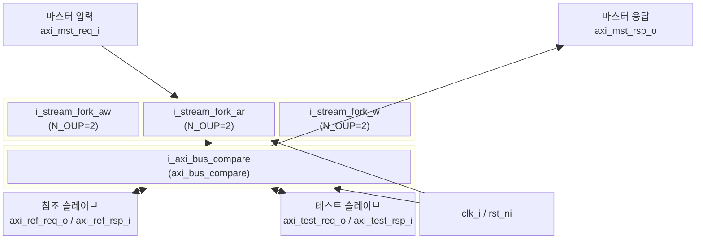

# axi_slave_compare

## 모듈 개요 및 기능

`axi_slave_compare`는 두 개의 AXI 슬레이브(참조 슬레이브와 테스트 슬레이브)에 동일한 AXI 트랜잭션을 동시에 전송하고 응답을 비교하는 FPGA 기반 검증용 합성 가능 모듈이다.

- **참조 응답(ref)**은 마스터에게 전달된다.
- **테스트 응답(test)**은 비교 후 폐기된다.
- AW, W, AR 채널은 `stream_fork`를 사용해 두 슬레이브에 동시 전달된다.
- 채널별 불일치(mismatch) 신호를 출력한다.
- 내부적으로 `axi_bus_compare`를 사용하여 실제 비교 수행한다.

---

## Mermaid 블록 다이어그램

---

## 파라미터 테이블

| 이름           | 타입          | 기본값           | 설명                                         |
|----------------|--------------|-----------------|----------------------------------------------|
| AxiIdWidth     | int unsigned | 0               | AXI4+ATOP ID 비트 폭                         |
| FifoDepth      | int unsigned | 0               | 비교용 내부 FIFO 깊이                        |
| UseSize        | bit          | 0               | 비교 시 size 필드 포함 여부                  |
| DataWidth      | int unsigned | 8               | AXI4+ATOP 데이터 비트 폭                     |
| axi_aw_chan_t  | type         | logic           | AW 채널 구조체 타입                          |
| axi_w_chan_t   | type         | logic           | W 채널 구조체 타입                           |
| axi_b_chan_t   | type         | logic           | B 채널 구조체 타입                           |
| axi_ar_chan_t  | type         | logic           | AR 채널 구조체 타입                          |
| axi_r_chan_t   | type         | logic           | R 채널 구조체 타입                           |
| axi_req_t      | type         | logic           | 요청 구조체 타입                             |
| axi_rsp_t      | type         | logic           | 응답 구조체 타입                             |
| id_t           | type         | logic[2**IW-1:0]| ID 타입 (덮어쓰지 말 것)                    |

---

## 포트 테이블

| 이름              | 방향   | 폭          | 설명                                             |
|-------------------|--------|------------|--------------------------------------------------|
| clk_i             | input  | 1          | 클록                                             |
| rst_ni            | input  | 1          | 비동기 리셋 (Active Low)                         |
| testmode_i        | input  | 1          | 테스트 모드 활성화                               |
| axi_mst_req_i     | input  | axi_req_t  | 마스터에서 오는 AXI 요청 입력                    |
| axi_mst_rsp_o     | output | axi_rsp_t  | 마스터로 반환하는 AXI 응답 출력 (참조 기반)      |
| axi_ref_req_o     | output | axi_req_t  | 참조 슬레이브로의 요청 출력                      |
| axi_ref_rsp_i     | input  | axi_rsp_t  | 참조 슬레이브로부터의 응답 입력                  |
| axi_test_req_o    | output | axi_req_t  | 테스트 슬레이브로의 요청 출력                    |
| axi_test_rsp_i    | input  | axi_rsp_t  | 테스트 슬레이브로부터의 응답 입력                |
| aw_mismatch_o     | output | id_t       | AW 채널 불일치 신호 (ID별)                       |
| w_mismatch_o      | output | logic      | W 채널 불일치 신호                               |
| b_mismatch_o      | output | id_t       | B 채널 불일치 신호 (ID별)                        |
| ar_mismatch_o     | output | id_t       | AR 채널 불일치 신호 (ID별)                       |
| r_mismatch_o      | output | id_t       | R 채널 불일치 신호 (ID별)                        |
| mismatch_o        | output | logic      | 전체 불일치 신호 (OR)                            |
| busy_o            | output | logic      | 모듈 동작 중 표시                                |

---

## 내부 아키텍처 설명

### 스트림 포크 (stream_fork)

AW, W, AR 채널 각각에 대해 `stream_fork` (N_OUP=2)를 사용하여 동일한 유효(valid) 신호를 두 슬레이브에 동시 전달한다. 두 슬레이브 모두 준비(ready)가 되어야만 핸드셰이크가 완료된다.

### 버스 어셈블리

각 슬레이브용 요청 구조체는 원본 마스터 요청을 복사하되 `aw_valid`, `ar_valid`, `w_valid` 만 `stream_fork` 출력으로 교체한다.

테스트 슬레이브의 B/R 응답은 즉시 수락(`r_ready='1`, `b_ready='1`)된다.

마스터에게 반환되는 응답은 참조 슬레이브 응답을 기반으로 하되, `aw_ready`, `w_ready`, `ar_ready`는 `stream_fork`의 통합 ready로 교체된다.

### axi_bus_compare

실제 채널별 비교 로직을 담당하는 서브모듈. 내부 FIFO를 사용하여 두 슬레이브의 응답을 수집하고 비교한다.

---

## 인스턴스화하는 서브모듈 목록

| 인스턴스명          | 모듈명           | 역할                                          |
|--------------------|-----------------|-----------------------------------------------|
| i_stream_fork_aw   | stream_fork     | AW 채널 1→2 포크                              |
| i_stream_fork_ar   | stream_fork     | AR 채널 1→2 포크                              |
| i_stream_fork_w    | stream_fork     | W 채널 1→2 포크                               |
| i_axi_bus_compare  | axi_bus_compare | 두 AXI 버스 채널별 응답 비교 로직             |

---

## 타이밍/레이턴시 특성

- `stream_fork` 핸드셰이크: 두 슬레이브 모두 ready여야 하므로 느린 슬레이브에 의해 지연 발생 가능
- B/R 채널 비교 레이턴시는 `FifoDepth` 파라미터에 따라 결정
- 참조 응답이 마스터에게 전달되므로 테스트 슬레이브 지연이 마스터 응답에 영향을 주지 않음

---

## 특수 동작

- **합성 가능**: FPGA 기반 검증에 활용 가능한 합성 가능 모듈
- **참조 우선**: 마스터는 항상 참조 슬레이브의 응답을 받음; 테스트 슬레이브 응답은 비교 후 폐기
- **테스트 B/R 자동 수락**: 테스트 슬레이브로의 `b_ready`와 `r_ready`를 항상 `'1`로 설정하여 백프레셔 없이 응답 수집
