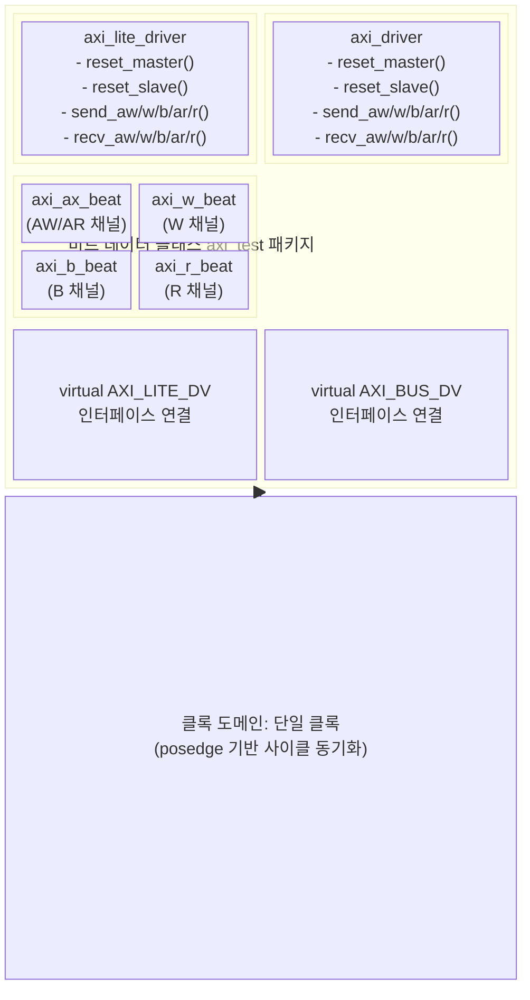

# axi_test

## 모듈 개요 및 기능

`axi_test`는 AXI4 및 AXI4-Lite 인터페이스의 시뮬레이션 검증을 위한 **SystemVerilog 패키지**다. 합성 불가능한 테스트벤치 유틸리티 클래스와 태스크 모음을 제공한다.

주요 구성:
- `axi_lite_driver`: AXI4-Lite 인터페이스 드라이버 클래스
- `axi_ax_beat`, `axi_w_beat`, `axi_b_beat`, `axi_r_beat`: AXI 채널 비트 데이터 클래스
- `axi_driver`: 완전한 AXI4 인터페이스 드라이버 클래스
- 랜덤 마스터/슬레이브 트랜잭션 생성기 클래스들

---

## Mermaid 블록 다이어그램

---

## 파라미터 테이블

### axi_lite_driver 파라미터

| 이름 | 타입  | 기본값 | 설명                               |
|------|-------|-------|-------------------------------------|
| AW   | int   | 32    | 주소 비트 폭                        |
| DW   | int   | 32    | 데이터 비트 폭                      |
| TA   | time  | 0ns   | 자극 적용 시간 (Application Time)   |
| TT   | time  | 0ns   | 자극 측정 시간 (Test Time)          |

### axi_driver 파라미터

| 이름 | 타입  | 기본값 | 설명                               |
|------|-------|-------|-------------------------------------|
| AW   | int   | 32    | 주소 비트 폭                        |
| DW   | int   | 32    | 데이터 비트 폭                      |
| IW   | int   | 8     | ID 비트 폭                          |
| UW   | int   | 1     | User 비트 폭                        |
| TA   | time  | 0ns   | 자극 적용 시간                      |
| TT   | time  | 0ns   | 자극 측정 시간                      |

### axi_ax_beat 파라미터

| 이름 | 타입  | 기본값 | 설명           |
|------|-------|-------|-----------------|
| AW   | int   | 32    | 주소 비트 폭    |
| IW   | int   | 8     | ID 비트 폭      |
| UW   | int   | 1     | User 비트 폭    |

---

## 포트 테이블

패키지이므로 포트가 없다. 드라이버 클래스는 가상(virtual) 인터페이스를 통해 DUT에 연결된다.

| 인터페이스 타입     | 설명                          |
|--------------------|-------------------------------|
| AXI_LITE_DV        | AXI4-Lite DV 인터페이스       |
| AXI_BUS_DV         | AXI4 전체 DV 인터페이스       |

---

## 내부 아키텍처 설명

### axi_lite_driver

AXI4-Lite 인터페이스에 대한 마스터/슬레이브 역할 수행 태스크 제공:

- `reset_master()` / `reset_slave()`: 모든 신호를 기본값으로 초기화
- `send_aw(addr, prot)`: AW 채널에 비트 전송 (ready 대기 후 완료)
- `send_w(data, strb)`: W 채널에 데이터 전송
- `send_b(resp)`: B 채널에 응답 전송 (슬레이브 역할)
- `send_ar(addr, prot)`: AR 채널에 비트 전송
- `send_r(data, resp)`: R 채널에 읽기 데이터 전송 (슬레이브 역할)
- `recv_*`: 해당 채널에서 비트 수신 (valid 대기 후 완료)

### axi_driver

AXI4 전체 인터페이스 드라이버. `axi_ax_beat`, `axi_w_beat`, `axi_b_beat`, `axi_r_beat` 클래스 객체를 인자로 사용:

- `send_aw(ax_beat_t beat)`: AW 채널 전송 (id, addr, len, size, burst, lock, cache, prot, qos, region, atop, user 모두 포함)
- `send_w(w_beat_t beat)`: W 채널 전송
- `send_b(b_beat_t beat)`: B 채널 전송 (슬레이브 역할)
- `send_ar(ax_beat_t beat)`: AR 채널 전송
- `send_r(r_beat_t beat)`: R 채널 전송 (슬레이브 역할)
- `recv_*`: 각 채널별 수신 태스크

### 타이밍 제어

`TA` (Application Time)와 `TT` (Test Time)를 사용하여 클록 에지 대비 신호 설정/샘플링 시점을 정밀 제어한다. `#TA` 지연 후 신호 적용, `#TT` 후 신호 샘플링.

---

## 인스턴스화하는 서브모듈 목록

없음 (패키지로 구성된 클래스 모음)

---

## 타이밍/레이턴시 특성

- `send_*` 태스크: `aw_ready`/`ar_ready`/`w_ready`를 기다리는 동기 핸드셰이크 수행
- `recv_*` 태스크: `valid` 신호가 활성화될 때까지 폴링
- 사이클 경계: `@(posedge axi.clk_i)` 기반 동기화
- `TA` 파라미터로 setup time 시뮬레이션 가능

---

## 특수 동작

- **시뮬레이션 전용**: 합성 불가능한 패키지로, 테스트벤치에서만 사용
- **랜덤화 지원**: `rand` 키워드로 `axi_ax_beat`, `axi_w_beat` 등 비트 필드를 SV 랜덤화 가능
- **AW.atop 지원**: `axi_ax_beat`에 `ax_atop` 필드 포함 (ATOP 트랜잭션 드라이빙 가능)
- **마스터/슬레이브 양방향**: 각 드라이버는 마스터 역할(send_aw/ar/w + recv_b/r)과 슬레이브 역할(recv_aw/ar/w + send_b/r) 모두 수행 가능
