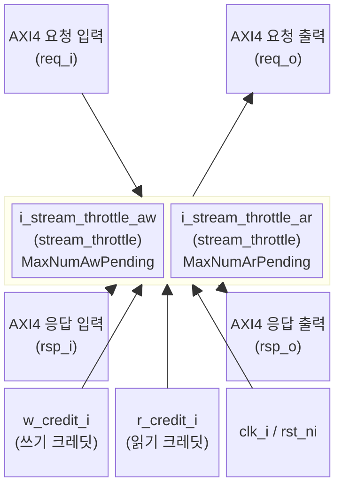

# axi_throttle

## 모듈 개요 및 기능

`axi_throttle`은 AXI4+ATOP 버스의 미처리(outstanding) 트랜잭션 수를 동적으로 제한하는 모듈이다. 컴파일 타임에 최대 허용 미처리 수를 설정하고, 런타임에 크레딧(credit) 신호로 실제 허용 수를 제어한다.

- **쓰기 스로틀**: AW 채널 진행을 제한, B 채널 응답으로 크레딧 회수
- **읽기 스로틀**: AR 채널 진행을 제한, R.last 채널 응답으로 크레딧 회수
- W, B, R 데이터 채널과 W/B 응답은 그대로 통과 (AX valid/ready만 제어)
- 순서 보장 또는 모든 요청/응답이 동일 ID인 환경을 가정

---

## Mermaid 블록 다이어그램

---

## 파라미터 테이블

| 이름             | 타입          | 기본값                               | 설명                                            |
|------------------|--------------|--------------------------------------|-------------------------------------------------|
| MaxNumAwPending  | int unsigned | 1                                    | 최대 허용 미처리 쓰기 요청 수 (컴파일 타임 상한) |
| MaxNumArPending  | int unsigned | 1                                    | 최대 허용 미처리 읽기 요청 수 (컴파일 타임 상한) |
| axi_req_t        | type         | logic                                | AXI4+ATOP 요청 구조체 타입                      |
| axi_rsp_t        | type         | logic                                | AXI4+ATOP 응답 구조체 타입                      |
| WCntWidth        | int unsigned | cf_math_pkg::idx_width(MaxNumAwPending) | 쓰기 크레딧 카운터 비트 폭 (덮어쓰지 말 것)  |
| RCntWidth        | int unsigned | cf_math_pkg::idx_width(MaxNumArPending) | 읽기 크레딧 카운터 비트 폭 (덮어쓰지 말 것)  |
| w_credit_t       | type         | logic [WCntWidth-1:0]               | 쓰기 크레딧 카운터 타입 (덮어쓰지 말 것)        |
| r_credit_t       | type         | logic [RCntWidth-1:0]               | 읽기 크레딧 카운터 타입 (덮어쓰지 말 것)        |

---

## 포트 테이블

| 이름         | 방향   | 폭           | 설명                                             |
|--------------|--------|-------------|--------------------------------------------------|
| clk_i        | input  | 1           | 클록                                             |
| rst_ni       | input  | 1           | 비동기 리셋 (Active Low)                         |
| req_i        | input  | axi_req_t   | AXI4+ATOP 요청 입력 (업스트림)                   |
| rsp_o        | output | axi_rsp_t   | AXI4+ATOP 응답 출력 (업스트림)                   |
| req_o        | output | axi_req_t   | AXI4+ATOP 요청 출력 (다운스트림)                 |
| rsp_i        | input  | axi_rsp_t   | AXI4+ATOP 응답 입력 (다운스트림)                 |
| w_credit_i   | input  | w_credit_t  | 런타임 쓰기 크레딧 (허용 미처리 쓰기 수)         |
| r_credit_i   | input  | r_credit_t  | 런타임 읽기 크레딧 (허용 미처리 읽기 수)         |

---

## 내부 아키텍처 설명

### 스로틀 동작 원리

두 개의 `stream_throttle` 서브모듈이 AW/AR 채널을 독립적으로 제어한다:

- **쓰기 경로**: `req_i.aw_valid` → `stream_throttle` → `throttled_aw_valid` → `req_o.aw_valid`
  - 크레딧 소비: AW 핸드셰이크 시
  - 크레딧 회수: B 채널 (`rsp_i.b_valid & req_i.b_ready`)
- **읽기 경로**: `req_i.ar_valid` → `stream_throttle` → `throttled_ar_valid` → `req_o.ar_valid`
  - 크레딧 소비: AR 핸드셰이크 시
  - 크레딧 회수: R.last 수신 (`rsp_i.r_valid & rsp_i.r.last`)

### 패스스루 연결

AX valid/ready 이외의 모든 신호는 직통 연결:
- `req_o = req_i` (단, `aw_valid`, `ar_valid`는 스로틀 출력으로 교체)
- `rsp_o = rsp_i` (단, `aw_ready`, `ar_ready`는 스로틀 출력으로 교체)

---

## 인스턴스화하는 서브모듈 목록

| 인스턴스명              | 모듈명           | 역할                              |
|------------------------|-----------------|-----------------------------------|
| i_stream_throttle_aw   | stream_throttle | AW 채널 미처리 쓰기 수 제한       |
| i_stream_throttle_ar   | stream_throttle | AR 채널 미처리 읽기 수 제한       |

---

## 타이밍/레이턴시 특성

- 크레딧이 남아 있을 때: 조합 논리로 AX valid 즉시 통과 (0 사이클 추가 레이턴시)
- 크레딧 소진 시: AX valid 차단 (B/R.last 수신 시까지 대기)
- 런타임 크레딧 변경: 즉시 반영 (조합 논리)

---

## 특수 동작

- **순서 가정**: 이 모듈은 요청이 순서대로 처리되거나 모든 요청/응답이 동일 ID를 갖는다고 가정한다 (out-of-order 처리 시 크레딧 계산이 올바르지 않을 수 있음)
- **동적 크레딧 제어**: `w_credit_i`와 `r_credit_i`를 런타임에 변경하여 쓰기/읽기 미처리 수를 동적으로 조절 가능
- **최대값 제약**: `MaxNumAwPending`/`MaxNumArPending`는 컴파일 타임 상한이며, 런타임 크레딧은 이 값을 초과할 수 없음
- **W 채널 비제어**: W 데이터 채널은 스로틀되지 않으므로, W 채널 backpressure는 다운스트림 슬레이브에 의해서만 발생
