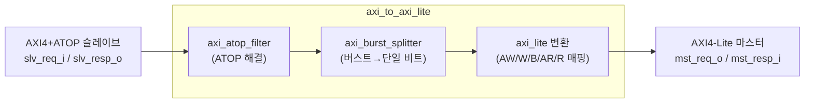

# axi_to_axi_lite.sv

## 개요

AXI4+ATOP를 AXI4-Lite로 변환하는 어댑터입니다. 원자적 트랜잭션(ATOP)과 버스트 지원을 포함합니다.

변환 파이프라인:
1. ATOP 필터링 → 2. 버스트 분할 → 3. AXI4-Lite로 변환

## 블록 다이어그램

## 파라미터

| 파라미터 | 타입 | 기본값 | 설명 |
|---------|------|--------|------|
| `AxiAddrWidth` | `int unsigned` | 0 | 주소 폭 |
| `AxiDataWidth` | `int unsigned` | 0 | 데이터 폭 |
| `AxiIdWidth` | `int unsigned` | 0 | ID 폭 |
| `AxiUserWidth` | `int unsigned` | 0 | 사용자 신호 폭 |
| `AxiMaxWriteTxns` | `int unsigned` | 0 | 최대 동시 쓰기 트랜잭션 수 |
| `AxiMaxReadTxns` | `int unsigned` | 0 | 최대 동시 읽기 트랜잭션 수 |
| `FullBW` | `bit` | 0 | axi_burst_splitter에서 풀 대역폭 ID 큐 모드 |
| `FallThrough` | `bit` | `1'b1` | FIFO 폴스루 모드 |
| `full_req_t` | `type` | `logic` | AXI4 요청 타입 |
| `full_resp_t` | `type` | `logic` | AXI4 응답 타입 |
| `lite_req_t` | `type` | `logic` | AXI4-Lite 요청 타입 |
| `lite_resp_t` | `type` | `logic` | AXI4-Lite 응답 타입 |

## 포트

| 포트 | 방향 | 설명 |
|------|------|------|
| `clk_i` | 입력 | 클록 |
| `rst_ni` | 입력 | 비동기 리셋 (액티브 로우) |
| `test_i` | 입력 | 테스트 모드 |
| `slv_req_i` | 입력 | AXI4+ATOP 슬레이브 요청 |
| `slv_resp_o` | 출력 | AXI4+ATOP 슬레이브 응답 |
| `mst_req_o` | 출력 | AXI4-Lite 마스터 요청 |
| `mst_resp_i` | 입력 | AXI4-Lite 마스터 응답 |

## 의존성

- `axi_atop_filter`
- `axi_burst_splitter`
- `axi_pkg`
