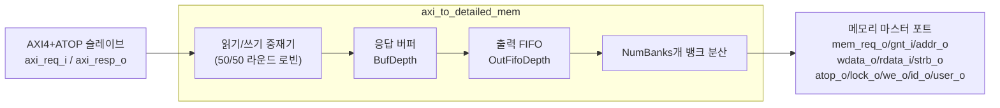

# axi_to_detailed_mem.sv

## 개요

AXI4+ATOP 슬레이브로서 AXI 버스트를 메모리 스트림으로 변환합니다. `axi_to_mem`에 비해 더 많은 메모리 세부 정보(ATOP, lock, ID, user 신호 등)를 포함합니다.

- 읽기와 쓰기가 동시에 활성화될 경우 각각 50% 활용률
- 뱅크(bank) 단위 메모리 인터페이스 지원

## 블록 다이어그램

## 파라미터

| 파라미터 | 타입 | 기본값 | 설명 |
|---------|------|--------|------|
| `axi_req_t` | `type` | `logic` | AXI4+ATOP 요청 타입 |
| `axi_resp_t` | `type` | `logic` | AXI4+ATOP 응답 타입 |
| `AddrWidth` | `int unsigned` | 1 | 주소 폭 |
| `DataWidth` | `int unsigned` | 1 | 데이터 폭 |
| `IdWidth` | `int unsigned` | 1 | ID 폭 |
| `UserWidth` | `int unsigned` | 1 | 사용자 신호 폭 |
| `NumBanks` | `int unsigned` | 1 | 메모리 뱅크 수 (DataWidth를 균등 분할) |
| `BufDepth` | `int unsigned` | 1 | 응답 버퍼 깊이 (메모리 응답 지연과 동일) |
| `HideStrb` | `bit` | `1'b0` | strb==0일 때 쓰기 숨김 |
| `OutFifoDepth` | `int unsigned` | 1 | 출력 FIFO 깊이 |

## 포트

| 포트 | 방향 | 폭 | 설명 |
|------|------|----|------|
| `clk_i` | 입력 | 1 | 클록 |
| `rst_ni` | 입력 | 1 | 비동기 리셋 |
| `busy_o` | 출력 | 1 | 처리 중 표시 |
| `axi_req_i` | 입력 | - | AXI4+ATOP 요청 |
| `axi_resp_o` | 출력 | - | AXI4+ATOP 응답 |
| `mem_req_o` | 출력 | NumBanks | 메모리 요청 |
| `mem_gnt_i` | 입력 | NumBanks | 메모리 승인 |
| `mem_addr_o` | 출력 | NumBanks×AddrWidth | 메모리 주소 |
| `mem_wdata_o` | 출력 | NumBanks×(DataWidth/NumBanks) | 쓰기 데이터 |
| `mem_strb_o` | 출력 | NumBanks×(DataWidth/NumBanks/8) | 바이트 스트로브 |
| `mem_atop_o` | 출력 | NumBanks×atop_t | 원자적 연산 신호 |
| `mem_lock_o` | 출력 | NumBanks | 잠금 신호 |
| `mem_we_o` | 출력 | NumBanks | 쓰기 활성화 |
| `mem_id_o` | 출력 | NumBanks×IdWidth | 요청 ID |
| `mem_user_o` | 출력 | NumBanks×UserWidth | 사용자 신호 |
| `mem_rdata_i` | 입력 | NumBanks×(DataWidth/NumBanks) | 읽기 데이터 |
| `mem_rvalid_i` | 입력 | NumBanks | 읽기 데이터 유효 |
| `mem_rerror_i` | 입력 | NumBanks | 읽기 에러 |

## 의존성

- `axi_pkg`
- `common_cells/registers.svh`
