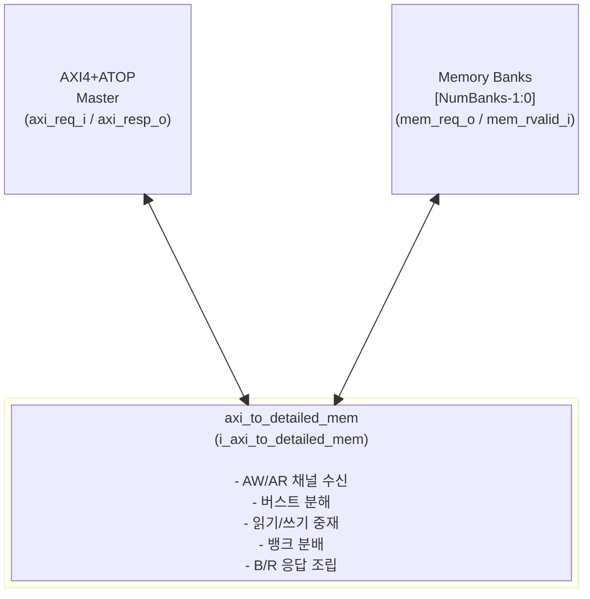
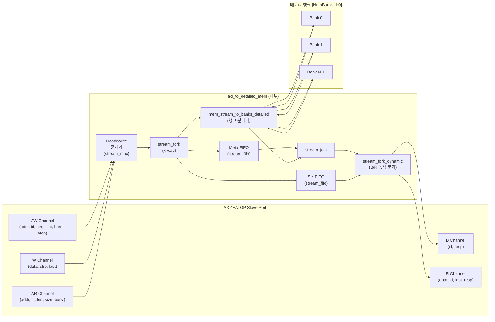

# axi_to_mem

## 모듈 개요 및 기능

`axi_to_mem`은 AXI4+ATOP 슬레이브 포트를 단순 메모리 스트림 인터페이스로 변환하는 프로토콜 변환기이다.
AXI 버스트 트랜잭션(읽기/쓰기)을 분해하여 `NumBanks`개의 병렬 메모리 뱅크로 요청을 발행한다.
읽기와 쓰기가 동시에 활성화될 경우 두 채널 모두 **50% 활용도**를 유지하는 중재 정책을 사용한다.

실제 로직은 내부적으로 `axi_to_detailed_mem`에 전적으로 위임하며, `mem_lock_o`, `mem_id_o`, `mem_user_o`, `mem_cache_o`, `mem_prot_o`, `mem_qos_o`, `mem_region_o` 같은 확장 사이드밴드 신호는 연결하지 않아 인터페이스를 단순하게 유지한다.

인터페이스 래퍼인 `axi_to_mem_intf`도 동일 파일에 포함되어 있으며, `AXI_BUS` SystemVerilog 인터페이스를 struct 형태의 `req_t`/`resp_t`로 변환한 뒤 `axi_to_mem`을 인스턴스화한다.

---

## Mermaid 블록 다이어그램

---

## 파라미터 테이블

| 이름 | 타입 | 기본값 | 설명 |
|---|---|---|---|
| `axi_req_t` | type | logic | AXI4+ATOP 요청 구조체 타입 |
| `axi_resp_t` | type | logic | AXI4+ATOP 응답 구조체 타입 |
| `AddrWidth` | int unsigned | 0 | 메모리 주소 폭 (비트). AXI 주소 폭 이하여야 함 |
| `DataWidth` | int unsigned | 0 | AXI4+ATOP 데이터 폭 (비트) |
| `IdWidth` | int unsigned | 0 | AXI4+ATOP ID 폭 (비트) |
| `NumBanks` | int unsigned | 0 | 출력 메모리 뱅크 수. `DataWidth`를 나누어야 함 |
| `BufDepth` | int unsigned | 1 | 메모리 응답 버퍼 깊이. 메모리 응답 레이턴시와 동일하게 설정 |
| `HideStrb` | bit | 1'b0 | 1이면 strobe가 모두 0인 쓰기 요청을 메모리로 전송하지 않음 |
| `OutFifoDepth` | int unsigned | 1 | 출력 FIFO 깊이. 뱅크 간 비대칭 역압력 발생 시 증가 필요 |
| `addr_t` | localparam type | logic[AddrWidth-1:0] | 종속 파라미터 - 메모리 주소 타입 |
| `mem_data_t` | localparam type | logic[DataWidth/NumBanks-1:0] | 종속 파라미터 - 뱅크당 데이터 타입 |
| `mem_strb_t` | localparam type | logic[DataWidth/NumBanks/8-1:0] | 종속 파라미터 - 뱅크당 스트로브 타입 |

---

## 포트 테이블

| 이름 | 방향 | 폭 | 설명 |
|---|---|---|---|
| `clk_i` | input | 1 | 클록 입력 |
| `rst_ni` | input | 1 | 비동기 리셋, 액티브 로우 |
| `busy_o` | output | 1 | 모듈이 AXI 요청 처리 중임을 나타내는 플래그 |
| `axi_req_i` | input | axi_req_t | AXI4+ATOP 슬레이브 포트 요청 입력 |
| `axi_resp_o` | output | axi_resp_t | AXI4+ATOP 슬레이브 포트 응답 출력 |
| `mem_req_o` | output | [NumBanks-1:0] | 뱅크별 메모리 요청 유효 신호 |
| `mem_gnt_i` | input | [NumBanks-1:0] | 뱅크별 메모리 요청 승인 신호 |
| `mem_addr_o` | output | addr_t [NumBanks-1:0] | 뱅크별 메모리 바이트 주소 |
| `mem_wdata_o` | output | mem_data_t [NumBanks-1:0] | 뱅크별 쓰기 데이터 |
| `mem_strb_o` | output | mem_strb_t [NumBanks-1:0] | 뱅크별 바이트 인에이블(스트로브) |
| `mem_atop_o` | output | axi_pkg::atop_t [NumBanks-1:0] | 뱅크별 atomic 연산 코드 |
| `mem_we_o` | output | [NumBanks-1:0] | 뱅크별 쓰기 인에이블 (1=write, 0=read) |
| `mem_rvalid_i` | input | [NumBanks-1:0] | 뱅크별 응답 유효 신호 (읽기/쓰기 모두 필요) |
| `mem_rdata_i` | input | mem_data_t [NumBanks-1:0] | 뱅크별 읽기 응답 데이터 |

---

## 내부 아키텍처 설명

### 위임 구조

`axi_to_mem`은 자체 로직을 포함하지 않으며, 모든 기능을 `axi_to_detailed_mem`에 위임한다. 차이점은 `UserWidth=1`로 고정하고 확장 사이드밴드 포트(lock, id, user, cache, prot, qos, region)를 연결하지 않는다는 점이다. 또한 오류 응답 입력(`mem_err_i`, `mem_exokay_i`)을 모두 `'0`으로 묶어 단순화한다.

### 내부 axi_to_detailed_mem의 동작 개요

1. **읽기/쓰기 분리**: AR/AW 채널을 각각 순차적으로 처리하며 버스트 카운터(`r_cnt_q`, `w_cnt_q`)로 진행 상태를 추적한다.
2. **중재(Arbitration)**: QoS, 버스트 단계, 라운드 로빈 순서로 우선순위를 결정하여 `stream_mux`로 출력한다.
3. **3-way Fork**: 중재된 메타 데이터를 메모리 요청, 메타 버퍼, 선택 버퍼로 동시 분기한다(`stream_fork`).
4. **뱅크 분배**: `mem_stream_to_banks_detailed`가 단일 메모리 요청을 `NumBanks`개로 분할하여 각 뱅크의 주소, 데이터, 스트로브를 계산한다.
5. **응답 조립**: 메모리 응답이 반환되면 `stream_join`으로 데이터와 메타를 결합한 뒤 `stream_fork_dynamic`으로 B(쓰기 응답) 또는 R(읽기 응답) 채널에 선택적으로 전달한다.

### HideStrb 기능

`HideStrb=1`일 때, 스트로브가 전부 0인 뱅크에 대한 쓰기 요청은 실제 메모리로 전송되지 않는다. 대신 응답 카운터가 즉시 처리된 것으로 기록하여 AXI 프로토콜 흐름을 유지한다.

---

## 인스턴스화하는 서브모듈 목록

| 인스턴스 이름 | 모듈 이름 | 설명 |
|---|---|---|
| `i_axi_to_detailed_mem` | `axi_to_detailed_mem` | 실제 AXI→메모리 변환 로직 전체를 담당 |

`axi_to_mem_intf` 내:

| 인스턴스 이름 | 모듈 이름 | 설명 |
|---|---|---|
| `i_axi_to_mem` | `axi_to_mem` | 인터페이스를 struct로 변환 후 위임 |

---

## 타이밍/레이턴시 특성

- **응답 레이턴시**: `BufDepth` 사이클. 메모리의 실제 읽기 레이턴시와 일치하도록 설정해야 한다.
- **읽기/쓰기 동시 처리**: 읽기와 쓰기가 동시에 요청되면 각각 50% 대역폭을 사용한다(라운드 로빈 중재).
- **출력 FIFO**: `OutFifoDepth`가 1이면 fall-through 레지스터로 동작하여 추가 레이턴시가 없다. 값을 높이면 뱅크 간 역압력(backpressure) 불균형 처리에 유리하지만 레이턴시가 증가한다.
- **버스트 지원**: INCR 버스트 타입만 지원한다(len > 0인 경우). len=0인 단일 전송은 FIXED/WRAP도 처리 가능하다.
- **ATOP**: Atomic 연산이 포함된 쓰기는 메모리로 전달되며, `atop[5]`가 설정된 경우(load-linked 류) R 채널에도 응답이 생성된다.
