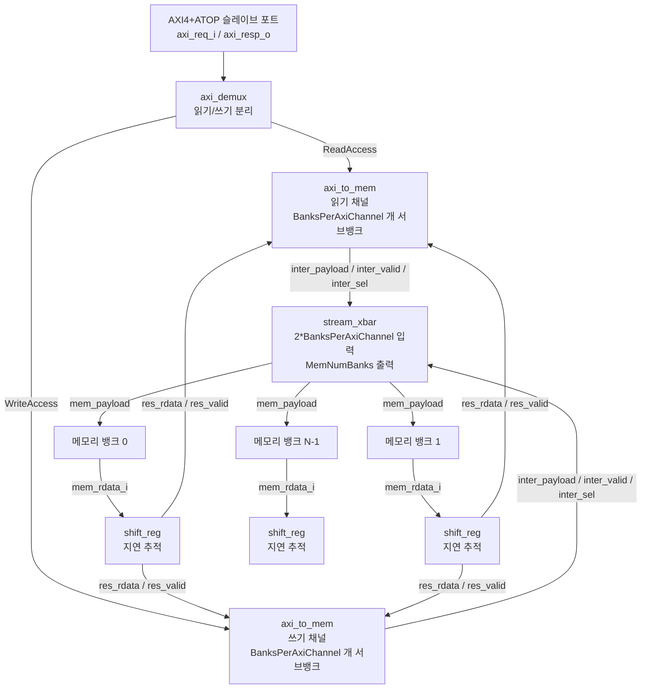

# axi_to_mem_banked

## 모듈 목적 및 개요

`axi_to_mem_banked`는 AXI4+ATOP 인터페이스를 뱅크(Bank)형 SRAM 메모리 슬레이브에 연결하는 프로토콜 변환 모듈입니다. 읽기와 쓰기 트랜잭션을 동시에 병렬 처리할 수 있어 `axi_to_mem`보다 높은 처리량을 제공하지만, 그만큼 더 많은 하드웨어 자원을 소모합니다.

핵심 동작 방식은 다음과 같습니다:
- `axi_demux`로 AXI 버스를 읽기/쓰기 채널로 분리
- 각 채널에서 `axi_to_mem`을 사용해 AXI 프로토콜을 메모리 스트림으로 변환
- `stream_xbar`로 여러 메모리 뱅크에 요청을 라우팅
- 시프트 레지스터를 이용해 메모리 지연(Latency)을 추적하고 올바른 읽기 응답 반환

사용 가능한 주소 공간은 0x0에서 시작하며, 모든 뱅크 용량의 합산이 최대 주소가 됩니다.

---

## 파라미터 테이블

| 이름 | 타입 | 기본값 | 설명 |
|------|------|--------|------|
| `AxiIdWidth` | `int unsigned` | `0` | AXI4+ATOP ID 비트 폭 |
| `AxiAddrWidth` | `int unsigned` | `0` | AXI4+ATOP 주소 비트 폭 |
| `AxiDataWidth` | `int unsigned` | `0` | AXI4+ATOP 데이터 비트 폭 |
| `axi_aw_chan_t` | `type` | `logic` | AXI AW 채널 구조체 타입 |
| `axi_w_chan_t` | `type` | `logic` | AXI W 채널 구조체 타입 |
| `axi_b_chan_t` | `type` | `logic` | AXI B 채널 구조체 타입 |
| `axi_ar_chan_t` | `type` | `logic` | AXI AR 채널 구조체 타입 |
| `axi_r_chan_t` | `type` | `logic` | AXI R 채널 구조체 타입 |
| `axi_req_t` | `type` | `logic` | AXI 요청 구조체 타입 |
| `axi_resp_t` | `type` | `logic` | AXI 응답 구조체 타입 |
| `MemNumBanks` | `int unsigned` | `4` | 메모리 뱅크 수 (2의 거듭제곱, `>= 2 * AxiDataWidth / MemDataWidth` 조건 충족 필요) |
| `MemAddrWidth` | `int unsigned` | `11` | 개별 뱅크의 워드 주소 비트 폭 |
| `MemDataWidth` | `int unsigned` | `32` | 메모리 매크로 데이터 비트 폭 (`AxiDataWidth % MemDataWidth == 0` 조건 필요) |
| `MemLatency` | `int unsigned` | `1` | 메모리 읽기 지연 사이클 수 |
| `HideStrb` | `bit` | `0` | 스트로브가 `0`일 때 쓰기 요청 숨김 여부 |
| `OutFifoDepth` | `int unsigned` | `1` | 출력 FIFO 깊이 (비대칭 역압 시 증가) |
| `mem_addr_t` | `type` | `logic[MemAddrWidth-1:0]` | (의존 파라미터) 메모리 주소 타입 |
| `mem_atop_t` | `type` | `axi_pkg::atop_t` | (의존 파라미터) 원자 연산 타입 |
| `mem_data_t` | `type` | `logic[MemDataWidth-1:0]` | (의존 파라미터) 메모리 데이터 타입 |
| `mem_strb_t` | `type` | `logic[MemDataWidth/8-1:0]` | (의존 파라미터) 바이트 스트로브 타입 |

---

## 포트 테이블

| 이름 | 방향 | 너비 | 설명 |
|------|------|------|------|
| `clk_i` | input | 1 | 클록 신호 |
| `rst_ni` | input | 1 | 비동기 리셋 (액티브 로우) |
| `test_i` | input | 1 | 테스트 모드 활성화 |
| `axi_req_i` | input | `axi_req_t` | AXI 슬레이브 포트 요청 |
| `axi_resp_o` | output | `axi_resp_t` | AXI 슬레이브 포트 응답 |
| `mem_req_o` | output | `[MemNumBanks-1:0]` | 메모리 뱅크 요청 신호 |
| `mem_gnt_i` | input | `[MemNumBanks-1:0]` | 메모리 뱅크 요청 승인 신호 |
| `mem_add_o` | output | `mem_addr_t[MemNumBanks-1:0]` | 메모리 뱅크 주소 (워드 주소) |
| `mem_we_o` | output | `[MemNumBanks-1:0]` | 쓰기 활성화 (액티브 하이) |
| `mem_wdata_o` | output | `mem_data_t[MemNumBanks-1:0]` | 쓰기 데이터 |
| `mem_be_o` | output | `mem_strb_t[MemNumBanks-1:0]` | 바이트 활성화 (액티브 하이) |
| `mem_atop_o` | output | `mem_atop_t[MemNumBanks-1:0]` | 원자 연산 코드 |
| `mem_rdata_i` | input | `mem_data_t[MemNumBanks-1:0]` | 메모리 뱅크 읽기 데이터 |
| `axi_to_mem_busy_o` | output | `[1:0]` | 읽기/쓰기 채널 각각의 바쁨 상태 |

---

## 내부 동작 및 로직 설명

### 1. 읽기/쓰기 분리 (axi_demux)

`axi_demux` 인스턴스가 AXI 슬레이브 포트를 2개의 포트로 정적 분리합니다:
- 포트 `0` (`ReadAccess = 1'b0`): AR 채널 (읽기 주소) 전용
- 포트 `1` (`WriteAccess = 1'b1`): AW/W 채널 (쓰기 주소/데이터) 전용

이 분리를 통해 읽기와 쓰기가 동시에 진행될 수 있습니다.

### 2. AXI → 메모리 프로토콜 변환 (axi_to_mem × 2)

각 채널에 대해 독립적인 `axi_to_mem` 인스턴스가 존재합니다:
- 하나의 AXI 데이터 폭(`AxiDataWidth`)을 `BanksPerAxiChannel = AxiDataWidth / MemDataWidth`개의 뱅크 폭으로 분할
- 각 뱅크 요청을 `xbar_payload_t` 구조체로 패킹 (주소, 쓰기 활성화, 데이터, 스트로브, 원자 연산 포함)

### 3. 뱅크 선택 신호 추출

바이트 주소에서 뱅크 선택 비트를 추출합니다:
- `BankSelOffset = log2(MemDataWidth / 8)` 비트 위치부터
- `BankSelWidth = log2(MemNumBanks)` 비트 폭으로 읽어 대상 뱅크 인덱스 결정

### 4. 읽기 응답 라우팅 (shift_reg)

`MemLatency` 사이클 깊이의 시프트 레지스터가 각 요청 사이클에 어떤 뱅크에서 응답이 와야 하는지 기억합니다:
- 요청 시점의 뱅크 선택 신호를 레지스터에 저장
- 정확히 `MemLatency` 사이클 후 `mem_rdata_i`에서 해당 뱅크 데이터를 선택

### 5. 스트림 크로스바 중재 (stream_xbar)

`2 * BanksPerAxiChannel`개의 입력 스트림을 `MemNumBanks`개의 메모리 뱅크로 라우팅합니다. 라운드-로빈 방식으로 충돌을 중재합니다.

---

## Mermaid 블록 다이어그램



---

## 의존성 모듈 목록

| 모듈 | 설명 |
|------|------|
| `axi_demux` | AXI 버스를 여러 슬레이브로 역다중화 |
| `axi_to_mem` | AXI 프로토콜을 메모리 스트림으로 변환 |
| `stream_xbar` | 스트림 기반 크로스바 중재기 |
| `shift_reg` | 파이프라인 지연 추적용 시프트 레지스터 |
| `axi_pkg` | AXI 타입 및 상수 정의 패키지 |
| `cf_math_pkg` | `idx_width` 등 수학 유틸리티 패키지 |

---

## 사용 예시

```systemverilog
// 파라미터 및 타입 정의
`include "axi/typedef.svh"

localparam int unsigned AXI_ID_W   = 4;
localparam int unsigned AXI_ADDR_W = 32;
localparam int unsigned AXI_DATA_W = 64;
localparam int unsigned MEM_BANKS  = 4;  // >= 2 * 64/32 = 4, 2의 거듭제곱
localparam int unsigned MEM_AW     = 12;
localparam int unsigned MEM_DW     = 32;
localparam int unsigned MEM_LAT    = 1;

typedef logic [AXI_ID_W  -1:0] id_t;
typedef logic [AXI_ADDR_W-1:0] addr_t;
typedef logic [AXI_DATA_W-1:0] data_t;
typedef logic [AXI_DATA_W/8-1:0] strb_t;
typedef logic [0:0] user_t;

`AXI_TYPEDEF_AW_CHAN_T(aw_t, addr_t, id_t, user_t)
`AXI_TYPEDEF_W_CHAN_T(w_t, data_t, strb_t, user_t)
`AXI_TYPEDEF_B_CHAN_T(b_t, id_t, user_t)
`AXI_TYPEDEF_AR_CHAN_T(ar_t, addr_t, id_t, user_t)
`AXI_TYPEDEF_R_CHAN_T(r_t, data_t, id_t, user_t)
`AXI_TYPEDEF_REQ_T(axi_req_t, aw_t, w_t, ar_t)
`AXI_TYPEDEF_RESP_T(axi_resp_t, b_t, r_t)

axi_to_mem_banked #(
  .AxiIdWidth   ( AXI_ID_W    ),
  .AxiAddrWidth ( AXI_ADDR_W  ),
  .AxiDataWidth ( AXI_DATA_W  ),
  .axi_aw_chan_t( aw_t        ),
  .axi_w_chan_t ( w_t         ),
  .axi_b_chan_t ( b_t         ),
  .axi_ar_chan_t( ar_t        ),
  .axi_r_chan_t ( r_t         ),
  .axi_req_t    ( axi_req_t   ),
  .axi_resp_t   ( axi_resp_t  ),
  .MemNumBanks  ( MEM_BANKS   ),
  .MemAddrWidth ( MEM_AW      ),
  .MemDataWidth ( MEM_DW      ),
  .MemLatency   ( MEM_LAT     )
) u_axi_to_mem_banked (
  .clk_i              ( clk              ),
  .rst_ni             ( rst_n            ),
  .test_i             ( 1'b0             ),
  .axi_req_i          ( axi_req          ),
  .axi_resp_o         ( axi_resp         ),
  .mem_req_o          ( mem_req          ),
  .mem_gnt_i          ( mem_gnt          ),
  .mem_add_o          ( mem_addr         ),
  .mem_we_o           ( mem_we           ),
  .mem_wdata_o        ( mem_wdata        ),
  .mem_be_o           ( mem_be           ),
  .mem_atop_o         ( mem_atop         ),
  .mem_rdata_i        ( mem_rdata        ),
  .axi_to_mem_busy_o  ( busy             )
);
```

### 파라미터 제약 조건

- `MemNumBanks >= 2 * AxiDataWidth / MemDataWidth`
- `MemNumBanks`는 반드시 2의 거듭제곱
- `AxiDataWidth % MemDataWidth == 0`
- `MemLatency >= 1`
