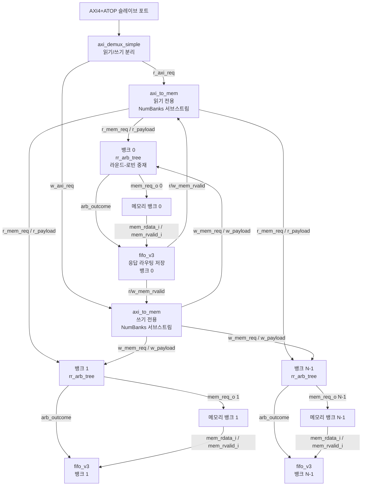

# axi_to_mem_interleaved

## 모듈 목적 및 개요

`axi_to_mem_interleaved`는 AXI4+ATOP 인터페이스를 SRAM 메모리 슬레이브에 연결하는 프로토콜 변환 모듈입니다. 읽기와 쓰기 트랜잭션을 **동시에** 처리하며, 읽기 요청이 쓰기 요청을 추월(bypass)할 수 있습니다. `axi_to_mem`보다 높은 성능을 제공하지만 더 많은 하드웨어를 필요로 합니다.

핵심 특징:
- `axi_demux_simple`을 통해 AXI 버스를 읽기/쓰기 채널로 분리
- 각 채널에 독립적인 `axi_to_mem` 인스턴스 배치
- 각 메모리 뱅크마다 `rr_arb_tree`를 이용한 세밀한 라운드-로빈 중재
- `fifo_v3`를 사용하여 응답을 올바른 AXI 채널(읽기 또는 쓰기)로 역라우팅

---

## 파라미터 테이블

| 이름 | 타입 | 기본값 | 설명 |
|------|------|--------|------|
| `axi_req_t` | `type` | `logic` | AXI4+ATOP 요청 구조체 타입 |
| `axi_resp_t` | `type` | `logic` | AXI4+ATOP 응답 구조체 타입 |
| `AddrWidth` | `int unsigned` | `0` | 주소 비트 폭 (`mem_addr_o` 폭 결정) |
| `DataWidth` | `int unsigned` | `0` | AXI 데이터 비트 폭 |
| `IdWidth` | `int unsigned` | `0` | AXI ID 비트 폭 |
| `NumBanks` | `int unsigned` | `0` | 출력 메모리 뱅크 수 (`DataWidth`를 균등 분할해야 함) |
| `BufDepth` | `int unsigned` | `1` | 메모리 응답 버퍼 깊이 (메모리 응답 지연과 동일하게 설정) |
| `HideStrb` | `bit` | `0` | 스트로브가 `0`일 때 쓰기 요청 숨김 여부 |
| `OutFifoDepth` | `int unsigned` | `1` | 출력 FIFO 깊이 |
| `addr_t` | `type` | `logic[AddrWidth-1:0]` | (의존 파라미터) 메모리 주소 타입 |
| `mem_data_t` | `type` | `logic[DataWidth/NumBanks-1:0]` | (의존 파라미터) 메모리 데이터 타입 |
| `mem_strb_t` | `type` | `logic[DataWidth/NumBanks/8-1:0]` | (의존 파라미터) 바이트 스트로브 타입 |

---

## 포트 테이블

| 이름 | 방향 | 너비 | 설명 |
|------|------|------|------|
| `clk_i` | input | 1 | 클록 신호 |
| `rst_ni` | input | 1 | 비동기 리셋 (액티브 로우) |
| `test_i` | input | 1 | 테스트 모드 활성화 |
| `busy_o` | output | 1 | 모듈 동작 중 상태 플래그 |
| `axi_req_i` | input | `axi_req_t` | AXI 슬레이브 포트 요청 |
| `axi_resp_o` | output | `axi_resp_t` | AXI 슬레이브 포트 응답 |
| `mem_req_o` | output | `[NumBanks-1:0]` | 각 뱅크에 대한 메모리 요청 유효 신호 |
| `mem_gnt_i` | input | `[NumBanks-1:0]` | 각 뱅크의 요청 승인 신호 |
| `mem_addr_o` | output | `addr_t[NumBanks-1:0]` | 각 뱅크의 바이트 주소 |
| `mem_wdata_o` | output | `mem_data_t[NumBanks-1:0]` | 각 뱅크의 쓰기 데이터 |
| `mem_strb_o` | output | `mem_strb_t[NumBanks-1:0]` | 각 뱅크의 바이트 스트로브 |
| `mem_atop_o` | output | `axi_pkg::atop_t[NumBanks-1:0]` | 각 뱅크의 원자 연산 코드 |
| `mem_we_o` | output | `[NumBanks-1:0]` | 쓰기 활성화 신호 |
| `mem_rvalid_i` | input | `[NumBanks-1:0]` | 메모리 응답 유효 신호 |
| `mem_rdata_i` | input | `mem_data_t[NumBanks-1:0]` | 각 뱅크의 읽기 데이터 |

---

## 내부 동작 및 로직 설명

### 1. AXI 버스 분리 (axi_demux_simple)

`axi_demux_simple`이 입력 AXI를 읽기 전용(`r_axi_req`)과 쓰기 전용(`w_axi_req`) 채널로 고정 분리합니다:
- AR 채널 → `r_axi_req` (select = `1'b0`)
- AW/W 채널 → `w_axi_req` (select = `1'b1`)

### 2. 독립적인 AXI-메모리 변환 (axi_to_mem × 2)

- `i_axi_to_mem_read`: 읽기 요청만 처리
- `i_axi_to_mem_write`: 쓰기 요청만 처리

각 인스턴스는 `NumBanks`개의 메모리 인터페이스를 생성합니다.

### 3. 뱅크별 라운드-로빈 중재 (rr_arb_tree)

각 뱅크에 대해 `rr_arb_tree`가 읽기/쓰기 요청을 중재합니다:
- 2개 입력: `r_mem_req[i]`, `w_mem_req[i]`
- 1개 출력: `mem_req_o[i]` (승자 요청 데이터와 중재 결과 `arb_outcome[i]`)

FIFO가 가득 찬 경우(`fifo_full[i]`) 요청을 차단하여 응답 라우팅 정보가 손실되지 않도록 합니다.

### 4. 응답 역라우팅 (fifo_v3)

각 뱅크마다 1비트 FIFO(`BufDepth+1` 깊이)가 중재 결과(`arb_outcome[i]`)를 저장합니다:
- 요청이 수락될 때(`mem_req_o & mem_gnt_i`) FIFO에 push
- 응답이 오면(`mem_rvalid_i`) FIFO에서 pop
- `arb_outcome_head[i]` = `1`이면 읽기 채널로, `0`이면 쓰기 채널로 응답 라우팅

```
w_mem_rvalid[i] = mem_rvalid_i[i] & !arb_outcome_head[i]  // 쓰기 응답
r_mem_rvalid[i] = mem_rvalid_i[i] &  arb_outcome_head[i]  // 읽기 응답
```

---

## Mermaid 블록 다이어그램



---

## 의존성 모듈 목록

| 모듈 | 설명 |
|------|------|
| `axi_demux_simple` | AXI 버스를 간단히 여러 슬레이브로 분리 |
| `axi_to_mem` | AXI 프로토콜을 메모리 스트림으로 변환 |
| `rr_arb_tree` | 라운드-로빈 중재 트리 |
| `fifo_v3` | 응답 라우팅 정보 저장용 FIFO |
| `axi_pkg` | AXI 타입 및 상수 정의 패키지 |

---

## 사용 예시

```systemverilog
`include "axi/typedef.svh"

localparam int unsigned AddrW    = 32;
localparam int unsigned DataW    = 64;
localparam int unsigned IdW      = 4;
localparam int unsigned NumBanks = 2;
localparam int unsigned BufDepth = 2;

// AXI 타입 정의 (생략 - typedef.svh 매크로 사용)
// ...

axi_to_mem_interleaved #(
  .axi_req_t   ( axi_req_t  ),
  .axi_resp_t  ( axi_resp_t ),
  .AddrWidth   ( AddrW      ),
  .DataWidth   ( DataW      ),
  .IdWidth     ( IdW        ),
  .NumBanks    ( NumBanks   ),
  .BufDepth    ( BufDepth   ),
  .HideStrb    ( 1'b0       ),
  .OutFifoDepth( 1          )
) u_interleaved (
  .clk_i        ( clk          ),
  .rst_ni       ( rst_n        ),
  .test_i       ( 1'b0         ),
  .busy_o       ( busy         ),
  .axi_req_i    ( axi_req      ),
  .axi_resp_o   ( axi_resp     ),
  .mem_req_o    ( mem_req      ),
  .mem_gnt_i    ( mem_gnt      ),
  .mem_addr_o   ( mem_addr     ),
  .mem_wdata_o  ( mem_wdata    ),
  .mem_strb_o   ( mem_strb     ),
  .mem_atop_o   ( mem_atop     ),
  .mem_we_o     ( mem_we       ),
  .mem_rvalid_i ( mem_rvalid   ),
  .mem_rdata_i  ( mem_rdata    )
);
```

### `axi_to_mem`과의 차이점

| 특성 | `axi_to_mem` | `axi_to_mem_interleaved` |
|------|-------------|--------------------------|
| 읽기/쓰기 동시 처리 | 불가 | 가능 |
| 읽기가 쓰기 추월 | 불가 | 가능 |
| 하드웨어 비용 | 낮음 | 높음 |
| 처리량 | 낮음 | 높음 |
