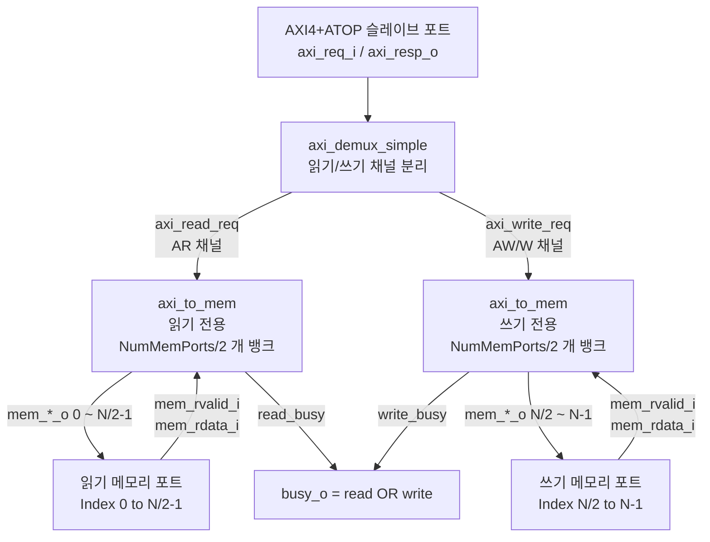

# axi_to_mem_split

## 모듈 목적 및 개요

`axi_to_mem_split`은 AXI4+ATOP 인터페이스를 메모리 프로토콜로 변환하는 모듈로, 읽기 채널과 쓰기 채널을 **완전히 분리된 메모리 포트**로 내보냅니다. 같은 뱅크 주소가 서로 다른 메모리 포트에서 접근 가능한 경우에만 사용할 수 있습니다.

`axi_to_mem_interleaved`와의 차이점:
- `axi_to_mem_interleaved`: 읽기/쓰기가 **동일한** 메모리 포트를 공유하며 뱅크 수준에서 중재
- `axi_to_mem_split`: 읽기/쓰기가 **완전히 분리된** 메모리 포트를 가짐 (포트 수 = `2 * AxiDataWidth / MemDataWidth`)

총 메모리 포트 수: `NumMemPorts = 2 * AxiDataWidth / MemDataWidth`
- 하위 `NumMemPorts/2`개 포트: 읽기 전용
- 상위 `NumMemPorts/2`개 포트: 쓰기 전용

---

## 파라미터 테이블

| 이름 | 타입 | 기본값 | 설명 |
|------|------|--------|------|
| `axi_req_t` | `type` | `logic` | AXI4+ATOP 요청 구조체 타입 |
| `axi_resp_t` | `type` | `logic` | AXI4+ATOP 응답 구조체 타입 |
| `AddrWidth` | `int unsigned` | `0` | 주소 비트 폭 |
| `AxiDataWidth` | `int unsigned` | `0` | AXI 데이터 비트 폭 |
| `IdWidth` | `int unsigned` | `0` | AXI ID 비트 폭 |
| `MemDataWidth` | `int unsigned` | `0` | 메모리 데이터 비트 폭 (`AxiDataWidth`를 균등 분할해야 함) |
| `BufDepth` | `int unsigned` | `0` | 메모리 응답 버퍼 깊이 (메모리 응답 지연과 동일하게 설정) |
| `HideStrb` | `bit` | `0` | 스트로브가 `0`일 때 쓰기 요청 숨김 여부 |
| `OutFifoDepth` | `int unsigned` | `1` | 출력 FIFO 깊이 |
| `NumMemPorts` | `int unsigned` | `2*AxiDataWidth/MemDataWidth` | (의존 파라미터) 전체 메모리 포트 수 |
| `addr_t` | `type` | `logic[AddrWidth-1:0]` | (의존 파라미터) 메모리 주소 타입 |
| `mem_data_t` | `type` | `logic[MemDataWidth-1:0]` | (의존 파라미터) 메모리 데이터 타입 |
| `mem_strb_t` | `type` | `logic[MemDataWidth/8-1:0]` | (의존 파라미터) 바이트 스트로브 타입 |

---

## 포트 테이블

| 이름 | 방향 | 너비 | 설명 |
|------|------|------|------|
| `clk_i` | input | 1 | 클록 신호 |
| `rst_ni` | input | 1 | 비동기 리셋 (액티브 로우) |
| `test_i` | input | 1 | 테스트 모드 활성화 |
| `busy_o` | output | 1 | 모듈 동작 중 상태 플래그 (`read_busy OR write_busy`) |
| `axi_req_i` | input | `axi_req_t` | AXI 슬레이브 포트 요청 |
| `axi_resp_o` | output | `axi_resp_t` | AXI 슬레이브 포트 응답 |
| `mem_req_o` | output | `[NumMemPorts-1:0]` | 각 메모리 포트 요청 유효 신호 |
| `mem_gnt_i` | input | `[NumMemPorts-1:0]` | 각 메모리 포트 요청 승인 신호 |
| `mem_addr_o` | output | `addr_t[NumMemPorts-1:0]` | 각 포트의 바이트 주소 |
| `mem_wdata_o` | output | `mem_data_t[NumMemPorts-1:0]` | 각 포트의 쓰기 데이터 |
| `mem_strb_o` | output | `mem_strb_t[NumMemPorts-1:0]` | 각 포트의 바이트 스트로브 |
| `mem_atop_o` | output | `axi_pkg::atop_t[NumMemPorts-1:0]` | 각 포트의 원자 연산 코드 |
| `mem_we_o` | output | `[NumMemPorts-1:0]` | 쓰기 활성화 신호 |
| `mem_rvalid_i` | input | `[NumMemPorts-1:0]` | 메모리 응답 유효 신호 |
| `mem_rdata_i` | input | `mem_data_t[NumMemPorts-1:0]` | 각 포트의 읽기 데이터 |

### 메모리 포트 인덱스 매핑

| 포트 범위 | 용도 |
|-----------|------|
| `[NumMemPorts/2-1:0]` | 읽기(AR) 채널 전용 포트 |
| `[NumMemPorts-1:NumMemPorts/2]` | 쓰기(AW/W) 채널 전용 포트 |

---

## 내부 동작 및 로직 설명

### 1. AXI 버스 분리 (axi_demux_simple)

`axi_demux_simple`이 AXI 버스를 고정 선택으로 분리합니다:
- AR 채널 → `axi_read_req` (select = `1'b0`)
- AW/W 채널 → `axi_write_req` (select = `1'b1`)

### 2. 읽기 전용 axi_to_mem (i_axi_to_mem_read)

- `NumBanks = NumMemPorts/2`
- `HideStrb = 1'b0` (하드코딩)
- 출력 포트: `mem_*_o[NumMemPorts/2-1:0]` (하위 절반)

### 3. 쓰기 전용 axi_to_mem (i_axi_to_mem_write)

- `NumBanks = NumMemPorts/2`
- `HideStrb = HideStrb` (파라미터 전달)
- 출력 포트: `mem_*_o[NumMemPorts-1:NumMemPorts/2]` (상위 절반)

### 4. 바쁨 플래그

```
busy_o = read_busy || write_busy
```

---

## Mermaid 블록 다이어그램



---

## 의존성 모듈 목록

| 모듈 | 설명 |
|------|------|
| `axi_demux_simple` | AXI 버스를 간단히 여러 슬레이브로 분리 |
| `axi_to_mem` | AXI 프로토콜을 메모리 스트림으로 변환 |
| `axi_pkg` | AXI 타입 및 상수 정의 패키지 |

---

## 사용 예시

```systemverilog
`include "axi/typedef.svh"
`include "axi/assign.svh"

localparam int unsigned AddrW    = 32;
localparam int unsigned AxiDW    = 64;
localparam int unsigned MemDW    = 32;
localparam int unsigned IdW      = 4;
localparam int unsigned BufDepth = 2;
// NumMemPorts = 2 * 64 / 32 = 4 (읽기 2개 + 쓰기 2개)
localparam int unsigned NMP = 2 * AxiDW / MemDW;

// AXI 타입 정의 (생략)
// ...

axi_to_mem_split #(
  .axi_req_t    ( axi_req_t  ),
  .axi_resp_t   ( axi_resp_t ),
  .AddrWidth    ( AddrW      ),
  .AxiDataWidth ( AxiDW      ),
  .IdWidth      ( IdW        ),
  .MemDataWidth ( MemDW      ),
  .BufDepth     ( BufDepth   )
) u_split (
  .clk_i        ( clk                    ),
  .rst_ni       ( rst_n                  ),
  .test_i       ( 1'b0                   ),
  .busy_o       ( busy                   ),
  .axi_req_i    ( axi_req                ),
  .axi_resp_o   ( axi_resp               ),
  .mem_req_o    ( mem_req    [NMP-1:0]   ),
  .mem_gnt_i    ( mem_gnt    [NMP-1:0]   ),
  .mem_addr_o   ( mem_addr   [NMP-1:0]   ),
  .mem_wdata_o  ( mem_wdata  [NMP-1:0]   ),
  .mem_strb_o   ( mem_strb   [NMP-1:0]   ),
  .mem_atop_o   ( mem_atop   [NMP-1:0]   ),
  .mem_we_o     ( mem_we     [NMP-1:0]   ),
  .mem_rvalid_i ( mem_rvalid [NMP-1:0]   ),
  .mem_rdata_i  ( mem_rdata  [NMP-1:0]   )
);

// 포트 0~1: 읽기 전용 SRAM에 연결
// 포트 2~3: 쓰기 전용 SRAM에 연결 (또는 동일 SRAM의 다른 포트)
```

### 사용 시 주의사항

- 읽기 포트와 쓰기 포트가 **같은 물리 메모리 뱅크를 다른 포트로 접근**하는 경우에만 올바르게 동작합니다.
- 읽기 전용 포트에서 `mem_we_o`가 절대 어서트되지 않으므로, 읽기 전용 메모리에도 연결 가능합니다.
