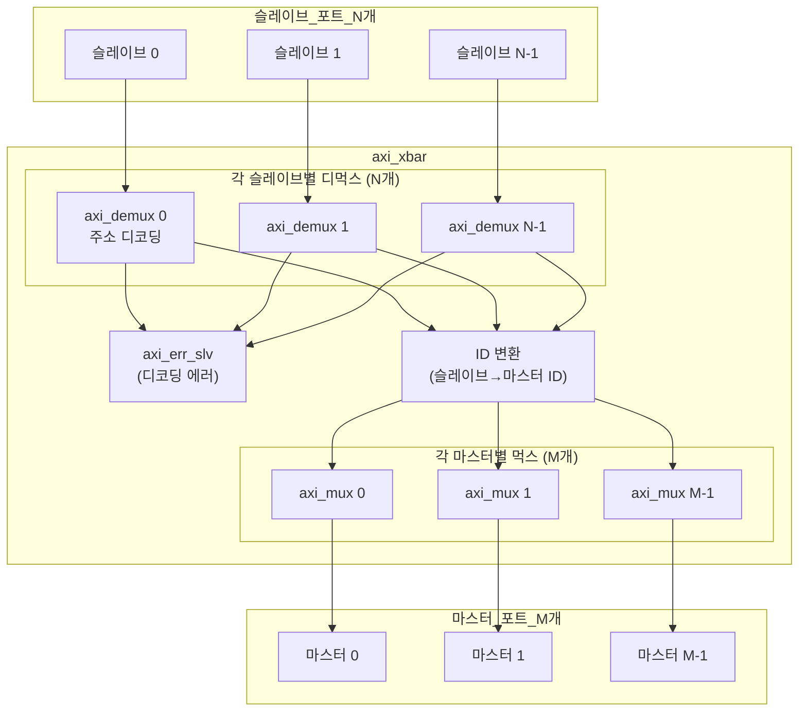

# axi_xbar.sv

## 개요

임의의 슬레이브 및 마스터 포트 수를 가진 완전 연결(Fully-Connected) AXI4+ATOP 크로스바 스위치입니다. ATOP(원자적 연산) 지원 및 연결 행렬(Connectivity Matrix)을 통한 부분 연결도 지원합니다.

자세한 문서는 `doc/axi_xbar.md`를 참조하세요.

## 블록 다이어그램

## 파라미터

| 파라미터 | 타입 | 기본값 | 설명 |
|---------|------|--------|------|
| `Cfg` | `axi_pkg::xbar_cfg_t` | `'0` | 크로스바 설정 구조체 |
| `ATOPs` | `bit` | `1'b1` | ATOP 원자적 연산 지원 |
| `Connectivity` | `bit [N-1:0][M-1:0]` | `'1` | 슬레이브-마스터 연결 행렬 (`1`=연결) |
| `slv_aw_chan_t` | `type` | `logic` | 슬레이브 AW 채널 타입 |
| `mst_aw_chan_t` | `type` | `logic` | 마스터 AW 채널 타입 |
| `w_chan_t` | `type` | `logic` | W 채널 타입 |
| `slv_b_chan_t` | `type` | `logic` | 슬레이브 B 채널 타입 |
| `mst_b_chan_t` | `type` | `logic` | 마스터 B 채널 타입 |
| `slv_ar_chan_t` | `type` | `logic` | 슬레이브 AR 채널 타입 |
| `mst_ar_chan_t` | `type` | `logic` | 마스터 AR 채널 타입 |
| `slv_r_chan_t` | `type` | `logic` | 슬레이브 R 채널 타입 |
| `mst_r_chan_t` | `type` | `logic` | 마스터 R 채널 타입 |
| `slv_req_t` | `type` | `logic` | 슬레이브 요청 타입 |
| `slv_resp_t` | `type` | `logic` | 슬레이브 응답 타입 |
| `mst_req_t` | `type` | `logic` | 마스터 요청 타입 |
| `mst_resp_t` | `type` | `logic` | 마스터 응답 타입 |
| `rule_t` | `type` | `xbar_rule_64_t` | 주소 디코딩 규칙 타입 |

## xbar_cfg_t 주요 필드

| 필드 | 설명 |
|------|------|
| `NoSlvPorts` | 슬레이브 포트 수 (N) |
| `NoMstPorts` | 마스터 포트 수 (M) |
| `MaxMstTrans` | 마스터 포트당 최대 미처리 트랜잭션 |
| `MaxSlvTrans` | 슬레이브 포트당 최대 미처리 트랜잭션 |
| `FallThrough` | FIFO 폴스루 모드 |
| `LatencyMode` | 지연 모드 설정 |
| `AxiIdWidthSlvPorts` | 슬레이브 포트 ID 폭 |
| `AxiIdUsedSlvPorts` | 사용되는 슬레이브 ID 비트 수 |
| `UniqueIds` | 고유 ID 보장 여부 |
| `AxiAddrWidth` | 주소 폭 |
| `AxiDataWidth` | 데이터 폭 |
| `NoAddrRules` | 주소 매핑 규칙 수 |

## 포트

| 포트 | 방향 | 설명 |
|------|------|------|
| `clk_i` | 입력 | 클록 |
| `rst_ni` | 입력 | 비동기 리셋 |
| `test_i` | 입력 | 테스트 모드 |
| `slv_ports_req_i` | 입력 | 슬레이브 포트 요청 배열 [N] |
| `slv_ports_resp_o` | 출력 | 슬레이브 포트 응답 배열 [N] |
| `mst_ports_req_o` | 출력 | 마스터 포트 요청 배열 [M] |
| `mst_ports_resp_i` | 입력 | 마스터 포트 응답 배열 [M] |
| `addr_map_i` | 입력 | 주소-마스터 포트 매핑 테이블 |
| `en_default_mst_port_i` | 입력 | 기본 마스터 포트 활성화 [N] |
| `default_mst_port_i` | 입력 | 기본 마스터 포트 인덱스 [N] |

## 의존성

- `axi_demux`
- `axi_mux`
- `axi_err_slv`
- `addr_decode` (common_cells)
- `axi_pkg`
- `cf_math_pkg` (common_cells)
