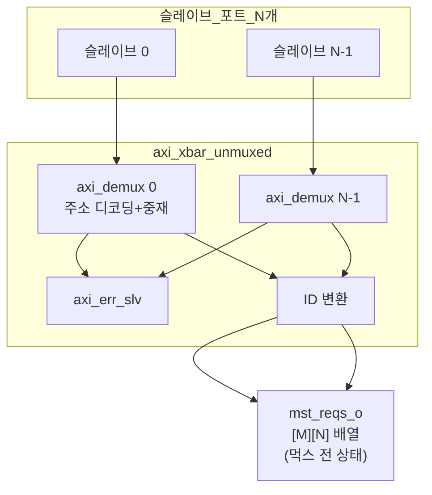

# axi_xbar_unmuxed.sv

## 개요

`axi_xbar`의 내부 변형으로, 마스터 포트의 출력 멀티플렉서(mux)를 제외한 크로스바 구조를 구현합니다. 슬레이브 포트의 디먹스에서 마스터 포트로의 신호를 완전히 펼친 배열로 출력합니다.

`axi_xbar`는 내부적으로 이 모듈과 별도의 `axi_mux`들을 조합하여 구현됩니다.

## 블록 다이어그램

## 파라미터

`axi_xbar`와 동일한 파라미터를 사용하나, 슬레이브/마스터 채널 타입이 통합되어 있습니다.

| 파라미터 | 타입 | 기본값 | 설명 |
|---------|------|--------|------|
| `Cfg` | `axi_pkg::xbar_cfg_t` | `'0` | 크로스바 설정 |
| `ATOPs` | `bit` | `1'b1` | ATOP 지원 |
| `Connectivity` | `bit [N][M]` | `'1` | 연결 행렬 |
| `aw_chan_t` | `type` | `logic` | AW 채널 타입 |
| `w_chan_t` | `type` | `logic` | W 채널 타입 |
| `b_chan_t` | `type` | `logic` | B 채널 타입 |
| `ar_chan_t` | `type` | `logic` | AR 채널 타입 |
| `r_chan_t` | `type` | `logic` | R 채널 타입 |
| `req_t` | `type` | `logic` | 요청 구조체 타입 |
| `resp_t` | `type` | `logic` | 응답 구조체 타입 |
| `rule_t` | `type` | `xbar_rule_64_t` | 주소 디코딩 규칙 타입 |

## `axi_xbar`와의 차이점

| 특성 | `axi_xbar` | `axi_xbar_unmuxed` |
|------|-----------|-------------------|
| 마스터 포트 출력 | 1개 (먹스 후) | N×M 배열 (먹스 전) |
| 슬레이브/마스터 ID | 서로 다를 수 있음 | 동일 타입 |
| 사용 목적 | 완전한 크로스바 | 일부 조합용 빌딩 블록 |

## 의존성

- `axi_demux`
- `axi_err_slv`
- `axi_pkg`
- `cf_math_pkg` (common_cells)
