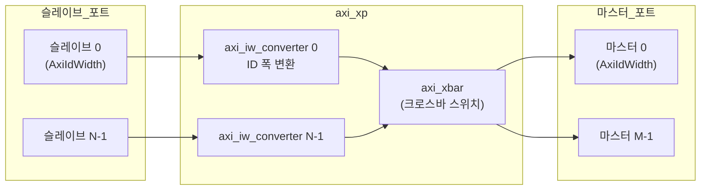

# axi_xp.sv

## 개요

동일한 AXI 포트 타입을 가진 슬레이브와 마스터 포트 간의 AXI 크로스포인트(Crosspoint) 스위치입니다. `axi_xbar`를 기반으로 하되, 슬레이브/마스터 포트가 동일한 신호 타입을 사용합니다.

IW(ID Width) 변환을 위해 각 슬레이브 포트에 `axi_iw_converter`를 포함합니다.

## 블록 다이어그램

## 파라미터

| 파라미터 | 타입 | 기본값 | 설명 |
|---------|------|--------|------|
| `ATOPs` | `bit` | `1'b1` | ATOP 원자적 연산 지원 |
| `Cfg` | `axi_pkg::xbar_cfg_t` | `'0` | 크로스바 설정 |
| `NumSlvPorts` | `int unsigned` | 0 | 슬레이브 포트 수 |
| `NumMstPorts` | `int unsigned` | 0 | 마스터 포트 수 |
| `Connectivity` | `bit [N][M]` | `'1` | 연결 행렬 |
| `AxiAddrWidth` | `int unsigned` | 0 | 주소 폭 |
| `AxiDataWidth` | `int unsigned` | 0 | 데이터 폭 |
| `AxiIdWidth` | `int unsigned` | 0 | 모든 포트의 ID 폭 |
| `AxiUserWidth` | `int unsigned` | 0 | 사용자 신호 폭 |
| `AxiSlvPortMaxUniqIds` | `int unsigned` | 0 | 슬레이브 포트 최대 고유 ID 수 |
| `AxiSlvPortMaxTxnsPerId` | `int unsigned` | 0 | ID당 최대 미처리 트랜잭션 |
| `AxiSlvPortMaxTxns` | `int unsigned` | 0 | 슬레이브 포트 최대 미처리 트랜잭션 |
| `AxiMstPortMaxUniqIds` | `int unsigned` | 0 | 마스터 포트 최대 고유 ID 수 |
| `AxiMstPortMaxTxnsPerId` | `int unsigned` | 0 | 마스터 ID당 최대 트랜잭션 |
| `axi_req_t` | `type` | `logic` | AXI 요청 타입 |
| `axi_resp_t` | `type` | `logic` | AXI 응답 타입 |
| `rule_t` | `type` | `xbar_rule_64_t` | 주소 디코딩 규칙 타입 |

## 포트

| 포트 | 방향 | 설명 |
|------|------|------|
| `clk_i` | 입력 | 클록 |
| `rst_ni` | 입력 | 비동기 리셋 |
| `test_i` | 입력 | 테스트 모드 |
| `slv_req_i` | 입력 | 슬레이브 포트 요청 배열 [N] |
| `slv_resp_o` | 출력 | 슬레이브 포트 응답 배열 [N] |
| `mst_req_o` | 출력 | 마스터 포트 요청 배열 [M] |
| `mst_resp_i` | 입력 | 마스터 포트 응답 배열 [M] |
| `addr_map_i` | 입력 | 주소-마스터 포트 매핑 |
| `en_default_mst_port_i` | 입력 | 기본 마스터 포트 활성화 |
| `default_mst_port_i` | 입력 | 기본 마스터 포트 인덱스 |

## `axi_xbar`와의 차이점

- 슬레이브와 마스터 포트가 동일한 AXI 타입 사용 (동형 포트)
- `axi_iw_converter`가 내장되어 ID 폭 관리를 자동화

## 의존성

- `axi_xbar`
- `axi_iw_converter`
- `axi_pkg`
- `axi/typedef.svh`
