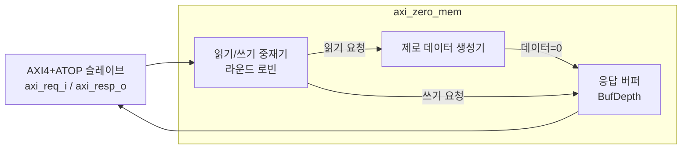

# axi_zero_mem.sv

## 개요

AXI4+ATOP 슬레이브로서 항상 0 데이터를 반환하고 쓰기 데이터를 무시하는 메모리 모듈입니다.

- **읽기**: 요청을 승인하고 데이터 `0`을 반환
- **쓰기**: 요청을 승인하고 쓰기 데이터를 무효화 (데이터 싱크로 사용 가능)
- 읽기와 쓰기가 동시에 활성화될 경우 각각 50% 활용률

## 블록 다이어그램



## 파라미터

| 파라미터 | 타입 | 기본값 | 설명 |
|---------|------|--------|------|
| `axi_req_t` | `type` | `logic` | AXI4+ATOP 요청 타입 |
| `axi_resp_t` | `type` | `logic` | AXI4+ATOP 응답 타입 |
| `AddrWidth` | `int unsigned` | 0 | 주소 폭 |
| `DataWidth` | `int unsigned` | 0 | 데이터 폭 |
| `IdWidth` | `int unsigned` | 0 | ID 폭 |
| `NumBanks` | `int unsigned` | 0 | 메모리 뱅크 수 |
| `BufDepth` | `int unsigned` | 1 | 응답 버퍼 깊이 |

## 포트

| 포트 | 방향 | 설명 |
|------|------|------|
| `clk_i` | 입력 | 클록 |
| `rst_ni` | 입력 | 비동기 리셋 (액티브 로우) |
| `busy_o` | 출력 | 처리 중 표시 |
| `axi_req_i` | 입력 | AXI4+ATOP 요청 |
| `axi_resp_o` | 출력 | AXI4+ATOP 응답 |

## 사용 예시

데이터를 폐기하는 싱크(sink) 또는 테스트 환경에서 응답 생성기로 사용합니다.

```systemverilog
axi_zero_mem #(
  .axi_req_t  ( axi_req_t  ),
  .axi_resp_t ( axi_resp_t ),
  .AddrWidth  ( 32         ),
  .DataWidth  ( 64         ),
  .IdWidth    ( 4          ),
  .NumBanks   ( 1          ),
  .BufDepth   ( 4          )
) i_zero_mem (
  .clk_i     ( clk    ),
  .rst_ni    ( rst_n  ),
  .busy_o    (        ),
  .axi_req_i ( req    ),
  .axi_resp_o( resp   )
);
```

## 의존성

- `axi_pkg`
- `common_cells/registers.svh`
