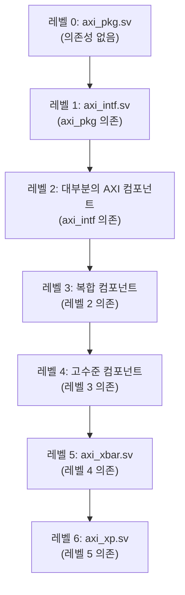

# src_files.yml

## 개요

AXI IP의 소스 파일 목록을 정의하는 설정 파일입니다. QuestaSim(vsim) 컴파일러가 사용하는 파일 순서와 컴파일 옵션을 명시합니다. 파일은 의존성 레벨별로 그룹화되어 있어 올바른 컴파일 순서를 보장합니다.

## 구조

```yaml
axi:          # 합성 가능한 RTL 파일 목록
axi_sim:      # 시뮬레이션 전용 파일 목록
```

## 컴파일 옵션

| 옵션 | 값 | 설명 |
|------|----|------|
| `vlog_opts` | `-L common_cells_lib` | common_cells 라이브러리 링크 |
| `incdirs` | `include`, `../../common_cells/include` | 헤더 파일 검색 경로 |

## 파일 레벨 구조



## axi 섹션 파일 목록

### 레벨 0 (기반 패키지)
- `src/axi_pkg.sv` — AXI 타입 및 상수 정의

### 레벨 1 (인터페이스)
- `src/axi_intf.sv` — SystemVerilog 인터페이스 정의

### 레벨 2 (기본 컴포넌트)
| 파일 | 기능 |
|------|------|
| `src/axi_atop_filter.sv` | ATOP 필터링 |
| `src/axi_burst_splitter_gran.sv` | 버스트 분할 (세분화) |
| `src/axi_burst_splitter_gran_wrapper.sv` | AMD Vivado Custom IP 패키징용 flat-port 래퍼 |
| `src/axi_burst_unwrap.sv` | 버스트 언랩 |
| `src/axi_bus_compare.sv` | 버스 비교 |
| `src/axi_cdc_dst.sv` / `src.sv` | CDC 목적지/소스 |
| `src/axi_cut.sv` | 파이프라인 슬라이스 |
| `src/axi_delayer.sv` | 지연 삽입 |
| `src/axi_demux_simple.sv` | 단순 디먹스 |
| `src/axi_dw_downsizer.sv` | 데이터 폭 축소 |
| `src/axi_dw_upsizer.sv` | 데이터 폭 확대 |
| `src/axi_fifo.sv` / `axi_fifo_delay_dyn.sv` | FIFO |
| `src/axi_id_remap.sv` / `axi_id_prepend.sv` | ID 처리 |
| `src/axi_inval_filter.sv` | 무효화 필터 |
| `src/axi_isolate.sv` | 버스 격리 |
| `src/axi_join.sv` | 버스 합류 |
| `src/axi_lite_*` | AXI-Lite 컴포넌트들 |
| `src/axi_modify_address.sv` | 주소 변환 |
| `src/axi_mux.sv` | 멀티플렉서 |
| `src/axi_rw_join.sv` / `axi_rw_split.sv` | R/W 채널 처리 |
| `src/axi_serializer.sv` | 직렬화 |
| `src/axi_slave_compare.sv` | 슬레이브 비교 |
| `src/axi_throttle.sv` | 트래픽 제한 |
| `src/axi_to_detailed_mem.sv` | 상세 메모리 인터페이스 |

### 레벨 3
- `src/axi_burst_splitter.sv`, `src/axi_cdc.sv`, `src/axi_demux.sv`, `src/axi_err_slv.sv`
- `src/axi_dw_converter.sv`, `src/axi_from_mem.sv`, `src/axi_id_serialize.sv`
- `src/axi_lfsr.sv`, `src/axi_multicut.sv`, `src/axi_to_axi_lite.sv`
- `src/axi_to_mem.sv`, `src/axi_zero_mem.sv`

### 레벨 4
- `src/axi_interleaved_xbar.sv`, `src/axi_iw_converter.sv`, `src/axi_lite_xbar.sv`
- `src/axi_xbar_unmuxed.sv`, `src/axi_to_mem_banked.sv`
- `src/axi_to_mem_interleaved.sv`, `src/axi_to_mem_split.sv`

### 레벨 5
- `src/axi_xbar.sv`

### 레벨 6
- `src/axi_xp.sv`

## axi_sim 섹션

시뮬레이션 전용 파일로 합성에서 제외됩니다.

| 플래그 | 의미 |
|--------|------|
| `skip_synthesis` | 합성 도구에서 제외 |
| `only_local` | 로컬 전용 |

| 파일 | 기능 |
|------|------|
| `src/axi_chan_compare.sv` | 채널 비교 검증 |
| `src/axi_dumper.sv` | 트랜잭션 덤프 |
| `src/axi_sim_mem.sv` | 시뮬레이션용 메모리 |
| `src/axi_test.sv` | 테스트 유틸리티 |
