# axi_synth_bench.sv

## 파일 개요 및 목적

이 파일은 **합성 테스트벤치(Synthesis Bench)** 로, AXI 관련 다양한 어댑터 변형을 인스턴스화하여 합성 가능성을 확인하는 것이 목적입니다. 실제 기능 시뮬레이션이 아닌, 파라미터 스위프(parameter sweep)를 통해 여러 구성에서 합성 에러가 없는지 검증합니다. 최상위 모듈 `axi_synth_bench`와 보조 합성 슬라이스 모듈들로 구성됩니다.

## Mermaid 블록 다이어그램

```mermaid
graph TD
    TOP[axi_synth_bench<br>clk_i / rst_ni]

    TOP --> A[synth_slice × 8<br>AXI Data Width sweep<br>8~1024 bit]
    TOP --> B[synth_slice × 6<br>AXI Addr Width sweep<br>1~129 bit]
    TOP --> C[synth_slice × 3<br>ID/User Width sweep]
    TOP --> D[synth_axi_atop_filter<br>IW 1~8, MaxTxn 1~12]
    TOP --> E[synth_axi_lite_xbar<br>NoSlvMst 1/2/4]
    TOP --> F[synth_axi_cdc<br>AW × IUW combinations]
    TOP --> G[synth_axi_lite_to_apb<br>Slaves×DataWidth combos]
    TOP --> H[synth_axi_lite_mailbox<br>IRQ mode × Depth sweep]
    TOP --> I[synth_axi_isolate<br>NumPending sweep]
    TOP --> J[synth_axi_modify_address<br>SLV/MST Addr combos]
    TOP --> K[synth_axi_serializer<br>NumPending sweep]
    TOP --> L[synth_axi_lite_regs<br>RegNumBytes sweep]
    TOP --> M[synth_axi_iw_converter<br>ID Width combos]
    TOP --> N[synth_axi_to_mem_banked<br>DataWidth × Bank combos]
    TOP --> O[synth_axi_lite_dw_converter<br>SLV/MST DW combos]

    subgraph synth_slice
        SS_FULL[AXI_BUS full] --> SS_DUT1[axi_to_axi_lite_intf]
        SS_DUT1 --> SS_LITE[AXI_LITE]
        SS_LITE --> SS_DUT2[axi_lite_to_axi_intf]
        SS_DUT2 --> SS_FULL2[AXI_BUS full]
    end
```



## 파라미터 테이블

### axi_synth_bench (최상위)

| 파라미터 이름 | 기본값/범위 | 설명 |
|---|---|---|
| `AXI_ADDR_WIDTH[6]` | `{32,64,1,2,42,129}` | 주소 폭 스위프 배열 |
| `AXI_ID_USER_WIDTH[3]` | `{0,1,8}` | ID/User 폭 스위프 배열 |
| `NUM_SLAVE_MASTER[3]` | `{1,2,4}` | 슬레이브/마스터 수 스위프 배열 |

### synth_slice

| 파라미터 이름 | 기본값 | 설명 |
|---|---|---|
| `AW` | -1 | AXI 주소 폭 |
| `DW` | -1 | AXI 데이터 폭 |
| `IW` | -1 | AXI ID 폭 |
| `UW` | -1 | AXI User 폭 |

### synth_axi_atop_filter

| 파라미터 이름 | 기본값 | 설명 |
|---|---|---|
| `AXI_ADDR_WIDTH` | 64 | AXI 주소 폭 |
| `AXI_DATA_WIDTH` | 64 | AXI 데이터 폭 |
| `AXI_ID_WIDTH` | 1~8 | AXI ID 폭 (루프) |
| `AXI_USER_WIDTH` | 4 | AXI User 폭 |
| `AXI_MAX_WRITE_TXNS` | 1~12 | 최대 동시 쓰기 트랜잭션 수 (루프) |

### synth_axi_lite_xbar

| 파라미터 이름 | 기본값 | 설명 |
|---|---|---|
| `NoSlvMst` | 1/2/4 | 슬레이브/마스터 포트 수 |

### synth_axi_cdc

| 파라미터 이름 | 기본값 | 설명 |
|---|---|---|
| `AXI_ADDR_WIDTH` | 다양 | AXI 주소 폭 |
| `AXI_DATA_WIDTH` | 128 | AXI 데이터 폭 |
| `AXI_ID_WIDTH` | 0/1/8 | AXI ID 폭 |
| `AXI_USER_WIDTH` | 0/1/8 | AXI User 폭 |

### synth_axi_lite_to_apb

| 파라미터 이름 | 기본값 | 설명 |
|---|---|---|
| `NoApbSlaves` | 1/2/4 | APB 슬레이브 수 |
| `DataWidth` | 8/16/32 | 데이터 폭 |

### synth_axi_lite_mailbox

| 파라미터 이름 | 기본값 | 설명 |
|---|---|---|
| `MAILBOX_DEPTH` | 4~128 (2의 거듭제곱) | 메일박스 FIFO 깊이 |
| `IRQ_EDGE_TRIG` | 0/1 | 엣지 트리거 인터럽트 여부 |
| `IRQ_ACT_HIGH` | 0/1 | 액티브 하이 인터럽트 여부 |

### synth_axi_isolate / synth_axi_serializer

| 파라미터 이름 | 기본값 | 설명 |
|---|---|---|
| `NumPending` | `AXI_ADDR_WIDTH[i]` | 최대 보류 요청 수 |
| `AxiIdWidth` | 32'd10 | AXI ID 폭 |
| `AxiAddrWidth` | 32'd64 | AXI 주소 폭 |
| `AxiDataWidth` | 32'd512 | AXI 데이터 폭 |
| `AxiUserWidth` | 32'd10 | AXI User 폭 |

### synth_axi_lite_regs

| 파라미터 이름 | 기본값 | 설명 |
|---|---|---|
| `REG_NUM_BYTES` | `{1,4,42,64,129,512}` | 레지스터 바이트 수 |
| `AXI_ADDR_WIDTH` | 32'd32 | AXI 주소 폭 |
| `AXI_DATA_WIDTH` | 32'd32 | AXI 데이터 폭 |

### synth_axi_iw_converter

| 파라미터 이름 | 기본값 | 설명 |
|---|---|---|
| `AxiSlvPortIdWidth` | 1/2/9 | 슬레이브 포트 ID 폭 |
| `AxiMstPortIdWidth` | 1/2/9 | 마스터 포트 ID 폭 |
| `AxiAddrWidth` | 32'd64 | AXI 주소 폭 |
| `AxiDataWidth` | 32'd512 | AXI 데이터 폭 |

### synth_axi_to_mem_banked

| 파라미터 이름 | 기본값 | 설명 |
|---|---|---|
| `AxiDataWidth` | 32/64/128/256/512 | AXI 데이터 폭 |
| `BankNum` | 2/4/6/8 | 메모리 뱅크 수 |
| `BankAddrWidth` | 5/11 | 뱅크 주소 폭 |

### synth_axi_lite_dw_converter

| 파라미터 이름 | 기본값 | 설명 |
|---|---|---|
| `AXI_SLV_PORT_DATA_WIDTH` | 32/64/128 | 슬레이브 포트 데이터 폭 |
| `AXI_MST_PORT_DATA_WIDTH` | 16/32/64 | 마스터 포트 데이터 폭 |

## 테스트 시나리오 및 커버리지 설명

이 파일은 기능 시뮬레이션이 아닌 **합성 커버리지** 를 목표로 합니다:

- **데이터 폭 스위프**: 8, 16, 32, 64, 128, 256, 512, 1024 비트 (8가지)
- **주소 폭 스위프**: 1, 2, 32, 42, 64, 129 비트 (6가지)
- **ID/User 폭 스위프**: 0, 1, 8 비트 (3가지 조합)
- **ATOP 필터**: ID 폭(1~8) × 최대 쓰기 트랜잭션(1~12) = 96가지 조합
- **Lite Xbar**: 1, 2, 4 포트
- **CDC**: 6 주소 폭 × 3 ID/User 폭 = 18가지 조합
- **AXI Lite → APB**: 3 데이터 폭 × 3 슬레이브 수 = 9가지 조합
- **Mailbox**: 4 IRQ 모드 × 6 깊이 = 24가지 조합
- **axi_to_mem_banked**: 5 데이터 폭 × 4 뱅크 수 × 2 주소 폭 = 40가지 조합
- **axi_lite_dw_converter**: 3 × 3 = 9가지 조합

## 주요 Task/Function 목록

이 파일은 합성 벤치로 Task/Function을 포함하지 않습니다. 각 보조 모듈은 단순히 DUT를 인스턴스화합니다.

## 사용 방법

합성 툴(Design Compiler, Genus 등)로 최상위 모듈 `axi_synth_bench`를 합성합니다:

```bash
# 예시: Synopsys Design Compiler
dc_shell> read_verilog axi_synth_bench.sv
dc_shell> elaborate axi_synth_bench
dc_shell> compile

# 예시: Cadence Genus
genus> read_hdl -sv axi_synth_bench.sv
genus> elaborate axi_synth_bench
genus> synthesize -to_mapped
```

합성 시 `clk_i`, `rst_ni` 포트가 필요합니다. 이 파일은 시뮬레이션 실행이 목적이 아니므로 별도의 시뮬레이션 명령은 없습니다.
