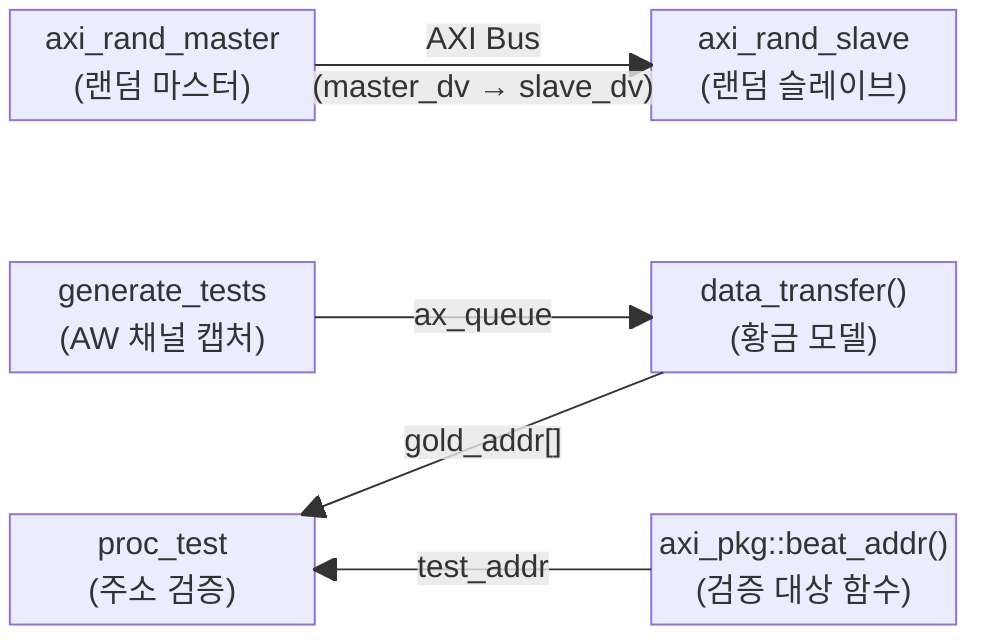
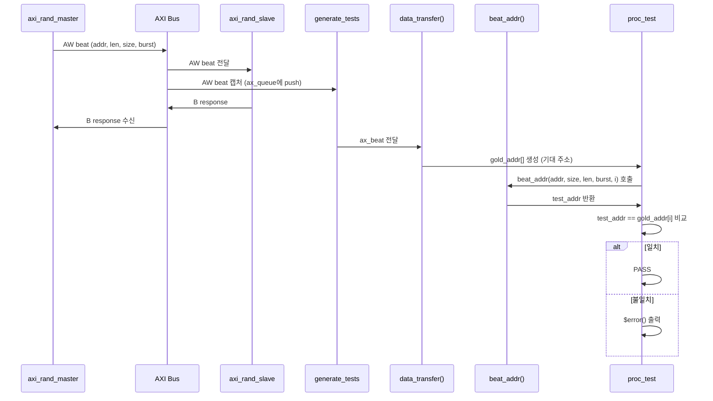

# tb_axi_addr_test.sv 테스트벤치 문서

## 1. 테스트벤치 목적 및 개요

이 테스트벤치는 `axi_pkg::beat_addr` 함수의 정확성을 검증하기 위해 작성된 주소 생성(Address Generation) 테스트입니다. AXI 버스트(burst) 전송에서 각 비트(beat)의 주소가 올바르게 계산되는지 확인하며, 특히 FIXED, INCR, WRAP 세 가지 버스트 타입에 대한 주소 래핑(wrapping) 동작을 검증합니다.

황금 모델(golden model)을 별도로 구현하여 AXI 스펙(ARM IHI0022, A-52 pseudocode 기반)과 `beat_addr` 함수의 출력을 비교 검증합니다.

---

## 2. 테스트 대상 모듈

| 대상 | 설명 |
|------|------|
| `axi_pkg::beat_addr` | AXI 버스트 전송 중 각 beat의 주소를 계산하는 패키지 함수 |

테스트벤치 자체는 DUT(Device Under Test) 모듈을 직접 인스턴스화하지 않고, 랜덤 마스터와 슬레이브를 연결한 루프백 구조를 사용합니다. 마스터가 발행한 AW 채널의 트랜잭션 정보를 캡처하여 `beat_addr` 함수 호출 결과와 황금 모델 결과를 비교합니다.

---

## 3. 주요 파라미터 및 설정

### 모듈 파라미터

| 파라미터 | 기본값 | 설명 |
|----------|--------|------|
| `NumTests` | `10000` | 수행할 AX 트랜잭션 수 |
| `PrintDbg` | `1'b0` | 각 계산된 주소 출력 여부 (디버그용) |

### AXI 인터페이스 파라미터

| 파라미터 | 값 | 설명 |
|----------|----|------|
| `AxiIdWidth` | `1` | ID 비트 폭 |
| `AxiAddrWidth` | `16` | 주소 비트 폭 |
| `AxiDataWidth` | `1024` | 데이터 비트 폭 |
| `AxiUserWidth` | `1` | User 신호 비트 폭 |

### 타이밍 파라미터

| 파라미터 | 값 | 설명 |
|----------|----|------|
| `CyclTime` | `10ns` | 클록 주기 |
| `ApplTime` | `2ns` | 자극 인가 시간 (클록 상승 후) |
| `TestTime` | `8ns` | 신호 샘플링 시간 (클록 상승 후) |

### 기타 설정

| 항목 | 값 | 설명 |
|------|----|------|
| `PrintTnx` | `1000` | 트랜잭션 진행 상황 출력 간격 |
| `NoWrites` | `NumTests` | 쓰기 트랜잭션 수 (= NumTests) |
| `NoReads` | `0` | 읽기 트랜잭션 수 (사용 안 함) |
| `NoPendingDut` | `16` | 동시 펜딩 트랜잭션 수 |
| 메모리 영역 | `0x0000 ~ 0xFFFF` | 3가지 캐시 타입으로 등록 |

---

## 4. 테스트 시나리오 설명

### 4.1 초기화 및 리셋

1. `clk_rst_gen`이 클록(10ns 주기)과 리셋 신호를 생성합니다.
2. 랜덤 마스터(`axi_rand_master_t`)와 랜덤 슬레이브(`axi_rand_slave_t`)가 초기화됩니다.
3. 마스터는 3가지 메모리 영역(DEVICE_NONBUFFERABLE, WTHRU_NOALLOCATE, WBACK_RWALLOCATE)을 등록합니다.

### 4.2 랜덤 트랜잭션 발행

- 마스터가 `NumTests`(10,000)개의 쓰기 전용 AXI 트랜잭션을 랜덤하게 발행합니다.
- 모든 버스트 타입(FIXED, INCR, WRAP)이 활성화됩니다.
- 슬레이브는 수신된 트랜잭션에 응답합니다.

### 4.3 AW 채널 캡처 및 황금 모델 계산

- `generate_tests` 프로세스가 AW 채널을 모니터링하여 각 트랜잭션의 `addr`, `len`, `size`, `burst`를 큐에 저장합니다.
- `data_transfer` 함수(황금 모델)가 ARM 스펙의 pseudocode를 기반으로 기대 주소 시퀀스를 계산합니다.
  - **BURST_FIXED**: 모든 beat에 동일한 주소 사용
  - **BURST_INCR**: 매 beat마다 `num_bytes`씩 주소 증가
  - **BURST_WRAP**: 증가하되 경계(wrap boundary) 도달 시 하위 경계로 래핑

### 4.4 주소 검증

- `proc_test` 프로세스가 각 트랜잭션에 대해 `axi_pkg::beat_addr`를 호출하여 계산된 주소와 황금 모델 주소를 비트 단위로 비교합니다.
- 불일치 시 `$error`로 기대값과 실제값을 출력합니다.

### 4.5 시뮬레이션 종료

- 모든 트랜잭션이 완료되면 `end_of_sim`이 `1`로 설정됩니다.
- 10,000 클록 사이클 후 `$stop()`으로 시뮬레이션이 종료됩니다.

---

## 5. Mermaid 다이어그램

### 5.1 테스트벤치 구조도



### 5.2 테스트 검증 시퀀스 다이어그램



---

## 6. 실행 방법

### 요구 사항

- SystemVerilog 지원 시뮬레이터 (QuestaSim, VCS, Xcelium, XSIM 등)
- `axi_pkg`, `axi_test`, `clk_rst_gen` 라이브러리 포함 필요

### QuestaSim / ModelSim 실행 예시

```bash
# 컴파일
vlog -sv \
  +incdir+<axi_include_path> \
  tb_axi_addr_test.sv

# 시뮬레이션 실행
vsim -c work.tb_axi_addr_test \
  -do "run -all; quit"
```

### 파라미터 오버라이드 예시

```bash
# 테스트 수 변경 및 디버그 출력 활성화
vsim -c work.tb_axi_addr_test \
  -g NumTests=1000 \
  -g PrintDbg=1 \
  -do "run -all; quit"
```

### 예상 출력

```
# 1000 트랜잭션마다 진행 상황 출력 (AW 카운트)
# 시뮬레이션 완료 시: "All transactions completed."
# 오류 없으면 정상 종료
```

### Makefile 빌드 시스템 사용 (프로젝트 루트에서)

```bash
# 프로젝트 루트에서 실행
make tb_axi_addr_test
```
