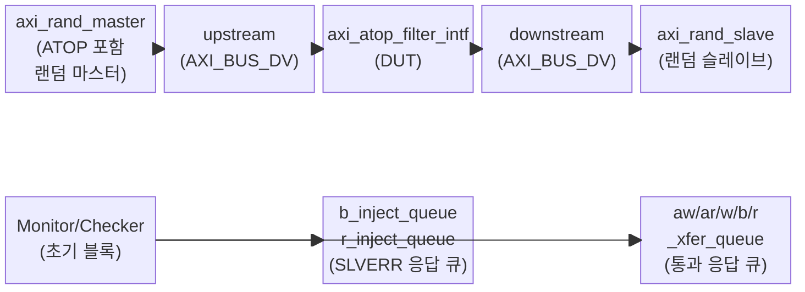
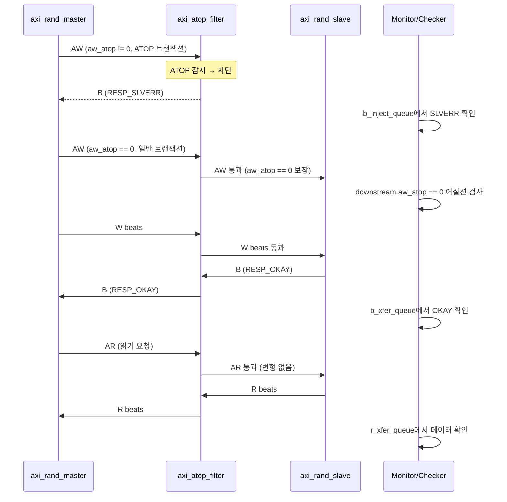

# tb_axi_atop_filter.sv 테스트벤치 문서

## 1. 테스트벤치 목적 및 개요

이 테스트벤치는 `axi_atop_filter` 모듈의 기능을 검증합니다. `axi_atop_filter`는 AXI 버스에서 Atomic Operation(ATOP) 트랜잭션을 필터링하여 다운스트림으로 전달하지 않고, 해당 트랜잭션에 대해 슬레이브 에러(SLVERR) 응답을 생성하는 모듈입니다.

테스트벤치는 랜덤 AXI 마스터를 사용하여 ATOP을 포함한 다양한 트랜잭션을 발행하고, 모니터 로직이 업스트림/다운스트림을 모두 관찰하여 필터가 올바르게 동작하는지 검증합니다.

---

## 2. 테스트 대상 모듈

| 대상 모듈 | 설명 |
|-----------|------|
| `axi_atop_filter_intf` | ATOP 트랜잭션을 차단하고 SLVERR 응답을 반환하는 AXI 필터 모듈 |

### 필터 동작 규칙

| 트랜잭션 유형 | 필터 동작 |
|--------------|-----------|
| 일반 AW (atop == 0) | 다운스트림으로 통과 |
| ATOP_ATOMICSTORE | B 채널에 SLVERR 반환, AW/W 차단 |
| ATOP_ATOMICLOAD / ATOP_ATOMICCMP | B + R 채널에 SLVERR 반환, AW/W 차단 |
| AR (모든 경우) | 다운스트림으로 통과 |

---

## 3. 주요 파라미터 및 설정

### AXI 인터페이스 파라미터

| 파라미터 | 기본값 | 설명 |
|----------|--------|------|
| `TB_AXI_ADDR_WIDTH` | `32` | 주소 비트 폭 |
| `TB_AXI_DATA_WIDTH` | `64` | 데이터 비트 폭 |
| `TB_AXI_ID_WIDTH` | `4` | ID 비트 폭 (ID 수 = 2^4 = 16) |
| `TB_AXI_USER_WIDTH` | `2` | User 신호 비트 폭 |
| `TB_AXI_MAX_READ_TXNS` | `10` | 최대 동시 읽기 트랜잭션 수 |
| `TB_AXI_MAX_WRITE_TXNS` | `12` | 최대 동시 쓰기 트랜잭션 수 (필터 기준) |

### 타이밍 파라미터

| 파라미터 | 기본값 | 설명 |
|----------|--------|------|
| `TB_TCLK` | `10ns` | 클록 주기 |
| `TB_TA` | `2.5ns` | 자극 인가 시간 (클록 주기의 1/4) |
| `TB_TT` | `7.5ns` | 신호 샘플링 시간 (클록 주기의 3/4) |

### 대기 사이클 파라미터

| 파라미터 | 기본값 | 설명 |
|----------|--------|------|
| `TB_REQ_MIN_WAIT_CYCLES` | `0` | 요청 최소 대기 사이클 |
| `TB_REQ_MAX_WAIT_CYCLES` | `10` | 요청 최대 대기 사이클 |
| `TB_RESP_MIN_WAIT_CYCLES` | `0` | 응답 최소 대기 사이클 |
| `TB_RESP_MAX_WAIT_CYCLES` | `5` | 응답 최대 대기 사이클 (REQ_MAX/2) |

### 트랜잭션 수

| 파라미터 | 기본값 | 설명 |
|----------|--------|------|
| `TB_N_TXNS` | `1000` | 총 트랜잭션 수 (읽기 1000 + 쓰기 1000) |

---

## 4. 테스트 시나리오 설명

### 4.1 초기화 및 리셋

1. `clk_rst_gen`이 클록(10ns 주기)과 5 사이클 리셋을 생성합니다.
2. 랜덤 마스터와 슬레이브가 초기화됩니다.
3. DUT(`axi_atop_filter_intf`)가 업스트림과 다운스트림 사이에 연결됩니다.

### 4.2 랜덤 트랜잭션 발행

- 마스터가 ATOP 포함 랜덤 트랜잭션 `TB_N_TXNS`개를 발행합니다.
- 마스터의 `MAX_WRITE_TXNS`는 `TB_AXI_MAX_WRITE_TXNS + 2`로 설정되어 필터의 허용 범위보다 더 많은 쓰기를 시도합니다 (필터 내성 테스트).
- 슬레이브는 다운스트림에서 랜덤 지연으로 응답합니다.

### 4.3 모니터 및 검증 로직

모니터는 클록 상승 에지마다 다음을 수행합니다:

**ATOP 필터 검증 (핵심):**
- 다운스트림 AW 채널에 `aw_atop != 0`이 절대 도달하지 않는지 어설션 검사
- 업스트림 AW 트랜잭션을 `w_cmd_queue`에 기록 (`thru` 플래그로 통과/차단 여부 결정)

**W beat 처리:**
- 통과(`thru = 1`) AW의 W beat는 `w_xfer_queue`에 저장
- 차단 AW의 W beat 마지막에 SLVERR B response를 `b_inject_queue`에 추가

**응답 검증:**
- 다운스트림 AR/AW/W가 기대 전송 큐와 일치하는지 검증
- 업스트림 R beat가 `r_inject_queue`(SLVERR) 또는 `r_xfer_queue`(정상)와 일치하는지 검증
- 업스트림 B beat가 `b_inject_queue`(SLVERR) 또는 `b_xfer_queue`(정상)와 일치하는지 검증

### 4.4 시뮬레이션 종료

- 마스터가 모든 트랜잭션 발행 완료 시 `mst_done = 1`로 설정되고 `$finish()`가 호출됩니다.

---

## 5. Mermaid 다이어그램

### 5.1 테스트벤치 구조도



### 5.2 ATOP 필터 동작 시퀀스 다이어그램



---

## 6. 실행 방법

### 요구 사항

- SystemVerilog 지원 시뮬레이터 (QuestaSim, VCS, Xcelium 등)
- `axi_pkg`, `axi_test`, `rand_id_queue_pkg`, `rand_verif_pkg`, `clk_rst_gen` 라이브러리

### QuestaSim 실행 예시

```bash
# 컴파일
vlog -sv \
  +incdir+<axi_include_path> \
  tb_axi_atop_filter.sv

# 기본 파라미터로 시뮬레이션
vsim -c work.tb_axi_atop_filter \
  -do "run -all; quit"
```

### 파라미터 오버라이드 예시

```bash
# 트랜잭션 수 줄이고 클록 주기 변경
vsim -c work.tb_axi_atop_filter \
  -g TB_N_TXNS=100 \
  -g TB_TCLK=5ns \
  -do "run -all; quit"
```

### 파라미터 오버라이드 (VCS)

```bash
vcs -sverilog tb_axi_atop_filter.sv \
  +define+TB_N_TXNS=100
./simv
```

### 검증 포인트

시뮬레이션 성공 기준:
- 시뮬레이션 중 `$fatal` 또는 `$error` 없이 완료
- `$finish()`로 정상 종료
- 모든 ATOP 트랜잭션에 대해 SLVERR가 정확히 반환됨
- 다운스트림에 `aw_atop != 0` 트랜잭션이 전달되지 않음
