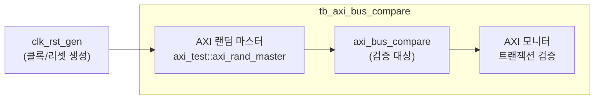

# tb_axi_bus_compare.sv

## 개요

`axi_bus_compare` 모듈의 테스트벤치입니다. 두 AXI 버스를 비교하여 데이터 일관성을 검증합니다.

## 테스트 구성

## 파라미터

| 파라미터 | 기본값 | 설명 |
|---------|--------|------|
| `TbTclk` | 10ns | 클록 주기 |
| `TbAddrWidth` | 64 | 주소 폭 |
| `TbDataWidth` | 128 | 데이터 폭 |
| `TbIdWidth` | 6 | ID 폭 |
| `TbUserWidth` | 2 | 사용자 신호 폭 |
| `TbWarnUninitialized` | 0 | 미초기화 경고 여부 |
| `TbApplDelay` | 2ns | 신호 적용 지연 |
| `TbAcqDelay` | 8ns | 신호 획득 지연 |

## 검증 대상

`axi_bus_compare`: 두 AXI 버스 간의 트랜잭션 데이터를 비교하여 불일치 검출

## 의존성

- `axi/assign.svh`
- `axi/typedef.svh`
- `clk_rst_gen` (common_verification)
- `axi_test` (검증 유틸리티)
