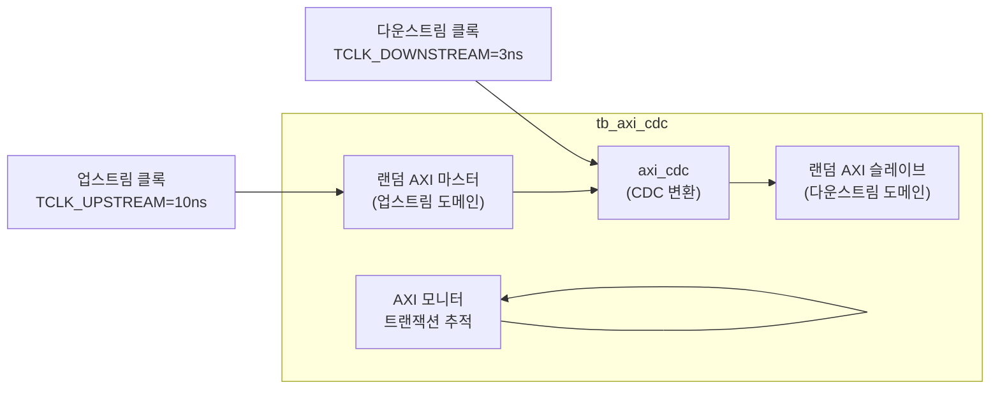

# tb_axi_cdc.sv

## 개요

`axi_cdc` 모듈의 테스트벤치입니다. 서로 다른 클록 도메인 간의 AXI 트랜잭션 전달이 올바른지 검증합니다.

## 테스트 구성

## 파라미터

| 파라미터 | 기본값 | 설명 |
|---------|--------|------|
| `AXI_AW` | 32 | 주소 폭 |
| `AXI_DW` | 64 | 데이터 폭 |
| `AXI_IW` | 4 | ID 폭 |
| `AXI_UW` | 2 | 사용자 신호 폭 |
| `AXI_MAX_READ_TXNS` | 10 | 최대 읽기 트랜잭션 |
| `AXI_MAX_WRITE_TXNS` | 12 | 최대 쓰기 트랜잭션 |
| `TCLK_UPSTREAM` | 10ns | 업스트림 클록 주기 |
| `TCLK_DOWNSTREAM` | 3ns | 다운스트림 클록 주기 |
| `N_TXNS` | 1000 | 총 테스트 트랜잭션 수 |

## 테스트 시나리오

1. 업스트림에서 `N_TXNS/2` 읽기 + `N_TXNS/2` 쓰기 트랜잭션 생성
2. `axi_cdc`를 통해 서로 다른 클록 도메인으로 전달
3. 다운스트림에서 모든 트랜잭션 수신 확인
4. 데이터 무결성 검증

## 검증 대상

`axi_cdc`: 2상 핸드셰이크 기반 AXI 클록 도메인 교차 회로

## 의존성

- `axi/typedef.svh`, `axi/assign.svh`
- `clk_rst_gen` (common_verification)
- `axi_test`
