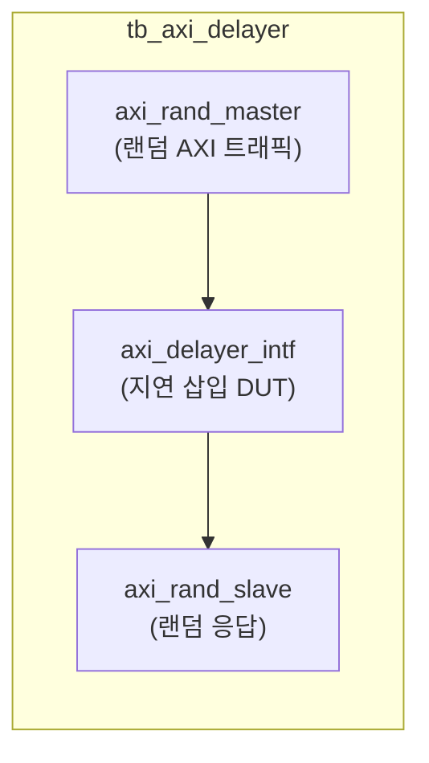

# tb_axi_delayer.sv

## 개요

`axi_delayer` 모듈의 테스트벤치입니다. AXI 채널에 임의의 지연을 삽입하는 기능을 검증합니다.

## 테스트 구성

## 파라미터

| 파라미터 | 값 | 설명 |
|---------|-----|------|
| `AW` | 32 | 주소 폭 |
| `DW` | 32 | 데이터 폭 |
| `IW` | 8 | ID 폭 |
| `UW` | 8 | 사용자 신호 폭 |
| `TS` | 4 | 타임스텝 수 |
| `tCK` | 1ns | 클록 주기 |

## 테스트 시나리오

1. 랜덤 AXI 마스터가 트랜잭션 생성
2. `axi_delayer`가 각 채널에 임의 지연 삽입
3. 랜덤 AXI 슬레이브가 응답
4. 지연 후에도 트랜잭션이 올바르게 완료되는지 검증

## 검증 대상

`axi_delayer_intf`: AXI 채널별 임의 지연 삽입 모듈 (인터페이스 버전)

## 의존성

- `axi/assign.svh`
- `axi_test`
