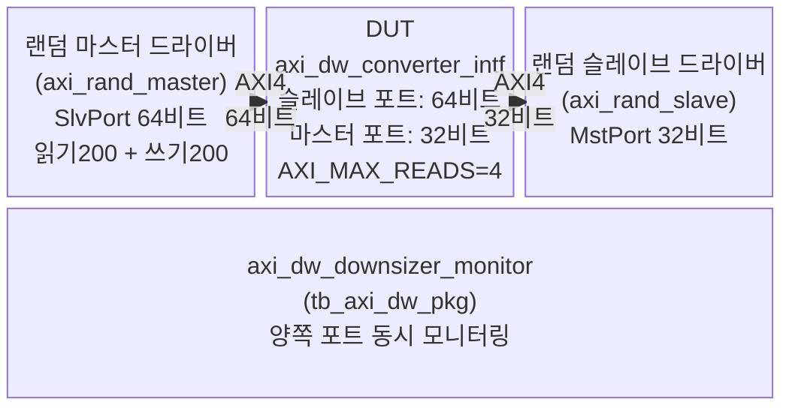
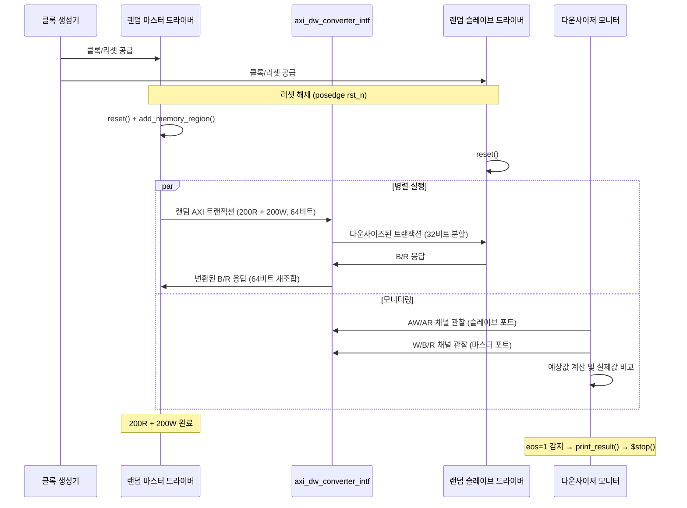

# tb_axi_dw_downsizer.sv 테스트벤치 문서

## 1. 테스트벤치 목적 및 개요

`tb_axi_dw_downsizer`는 AXI 데이터 폭 다운사이저(Data Width Downsizer)를 검증하기 위한 SystemVerilog 테스트벤치입니다. 슬레이브 포트(Slave Port)의 넓은 데이터 버스(기본값 64비트)를 마스터 포트(Master Port)의 좁은 데이터 버스(기본값 32비트)로 변환하는 `axi_dw_converter_intf` 모듈의 정확성을 검증합니다.

랜덤 AXI 마스터 드라이버가 무작위 읽기/쓰기 트랜잭션을 생성하고, 랜덤 슬레이브 드라이버가 이를 수신합니다. `tb_axi_dw_pkg`의 `axi_dw_downsizer_monitor` 클래스가 양쪽 포트를 모니터링하여 AXI 비트(beat)의 손실 또는 오류 없는 정확한 변환을 검증합니다.

- **저자**: Matheus Cavalcante, Andreas Kurth (ETH Zurich, University of Bologna)
- **라이선스**: Solderpad Hardware License v0.51

---

## 2. 테스트 대상 모듈

| 모듈명 | 설명 |
|---|---|
| `axi_dw_converter_intf` | AXI 데이터 폭 변환기 인터페이스 래퍼. 슬레이브 포트의 64비트 데이터를 마스터 포트의 32비트 데이터로 다운사이징 |

DUT는 슬레이브 포트(`slv`)로 64비트 AXI 트랜잭션을 받아, 마스터 포트(`mst`)에서 32비트 AXI 트랜잭션으로 분할하여 출력합니다. INCR 및 FIXED 버스트 타입을 지원하며, WRAP 버스트는 지원하지 않습니다.

---

## 3. 주요 파라미터 및 설정

### AXI 파라미터

| 파라미터 | 기본값 | 설명 |
|---|---|---|
| `TbAxiAddrWidth` | 64 | AXI 주소 버스 폭 (비트) |
| `TbAxiIdWidth` | 4 | AXI ID 버스 폭 (비트), 최대 16개 ID |
| `TbAxiSlvPortDataWidth` | 64 | 슬레이브 포트 데이터 버스 폭 (입력, 비트) |
| `TbAxiMstPortDataWidth` | 32 | 마스터 포트 데이터 버스 폭 (출력, 비트) |
| `TbAxiUserWidth` | 8 | AXI 사용자 신호 폭 (비트) |
| `TbInitialBStallCycles` | 0 | 초기 B 채널 스톨 사이클 수 |
| `TbInitialRStallCycles` | 0 | 초기 R 채널 스톨 사이클 수 |

### 타이밍 파라미터

| 파라미터 | 기본값 | 설명 |
|---|---|---|
| `TbCyclTime` | 10ns | 클록 주기 |
| `TbApplTime` | 2ns | 자극 인가 시간 (클록 상승 후 지연) |
| `TbTestTime` | 8ns | 신호 샘플링 시간 (클록 상승 전) |

### 랜덤 마스터 드라이버 설정

| 설정 | 값 | 설명 |
|---|---|---|
| `MAX_READ_TXNS` | 8 | 동시 최대 읽기 트랜잭션 수 |
| `MAX_WRITE_TXNS` | 8 | 동시 최대 쓰기 트랜잭션 수 |
| `AXI_BURST_FIXED` | 0 (비활성) | FIXED 버스트 비활성화 |
| `AXI_ATOPS` | 1 (활성) | ATOP(Atomic Operations) 활성화 |
| 메모리 영역 | 전체 주소 공간 | `WTHRU_NOALLOCATE` 캐시 속성 |

### DUT 설정

| 설정 | 값 | 설명 |
|---|---|---|
| `AXI_MAX_READS` | 4 | DUT 내부 최대 동시 읽기 수 |

---

## 4. 테스트 시나리오 설명

### 시나리오 1: 리셋 및 초기화
- 리셋 신호 `rst_n`이 비활성 상태에서 마스터/슬레이브 드라이버 초기화
- 메모리 영역 전체(`0x0..0` ~ `0xF..F`)를 `WTHRU_NOALLOCATE` 속성으로 등록
- 리셋 해제 후 동작 시작

### 시나리오 2: B/R 채널 스톨 시뮬레이션
- `TbInitialBStallCycles` / `TbInitialRStallCycles` 파라미터로 초기 응답 지연 시뮬레이션
- `b_stall`, `r_stall` 카운터가 0이 될 때까지 B/R 채널의 `valid` 및 `ready` 신호를 강제로 0으로 설정

### 시나리오 3: 랜덤 읽기/쓰기 트랜잭션
- 랜덤 마스터 드라이버가 읽기 200회, 쓰기 200회 트랜잭션 생성 (`master_drv.run(200, 200)`)
- 랜덤 슬레이브 드라이버가 트랜잭션을 수신 및 응답
- 두 드라이버가 fork/join_any로 병렬 실행

### 시나리오 4: 모니터링 및 검증
- `axi_dw_downsizer_monitor`가 슬레이브 포트(master_dv)와 마스터 포트(slave_dv)를 동시에 모니터링
- AW, AR, W, B, R 채널 모든 비트에 대해 예상값과 실제값 비교
- 다운사이징 규칙 검증:
  - INCR 버스트: 비트 수 증가 및 필요시 버스트 분할
  - FIXED 버스트: INCR 버스트로 분할
  - 정렬(alignment) 조정에 따른 비트 수 계산 검증

### 시나리오 5: 종료 및 결과 출력
- 10 클록 사이클 대기 후 시뮬레이션 종료(`eos = 1`)
- `monitor.print_result()`로 예상/수행/실패 테스트 수 출력

---

## 5. Mermaid 다이어그램

### 테스트 구조도



### 시뮬레이션 시퀀스 다이어그램



---

## 6. 실행 방법

### ModelSim / QuestaSim

```tcl
# 소스 컴파일 (예시, 프로젝트 환경에 따라 파일 목록 조정 필요)
vlog -sv \
  src/axi_dw_converter_intf.sv \
  test/tb_axi_dw_pkg.sv \
  test/tb_axi_dw_downsizer.sv

# 시뮬레이션 실행 (기본 파라미터)
vsim -voptargs=+acc work.tb_axi_dw_downsizer

# 파라미터 오버라이드 예시 (B/R 채널 스톨 활성화)
vsim -voptargs=+acc \
  -GTbInitialBStallCycles=10 \
  -GTbInitialRStallCycles=10 \
  work.tb_axi_dw_downsizer

# 실행
run -all
```

> 소스 파일 상단 주석에도 다음 명령이 명시되어 있습니다:
> ```
> vsim -voptargs=+acc work.tb_axi_dw_downsizer
> ```

### 결과 확인

시뮬레이션 종료 시 콘솔에 다음과 같은 결과가 출력됩니다:

```
Tests Expected:  <N>
Tests Conducted: <N>
Tests Failed:    0
```

- `Tests Failed`가 0이면 검증 통과
- 0보다 크면 `$error: Simulation encountered unexpected transactions!` 메시지와 함께 실패 원인 출력
