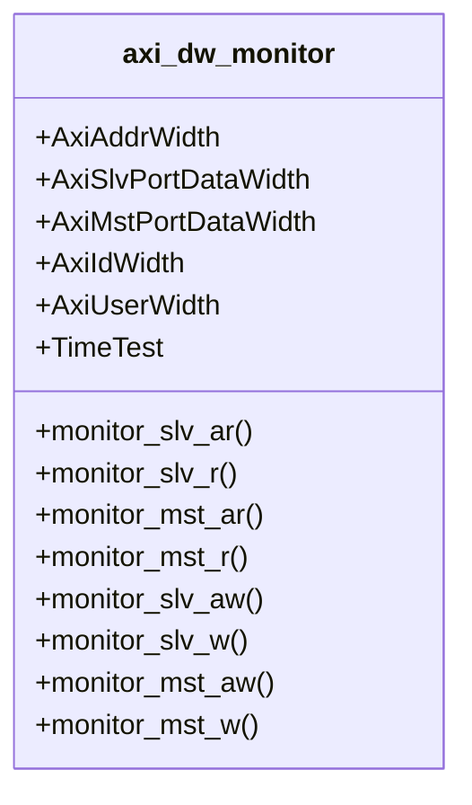

# tb_axi_dw_pkg.sv

## 개요

AXI 데이터 폭 변환기(DWC) 테스트에 사용되는 공통 패키지입니다. `axi_dw_upsizer`와 `axi_dw_downsizer`의 테스트벤치에서 공유하는 모니터 클래스를 정의합니다.

## 블록 다이어그램



## 주요 클래스

### `axi_dw_monitor`

AXI 데이터 폭 변환기 전용 AXI 버스 모니터입니다.

- 슬레이브 포트와 마스터 포트를 동시에 스누핑(snooping)
- FIFO와 ID 큐를 채워 AXI 비트가 손실되지 않았는지 검증
- 읽기/쓰기 채널 모두 모니터링

## 패키지 임포트

```systemverilog
package tb_axi_dw_pkg;
  import axi_pkg::len_t;
  import axi_pkg::burst_t;
  import axi_pkg::size_t;
  import axi_pkg::cache_t;
  import axi_pkg::modifiable;
```

## 사용 대상

- `tb_axi_dw_downsizer.sv`
- `tb_axi_dw_upsizer.sv`

## 의존성

- `axi_pkg`
