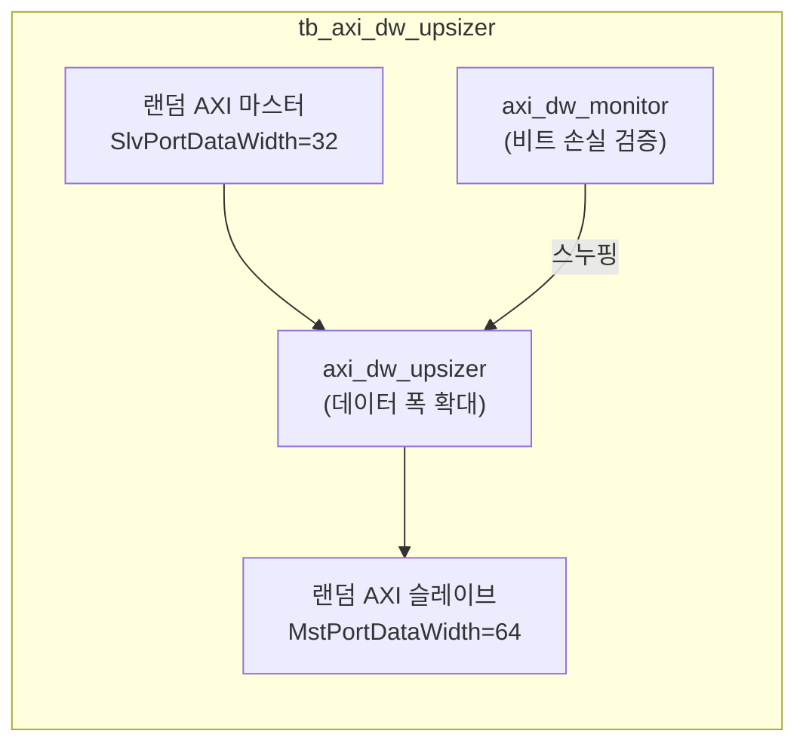

# tb_axi_dw_upsizer.sv

## 개요

`axi_dw_upsizer` 모듈의 테스트벤치입니다. 좁은 데이터 폭 슬레이브에서 넓은 데이터 폭 마스터로의 변환이 올바른지 검증합니다.

## 테스트 구성

## 파라미터

| 파라미터 | 기본값 | 설명 |
|---------|--------|------|
| `TbAxiAddrWidth` | 64 | 주소 폭 |
| `TbAxiIdWidth` | 4 | ID 폭 |
| `TbAxiSlvPortDataWidth` | 32 | 슬레이브(좁은) 데이터 폭 |
| `TbAxiMstPortDataWidth` | 64 | 마스터(넓은) 데이터 폭 |
| `TbAxiUserWidth` | 8 | 사용자 신호 폭 |
| `TbCyclTime` | 10ns | 클록 주기 |
| `TbApplTime` | 2ns | 신호 적용 지연 |
| `TbTestTime` | 8ns | 신호 테스트 지연 |

## 테스트 시나리오

1. 랜덤 AXI 마스터(32비트)가 다양한 버스트 타입의 트랜잭션 생성
2. `axi_dw_upsizer`가 32→64비트로 업사이징
3. 랜덤 AXI 슬레이브(64비트)가 응답
4. `axi_dw_monitor`가 모든 비트가 올바르게 전달되었는지 검증

## 검증 대상

`axi_dw_upsizer`: AXI 데이터 폭 확대 변환기

## 의존성

- `axi/assign.svh`
- `tb_axi_dw_pkg`
- `clk_rst_gen` (common_verification)
- `axi_test`
