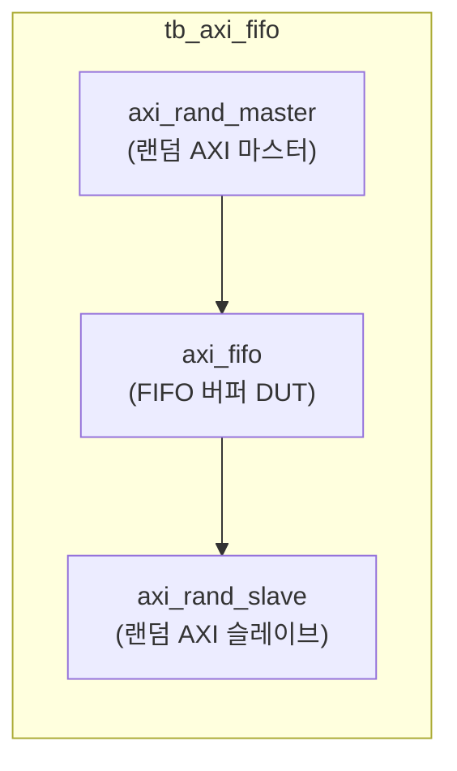

# tb_axi_fifo.sv

## 개요

`axi_fifo` 모듈의 테스트벤치입니다. AXI FIFO 버퍼의 올바른 동작(저장/전달, 순서 보존)을 검증합니다.

## 테스트 구성

## 파라미터

| 파라미터 | 기본값 | 설명 |
|---------|--------|------|
| `Depth` | 16 | FIFO 깊이 |
| `FallThrough` | 0 | 폴스루 모드 |
| `NoWrites` | 200 | 마스터당 쓰기 수 |
| `NoReads` | 200 | 마스터당 읽기 수 |

## 내부 설정

| 파라미터 | 값 | 설명 |
|---------|-----|------|
| `MaxAW`, `MaxAR` | 30 | 최대 동시 트랜잭션 |
| `EnAtop` | `1'b1` | ATOP 활성화 |
| `CyclTime` | 10ns | 클록 주기 |
| `AxiIdWidth` | 4 | ID 폭 |
| `AxiAddrWidth` | 32 | 주소 폭 |
| `AxiDataWidth` | 64 | 데이터 폭 |
| `AxiUserWidth` | 5 | 사용자 신호 폭 |

## 테스트 시나리오

1. 랜덤 AXI 마스터가 읽기/쓰기 트랜잭션 생성 (ATOP 포함)
2. `axi_fifo`가 트랜잭션을 버퍼링
3. 슬레이브에서 응답 생성
4. 모든 트랜잭션이 순서대로 완료되는지 검증

## 검증 대상

`axi_fifo`: AXI 트랜잭션 FIFO 버퍼

## 의존성

- `axi/typedef.svh`, `axi/assign.svh`
- `axi_test`
