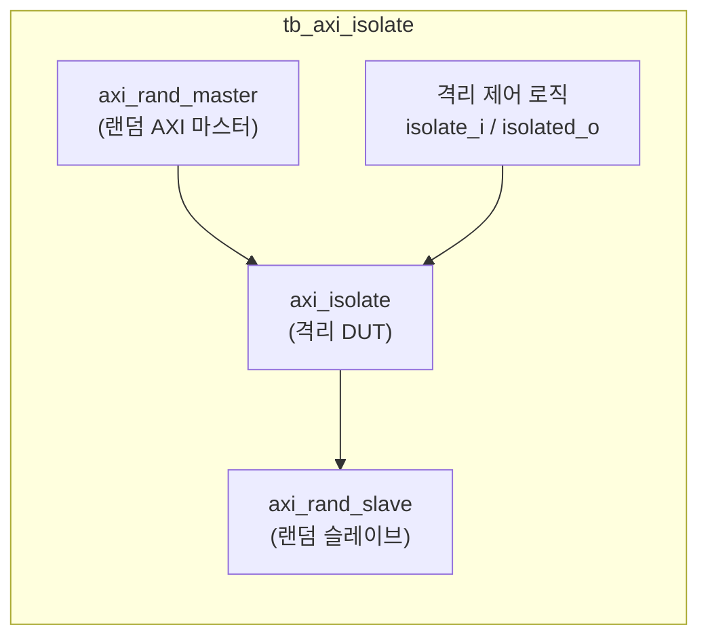

# tb_axi_isolate.sv

## 개요

`axi_isolate` 모듈의 테스트벤치입니다. AXI 버스 격리 동작이 올바른지 검증합니다.

## 테스트 구성

## 파라미터

| 파라미터 | 기본값 | 설명 |
|---------|--------|------|
| `NoWrites` | 50000 | 마스터당 쓰기 수 |
| `NoReads` | 30000 | 마스터당 읽기 수 |
| `NoPendingDut` | 16 | DUT 최대 보류 트랜잭션 수 |

## 내부 설정

| 파라미터 | 값 | 설명 |
|---------|-----|------|
| `MaxAW`, `MaxAR` | 30 | 최대 동시 트랜잭션 |
| `EnAtop` | `1'b1` | ATOP 활성화 |
| `CyclTime` | 10ns | 클록 주기 |
| `AxiIdWidth` | 4 | ID 폭 |
| `AxiAddrWidth` | 32 | 주소 폭 |
| `AxiDataWidth` | 64 | 데이터 폭 |

## 테스트 시나리오

1. 랜덤 AXI 마스터가 대량의 읽기/쓰기 트랜잭션 생성
2. 격리 신호(`isolate_i`) 어서트/디어서트 반복
3. 격리 완료 신호(`isolated_o`) 확인
4. 격리 중 새 트랜잭션이 올바르게 차단되는지 검증
5. 격리 해제 후 트랜잭션이 재개되는지 검증

## 검증 대상

`axi_isolate`: AXI 버스 격리 모듈 (진행 중인 트랜잭션 완료 후 격리)

## 의존성

- `axi/typedef.svh`, `axi/assign.svh`
- `axi_test`
