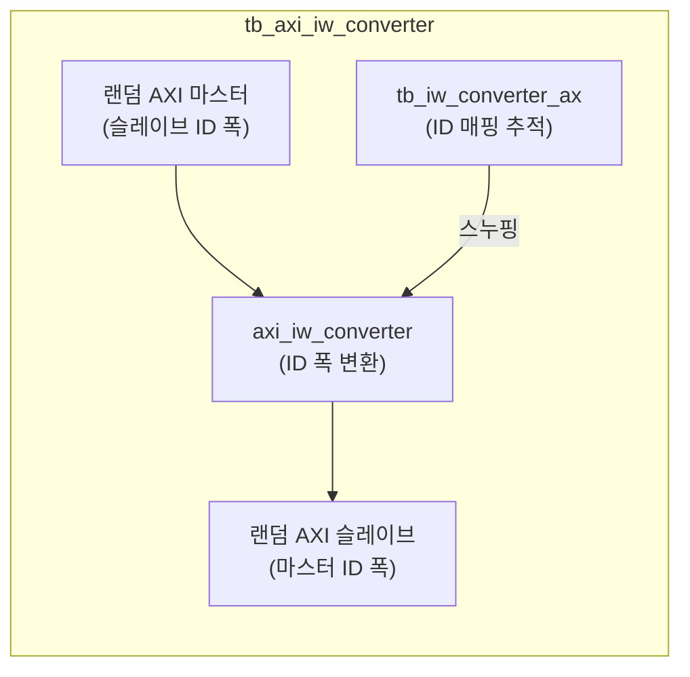

# tb_axi_iw_converter.sv

## 개요

`axi_iw_converter` 모듈의 테스트벤치입니다. AXI ID 폭 변환이 올바른지 검증합니다.

## 테스트 구성

## 검증 클래스

### `tb_iw_converter_ax`

AR/AW 채널을 추적하는 헬퍼 클래스입니다.

- `upstream_ax`: 업스트림 AX 채널 데이터 저장
- `downstream_id`: 다운스트림 ID 저장
- `equals_except_id()`: ID를 제외한 두 AX 채널 비교

## 테스트 시나리오

1. 다양한 ID를 가진 읽기/쓰기 트랜잭션 생성
2. `axi_iw_converter`가 ID 폭 변환
3. 변환된 ID로 슬레이브에서 응답
4. 응답이 올바른 업스트림 트랜잭션에 매핑되는지 검증

## 검증 대상

`axi_iw_converter`: AXI ID 폭 변환기 (remap 또는 serialize 방식)

## 의존성

- `axi/assign.svh`, `axi/typedef.svh`
- `axi_test`
