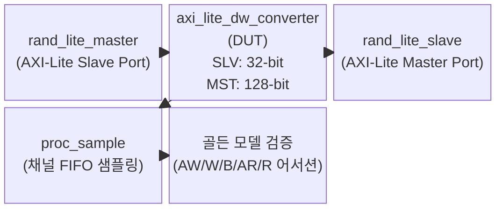
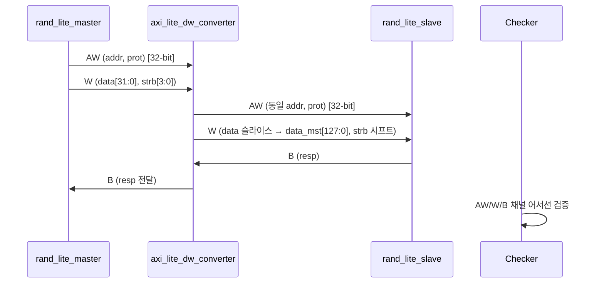

# tb_axi_lite_dw_converter.sv 테스트벤치 문서

## 목적 및 개요

`tb_axi_lite_dw_converter`는 AXI4-Lite 데이터 폭 변환 모듈(`axi_lite_dw_converter_intf`)의 기능을 검증하는 테스트벤치입니다. 슬레이브 포트(Slave Port)와 마스터 포트(Master Port)의 데이터 폭이 다를 때 올바른 업사이징(Upsizing) 또는 다운사이징(Downsizing) 동작을 확인하며, 각 채널(AW, W, B, AR, R)에서 변환된 신호가 기대값과 일치하는지 어서션으로 검증합니다.

ETH Zurich / University of Bologna에서 개발하였으며 Solderpad Hardware License v0.51에 따라 배포됩니다.

---

## 테스트 대상 모듈

| 항목 | 내용 |
|------|------|
| 모듈명 | `axi_lite_dw_converter_intf` |
| 기능 | AXI4-Lite 슬레이브 포트와 마스터 포트 간의 데이터 폭 변환 (업사이저 / 다운사이저 / 패스스루) |
| 포트 | `slv` (슬레이브 포트, 좁은 데이터 폭) / `mst` (마스터 포트, 넓은 데이터 폭) |

---

## 주요 파라미터 및 설정

| 파라미터 | 기본값 | 설명 |
|----------|--------|------|
| `TbAxiAddrWidth` | 32 | AXI4-Lite 주소 비트 폭 |
| `TbAxiDataWidthSlv` | 32 | 슬레이브 포트 데이터 비트 폭 |
| `TbAxiDataWidthMst` | 128 | 마스터 포트 데이터 비트 폭 |
| `NumWrites` | 10000 | 랜덤 쓰기 트랜잭션 횟수 |
| `NumReads` | 10000 | 랜덤 읽기 트랜잭션 횟수 |

### 타이밍 파라미터

| 파라미터 | 값 | 설명 |
|----------|----|------|
| `CyclTime` | 10 ns | 클럭 주기 |
| `ApplTime` | 2 ns | 자극 적용 시간 (클럭 상승 후 지연) |
| `TestTime` | 8 ns | 출력 샘플링 시간 (클럭 상승 후 지연) |

---

## 테스트 시나리오 설명

### 동작 모드 분기

`TbAxiDataWidthMst`와 `TbAxiDataWidthSlv`의 관계에 따라 세 가지 검증 경로가 선택됩니다.

#### 1. 다운사이저 모드 (MST 폭 < SLV 폭)

- 슬레이브에서 수신한 하나의 AW/W 트랜잭션을 `DataDivFactor`개의 작은 트랜잭션으로 분할
- 분할된 AW 주소가 올바른 오프셋으로 생성되었는지 검증
- W 데이터/스트로브가 상위·하위 슬라이스로 올바르게 분리되었는지 검증
- B 응답: `DataDivFactor`개의 B 응답 OR 결합 후 슬레이브 응답과 비교
- R 데이터: 마스터에서 수신한 여러 조각을 합산하여 슬레이브 응답과 비교

#### 2. 패스스루 모드 (MST 폭 == SLV 폭)

- 매 클럭마다 마스터 요청/응답 구조체와 슬레이브 요청/응답 구조체가 완전히 동일한지 어서션으로 검증

#### 3. 업사이저 모드 (MST 폭 > SLV 폭)

- AW 채널: 슬레이브 AW와 마스터 AW가 동일한지 검증
- W 채널: 슬레이브 W 데이터가 마스터 W 데이터의 해당 슬라이스에 배치되었는지, 스트로브가 올바르게 시프트되었는지 검증
- B 채널: 슬레이브와 마스터의 B 응답이 동일한지 검증
- AR 채널: AR 주소가 동일한지 검증하고 읽기 오프셋을 FIFO에 저장
- R 채널: 마스터 R 데이터를 오프셋에 따라 슬라이스하여 슬레이브 R 데이터와 비교

### 트래픽 생성

| 프로세스 | 설명 |
|----------|------|
| `proc_generate_traffic` | `rand_lite_master_t`로 랜덤 읽기/쓰기 트랜잭션 생성, 시뮬레이션 종료 제어 |
| `proc_recieve_traffic` | `rand_lite_slave_t`로 마스터 포트 응답 처리 |
| `proc_sample` | 모든 채널의 핸드셰이크 시점에 FIFO에 채널 데이터 적재 |

### 시뮬레이션 종료 조건

모든 랜덤 트랜잭션 완료 후 `end_of_sim`이 어서트되면 1000 클럭 후 `$stop()` 호출

---

## Mermaid 다이어그램

### 테스트 구조도



### 업사이저 쓰기 시퀀스 다이어그램



---

## 실행 방법

### 권장 시뮬레이터

Questa / ModelSim, VCS, Xcelium 등 SystemVerilog 어서션을 지원하는 시뮬레이터

### 기본 실행 예시 (Questa)

```bash
# 작업 디렉토리: /home/user/axi
vlog -sv \
  +incdir+include \
  test/tb_axi_lite_dw_converter.sv

vsim -c tb_axi_lite_dw_converter \
  -do "run -all; quit"
```

### 파라미터 변경 예시

```bash
# 다운사이저 모드 테스트 (MST 폭 < SLV 폭)
vsim -c tb_axi_lite_dw_converter \
  -G TbAxiDataWidthSlv=64 \
  -G TbAxiDataWidthMst=32 \
  -G NumWrites=1000 \
  -G NumReads=1000 \
  -do "run -all; quit"

# 패스스루 모드 테스트 (동일 폭)
vsim -c tb_axi_lite_dw_converter \
  -G TbAxiDataWidthSlv=32 \
  -G TbAxiDataWidthMst=32 \
  -do "run -all; quit"
```

### 성공 기준

시뮬레이션 종료 시 다음 메시지가 출력되면 성공입니다.

```
Simulation stopped as all Masters transferred their data, Success.
```

어서션 실패 시 `$error` 메시지가 출력되며 해당 채널과 기대값/실제값이 표시됩니다.
