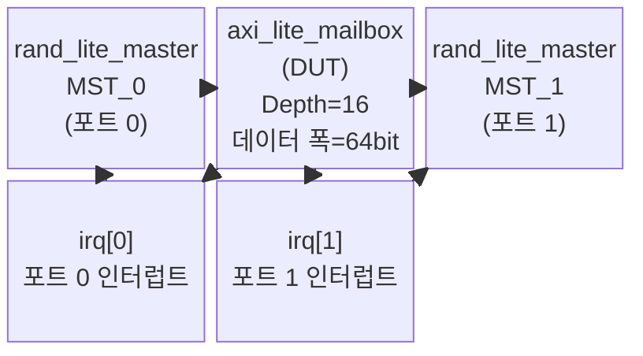
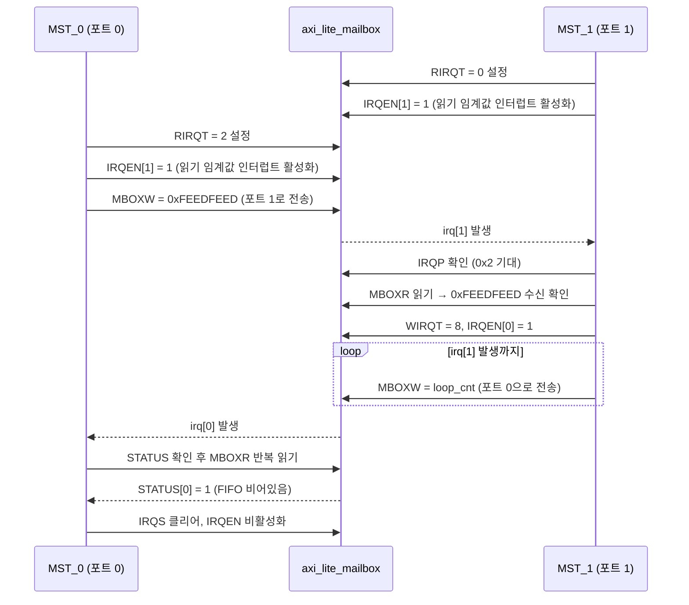

# tb_axi_lite_mailbox.sv 테스트벤치 문서

## 목적 및 개요

`tb_axi_lite_mailbox`는 AXI4-Lite 메일박스 모듈(`axi_lite_mailbox_intf`)을 검증하는 지향적(Directed) 테스트벤치입니다. 두 개의 독립적인 AXI4-Lite 마스터(포트 0 / 포트 1)가 메일박스 레지스터에 접근하여 다음 기능을 순차적으로 검증합니다.

- 초기 레지스터 값 확인 (읽기 전용 레지스터 포함)
- 빈 FIFO에서 읽기 시 에러 인터럽트 동작
- 포트 간 데이터 교환 및 임계값 기반 인터럽트
- FIFO 플러시(Flush) 동작
- FIFO 오버플로우 시 에러 인터럽트 처리
- 매핑되지 않은 주소 접근 처리

각 테스트 단계마다 AXI4-Lite 응답 코드와 반환 데이터가 어서션으로 검증됩니다.

ETH Zurich에서 개발하였으며 Solderpad Hardware License v0.51에 따라 배포됩니다.

---

## 테스트 대상 모듈

| 항목 | 내용 |
|------|------|
| 모듈명 | `axi_lite_mailbox_intf` |
| 기능 | 두 AXI4-Lite 포트 간 비동기 데이터 전달용 FIFO 메일박스, 인터럽트 지원 |
| 포트 | `slv[0]`, `slv[1]` (각 포트 독립 AXI4-Lite 슬레이브 인터페이스) |
| 인터럽트 | `irq_o[1:0]` – 포트별 인터럽트 출력 |

---

## 주요 파라미터 및 설정

| 파라미터 | 값 | 설명 |
|----------|----|------|
| `AxiAddrWidth` | 32 | AXI4-Lite 주소 비트 폭 |
| `AxiDataWidth` | 64 | AXI4-Lite 데이터 비트 폭 |
| `MailboxDepth` | 16 | 메일박스 FIFO 깊이 (최대 저장 가능 데이터 수) |
| `IRQ_EDGE_TRIG` | 0 (레벨 트리거) | 인터럽트 트리거 방식 |
| `IRQ_ACT_HIGH` | 1 (고활성) | 인터럽트 극성 |
| `base_addr_i` | 0 | 레지스터 베이스 주소 |

### 타이밍 파라미터

| 파라미터 | 값 | 설명 |
|----------|----|------|
| `CyclTime` | 10 ns | 클럭 주기 |
| `ApplTime` | 2 ns | 자극 적용 지연 |
| `TestTime` | 8 ns | 샘플링 지연 |

### 레지스터 주소 맵 (베이스 = 0x0000_0000)

| 열거형 이름 | 오프셋 | 설명 |
|------------|--------|------|
| `MBOXW` | 0x00 | 메일박스 쓰기 레지스터 |
| `MBOXR` | 0x08 | 메일박스 읽기 레지스터 |
| `STATUS` | 0x10 | FIFO 상태 레지스터 |
| `ERROR` | 0x18 | 에러 상태 레지스터 |
| `WIRQT` | 0x20 | 쓰기 인터럽트 임계값 |
| `RIRQT` | 0x28 | 읽기 인터럽트 임계값 |
| `IRQS` | 0x30 | 인터럽트 상태 (쓰기로 클리어) |
| `IRQEN` | 0x38 | 인터럽트 활성화 레지스터 |
| `IRQP` | 0x40 | 인터럽트 펜딩 레지스터 |
| `CTRL` | 0x48 | 제어 레지스터 (플러시 등) |

---

## 테스트 시나리오 설명

### 포트 0 (MST_0) 시나리오

#### 1단계: 초기 레지스터 읽기 검증

리셋 해제 후 모든 레지스터를 순서대로 읽어 초기값을 확인합니다.

| 레지스터 | 기대값 | 특이사항 |
|----------|--------|----------|
| MBOXW | 0xFEEDC0DE | RESP_OKAY |
| MBOXR | 0xFEEDDEAD | RESP_SLVERR (빈 FIFO 읽기) |
| STATUS | 0x1 | FIFO 비어있음 |
| IRQS | 0b100 | 에러 인터럽트 발생 |

에러 인터럽트는 IRQS 레지스터에 쓰기(0x4)로 클리어합니다.

#### 2단계: 에러 인터럽트 검증

에러 인터럽트(IRQEN[2])를 활성화한 후 빈 FIFO에서 읽어 인터럽트가 발생하는지 확인하고 클리어합니다.

#### 3단계: 포트 간 데이터 교환

1. 포트 0이 읽기 임계값(`RIRQT`)을 2로 설정하고 읽기 임계값 인터럽트를 활성화
2. 포트 0이 포트 1로 데이터(`0xFEEDFEED`) 전송
3. `irq[0]` 인터럽트 대기 → 인터럽트 수신 확인
4. STATUS가 0b1000(FIFO에 2개 이상)임을 확인
5. STATUS[0](FIFO 비어있음)이 어서트될 때까지 MBOXR 반복 읽기
6. 인터럽트 클리어 및 임계값 초기화

#### 4단계: FIFO 플러시

CTRL 레지스터에 쓰기로 전체 FIFO 플러시 동작 확인

#### 5단계: 쓰기 오버플로우 에러 인터럽트

에러 인터럽트 활성화 후 `irq[0]`이 발생할 때까지 MBOXW에 반복 쓰기 → FIFO 오버플로우 → 에러 상태 확인 후 플러시 및 인터럽트 클리어

#### 6단계: 비정상 접근 처리

매핑되지 않은 주소(`0xDEAD`)에 읽기/쓰기 시 `RESP_SLVERR` 반환 확인, 읽기 전용 레지스터(ERROR) 쓰기 시 에러 반환 확인

---

### 포트 1 (MST_1) 시나리오

1. 리셋 직후 읽기/쓰기 FIFO 독립 플러시 검증
2. 읽기 임계값 0 설정 후 읽기 인터럽트 대기 → 포트 0에서 보낸 데이터(`0xFEEDFEED`) 수신 확인
3. 쓰기 임계값(8) 설정 및 쓰기 인터럽트 활성화
4. `irq[1]`이 발생할 때까지 MBOXW에 반복 쓰기 (루프 카운터 값 전송)
5. STATUS[3](FIFO 임계값 초과)이 클리어될 때까지 대기 후 인터럽트 클리어

---

## Mermaid 다이어그램

### 테스트 구조도



### 포트 간 데이터 교환 시퀀스



---

## 실행 방법

### 권장 시뮬레이터

Questa / ModelSim, VCS, Xcelium 등 SystemVerilog 지원 시뮬레이터

### 기본 실행 예시 (Questa)

```bash
# 작업 디렉토리: /home/user/axi
vlog -sv \
  +incdir+include \
  test/tb_axi_lite_mailbox.sv

vsim -c tb_axi_lite_mailbox \
  -do "run -all; quit"
```

### 성공 기준

시뮬레이션 종료 시 아래 메시지가 출력되면 성공입니다.

```
Slave port 0 failed tests: 0
Slave port 1 failed tests: 0
Simulation stopped as all Masters transferred their data, Success.
```

어서션 실패 횟수가 0보다 크면 `$fatal`이 호출되어 시뮬레이션이 비정상 종료됩니다.
