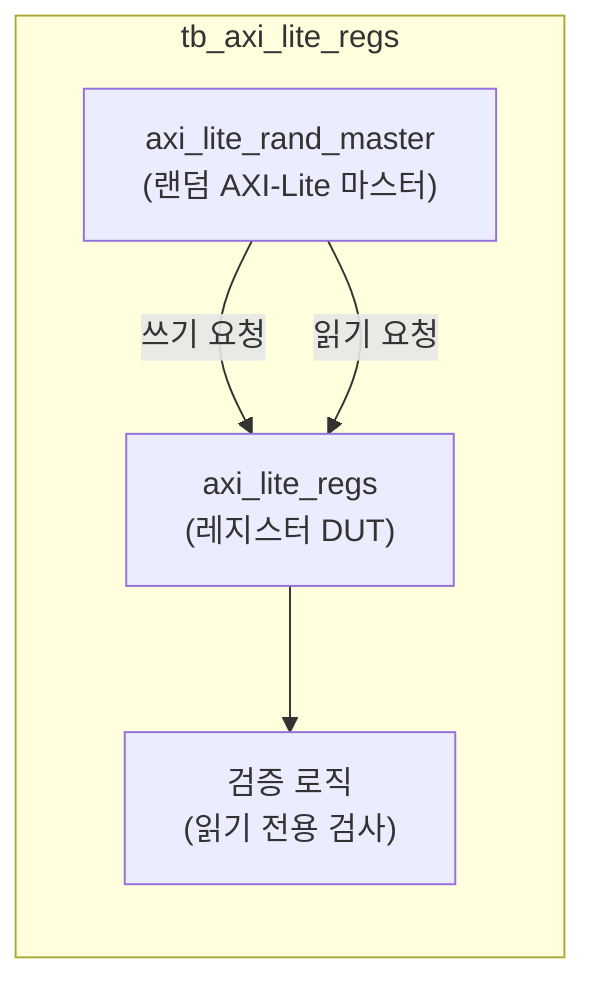

# tb_axi_lite_regs.sv

## 개요

`axi_lite_regs` 모듈의 테스트벤치입니다. AXI4-Lite 레지스터 인터페이스의 읽기/쓰기 동작과 읽기 전용(read-only) 레지스터 보호를 검증합니다.

## 테스트 구성

## 파라미터

| 파라미터 | 기본값 | 설명 |
|---------|--------|------|
| `TbRegNumBytes` | 200 | 레지스터 총 바이트 수 |
| `TbAxiReadOnly` | 18'b101110111111000000 | 읽기 전용 레지스터 비트맵 |
| `TbNoWrites` | 1000 | 총 쓰기 트랜잭션 수 |
| `TbNoReads` | 1500 | 총 읽기 트랜잭션 수 |

## 내부 설정

| 파라미터 | 값 | 설명 |
|---------|-----|------|
| `AxiAddrWidth` | 32 | 주소 폭 |
| `AxiDataWidth` | 32 | 데이터 폭 |
| `CyclTime` | 10ns | 클록 주기 |

## 테스트 시나리오

1. 랜덤 AXI-Lite 마스터가 1000번의 쓰기 트랜잭션 생성
2. `axi_lite_regs`가 쓰기 데이터를 레지스터에 저장
3. 읽기 전용 레지스터(`TbAxiReadOnly` 비트맵 기준)에 쓰기 시 무시됨 검증
4. 1500번의 읽기 트랜잭션으로 레지스터 값 확인
5. 읽기 전용 영역의 초기 값이 보존되는지 검증

## 검증 대상

`axi_lite_regs`: AXI4-Lite 레지스터 블록 (읽기/쓰기, 읽기 전용 지원)

## 의존성

- `axi/typedef.svh`, `axi/assign.svh`
- `axi_test`
