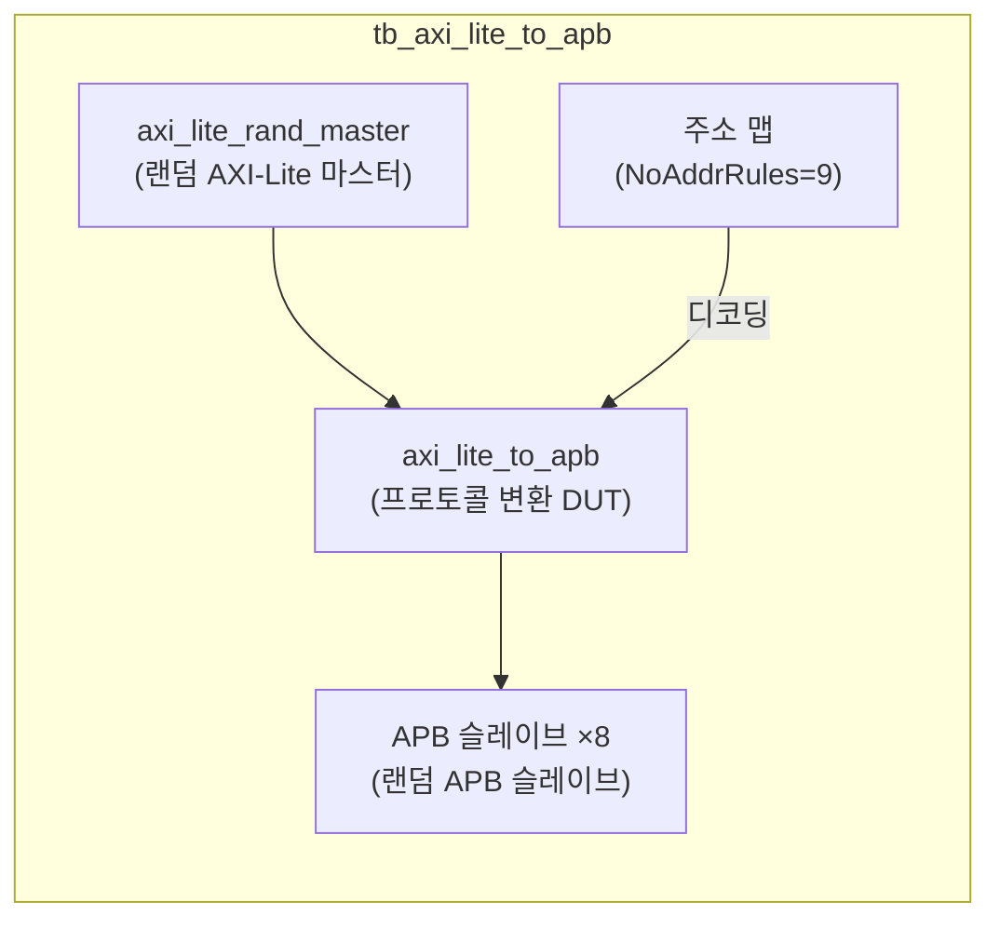
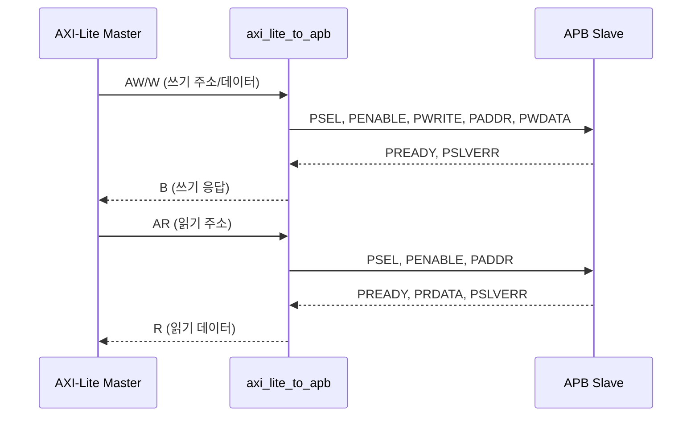

# tb_axi_lite_to_apb.sv

## 개요

`axi_lite_to_apb` 모듈의 테스트벤치입니다. AXI4-Lite에서 APB(Advanced Peripheral Bus) 프로토콜로의 변환이 올바른지 검증합니다.

## 테스트 구성

## 파라미터

| 파라미터 | 기본값 | 설명 |
|---------|--------|------|
| `NoApbSlaves` | 8 | APB 슬레이브 수 |
| `NoAddrRules` | 9 | 주소 디코딩 규칙 수 |
| `NoWrites` | 10000 | 총 쓰기 트랜잭션 수 |
| `NoReads` | 20000 | 총 읽기 트랜잭션 수 |

## 내부 설정

| 파라미터 | 값 | 설명 |
|---------|-----|------|
| `AxiAddrWidth` | 32 | 주소 폭 |
| `AxiDataWidth` | 32 | 데이터 폭 |
| `CyclTime` | 10ns | 클록 주기 |

## APB 프로토콜

## 테스트 시나리오

1. 랜덤 AXI-Lite 마스터가 10000 쓰기 + 20000 읽기 트랜잭션 생성
2. 주소 디코더가 9개 규칙 기반으로 8개 APB 슬레이브 선택
3. `axi_lite_to_apb`가 AXI-Lite → APB 프로토콜 변환
4. APB 슬레이브 오류 응답(PSLVERR) 처리 검증
5. 모든 트랜잭션 완료 및 데이터 정합성 검증

## 검증 대상

`axi_lite_to_apb`: AXI4-Lite to APB 브리지 (멀티 슬레이브 지원)

## 의존성

- `axi/typedef.svh`, `axi/assign.svh`
- `axi_test`
- APB 관련 패키지
